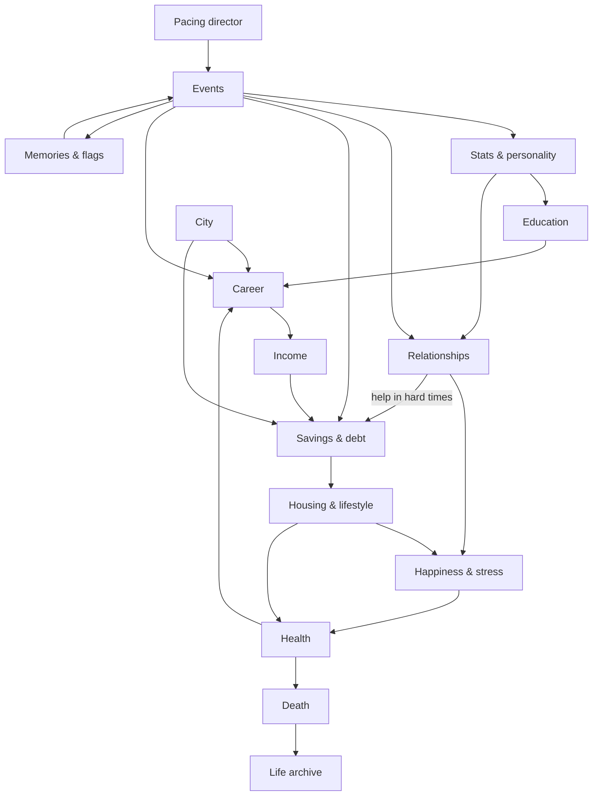

# WIPlife — Game Design Document, Part 1

**Status:** Draft for review. Covers sections A–L and S (open questions). Part 2 (technical architecture, data model, roadmap with stage gates, testing, content pipeline) follows once this design is approved.

---

## Decisions locked during the interview

| Area | Decision |
|---|---|
| Tone | Balanced mix of humor and drama |
| Setting | Modern United States; about 5 cities with different costs of living |
| Audience | Mature (crime, vices, adult themes); age gate and content notice |
| Character creation | One-tap random start, plus full custom with no restrictions |
| Identity | Fully custom gender and pronouns; orientation set at creation but can change or be discovered through play |
| Time | One year per turn |
| Player agency | Respond to events; simple management screens for deliberate actions |
| Event density | Varies by life stage and how eventful life currently is |
| MVP careers | Traditional and professional; skilled trades and gig work |
| Money | Simple: income, expenses, savings, debt |
| Education | Realistic: majors, GPA, scholarships, student loans, trade school |
| Relationships | Moderate: affection, trust, key memories |
| Children and heirs | After the MVP, but designed for now |
| Death | Player chooses a new life or plays as an heir (heir play after the MVP) |
| Goals | Self-directed; no aspirations system |
| Jail | Time skip with a few prison events (playable prison later) |
| Early childhood | Playable ages 0–4, including family hardship events |
| Stat display | Bars only, no numbers |
| Legendary events | Secret and untracked, but recorded in life history |
| Progression | Life archive only; no achievements or unlocks |
| Saves | Local device only, plus export/import |
| Monetization | Completely free |
| Sharing | None in version 1 |

---

## A. Game Vision

A free, mobile-first web life simulator set in the modern United States. Each life is told through the moments that matter rather than through menus of repeatable activities. Every year brings a few decisions, and the people you meet remember what you did. When a life ends, it becomes a permanent entry in your archive, a growing record of everyone you've been.

The game has three equal pillars of identity:

1. **Moments, not menus.** Lives unfold through meaningful, well-written decisions, not repetitive button tapping.
2. **Everything is remembered.** Choices leave marks on people and on the world, and they come back years later.
3. **Every life is kept.** The archive of past lives, each with its own obituary, is the long-term reward.

### Name

**WIPlife.** "WIP" means "work in progress," which fits a game about lives that are never finished until they end. A formal trademark check is still recommended before launch.

---

## B. Design Pillars

1. **Moments, not menus.** Every event has to be worth reading. If a choice has no real trade-off, cut it or rewrite it.
2. **Everything is remembered.** Important choices write memory tags and flags, and later content checks for them.
3. **Every life is kept.** The archive is the only thing that carries over, so each life's summary must be worth rereading.
4. **Interesting over realistic.** The simulation should be believable, but an interesting outcome beats an accurate one.
5. **Failure is a new chapter.** Setbacks such as getting fired, divorced, arrested or going broke open new story paths instead of ending the fun.
6. **Tone is paced.** Humor and weight sit side by side, and the pacing keeps a joke from landing right after a tragedy.
7. **Content is data.** New events, jobs, cities and majors are added as data files, without changing the engine.

---

## C. Core Gameplay Loop

### Each turn (one year)

1. **Review.** The home screen shows age, key stats, money, job or school, and last year's headline.
2. **Manage (optional).** Take deliberate actions such as applying for a job, quitting, moving, breaking up, proposing, seeing a doctor, changing housing, or changing lifestyle spending.
3. **Age up.** The single primary action, always visible.
4. **Simulate.** The year resolves: aging, income and expenses, debt payments, relationship drift, health changes, school or work performance, and any scheduled consequences.
5. **Events.** The pacing director picks 0–6 events. Each appears as a card, and the player chooses; the outcome shows on the same card.
6. **Year recap.** A short card shows what changed: money, stat changes, new or lost relationships, and important memories.

### What creates anticipation

- **Planted seeds.** Players learn that choices return, so a loan to a friend or a lie to a boss stays in their mind.
- **Life-stage transitions** such as turning 16 or 18, graduating, the first job, retirement.
- **Visible pending outcomes** such as college decisions, court dates or a promotion review, shown as "coming up next year."

### What creates meaningful choices

- **Trade-offs.** Choices trade money against happiness, safety against opportunity, or honesty against relationships.
- **Stats shape the odds.** A confident character is more likely to succeed when asking for a raise. Risk is hinted at but not shown as an exact percentage.
- **Personality unlocks options.** A risk-taker sees bolder choices, and a very kind character sees gentler ones.

### Long-term goals

In the MVP, goals are set by the player and come from the systems themselves: finishing school, climbing a career ladder, getting out of debt, buying a home, finding a partner, living long. (See the open question on optional life aspirations.)

### Why players start another life

A new city, family or personality produces a very different life. Players also come back to try a different path, to find secret legendary events, and to add a new obituary to the archive.

---

## D. Feature List

### MVP

- Age gate and content notice on first launch.
- **Character creation:** one-tap random start, or full custom (name, gender, pronouns, orientation, appearance descriptors, city, parents and siblings, family wealth, stats and personality).
- **Aging from birth to death** across six life stages. Ages 0–4 are playable, with family events such as parents fighting, divorce, neglect or mistreatment, moving, and new siblings.
- **Self-discovery system:** orientation, gender identity and expression, and personality can shift or be discovered through events, with accept or suppress choices (see section F).
- **Event engine** with chains, delayed consequences, memory tags, tone tags, pronoun templates, rarity tiers, cooldowns, and a pacing director.
- **About 300 events at launch,** including a small set of secret legendary ones.
- **Relationships:** parents, siblings, friends, dates, partners and spouse, each with affection, trust and memories. Supports dating, breakups, marriage and divorce.
- **Education:** automatic elementary school, high school GPA, college with about 10 majors, trade school with about 6 trades, grad school (law, medicine, MBA, master's), scholarships, student loans, and dropping out.
- **Careers:** about 30 job tracks across professional, trade and gig work, with applications, levels, promotions, firing, quitting and workplace events.
- **Money:** salary, an approximate effective tax rate, city-based living costs, a lifestyle spending tier, savings, and debt (student and personal loans).
- **Housing:** live with parents, rent, or buy a home (simple mortgage).
- **Health:** a health stat, illness and injury events, doctor visits, and death from age, health or events.
- **Crime as events** (not a career): fines, probation, a criminal record that limits job options, and jail time as a consequence. Jail is a time skip with a few prison events.
- **Moving** between the five cities.
- **Death screen** with a generated obituary, and a life archive of all past lives.
- **Saves:** automatic local saves, a request that the browser keep the data, installable app support, and export/import of a save file.

### Version 1 (post-MVP)

- Children and parenting, heir play, and inheritance.
- Criminal careers; entertainment, sports and fame careers.
- Playable prison phase.
- Expanded early-childhood hardship: foster care, custody battles, child services.
- More economy depth: credit score, detailed taxes, insurance.
- Pets and vehicles.
- Politics, military, and owning a business.
- More cities.
- A shareable life summary.
- UI themes.

### Future

- Stocks, a real estate market, and deeper business simulation.
- Additional countries.
- Optional accounts and cloud saves.
- Player-made scenarios and community content.

---

## E. Simulation Systems

### Dependency map



### Systems

| System | What it does |
|---|---|
| Time & aging | Advances a year, moves the character between life stages, applies age effects |
| Pacing director | Decides how many events happen this year and balances their tone |
| Event engine | Picks eligible events, presents choices, applies outcomes, schedules follow-ups |
| Stats | Holds core, personality and hidden values; applies changes and slow drift |
| Relationships | Tracks people, affection, trust, memories and status |
| Education | Tracks enrollment, GPA, acceptance, majors, loans and credentials |
| Career | Tracks job applications, performance, levels, pay and job loss |
| Economy | Runs a yearly ledger: income, tax, expenses and debt |
| Housing | Tracks living situation and its cost |
| Health | Tracks the health stat, conditions and the chance of death |
| Location | City data: cost of living and job availability |
| Legal | Tracks criminal record, sentences and restrictions |
| Life history | Logs notable moments; builds the obituary and archive entry |

### Controlled randomness

- Each life gets a seed, so any life can be replayed exactly to reproduce bugs.
- Outcomes are weighted by stats but never certain; success chances stay between 5% and 95%.
- **Positive loops:** money brings better health and more options. Wide appeal expands the dating pool.
- **Negative loops:** stress hurts health, which hurts job performance, which leads to job loss and more stress.
- **Recovery paths:** "rock bottom" events, second chances, and high-trust people who offer help (a loan, a place to stay, a job lead).

---

## F. Character Model

All stats run from 0 to 100.

### Identity

Name, gender identity, gender expression, pronouns (subject, object, possessive, reflexive), orientation, birth year, city, appearance descriptors, and family background. Each identity field has a current value and can also have a hidden latent value (see self-discovery below).

Birth year is always the year the life starts; there is no birth-year picker.

The game speaks to the player as "you," so the player's pronouns mainly appear when NPCs talk about them and in the obituary. NPCs always use their own pronouns.

### Core attributes (visible)

| Stat | Purpose |
|---|---|
| Health | Survival, illness risk, work capacity |
| Happiness | Mood; affects relationships and stress; its average appears in the obituary |
| Smarts | Grades, admissions, professional job performance |
| Looks | Dating options, some jobs, first impressions |
| Fitness | Health over time, trades and physical jobs, injury risk |
| Stress | Lowers health and happiness; raised by debt, work and conflict |

Wealth is tracked as money, not as a stat.

### Personality (visible; set at creation, drifts slowly through choices)

| Trait | Purpose |
|---|---|
| Ambition | Promotion odds; unlocks bolder career choices |
| Confidence | Success when asking out, negotiating or interviewing |
| Kindness | Relationship growth; unlocks generous choices |
| Risk-taking | Unlocks risky choices; raises accident and crime event weight |
| Discipline | GPA, job performance, debt management |
| Sociability | How many friends and partners you meet |

### Hidden variables

| Variable | Purpose |
|---|---|
| Luck | Small nudge to random outcomes |
| Reputation | How the community sees you; affects job offers and some events |
| Genetic health risk | Raises the chance of certain illnesses later in life |
| Hidden talent | One random talent area, found through events; boosts related success |
| Vice susceptibility | Chance that a vice turns into a harmful pattern |
| Inner conflict | Builds up when the player suppresses who they are; raises Stress, slowly lowers Happiness, and triggers crisis or resurfacing events |

### Self-discovery system

Characters can have **latent** traits that differ from how they start: a different orientation, gender identity or expression, or personality tendencies (for example, a cautious person who turns out to love risk). Both random and fully custom characters roll a chance of latent differences, so any life can bring surprises.

1. **Discovery events** bring a latent trait to the surface. They can happen at random or be set off by circumstances, such as an encounter, a new friend, or a moment of noticing something about yourself.
2. **The player chooses** to accept or explore it, or to suppress it.
3. **Accepting** updates the character's identity and can lead to follow-up events, such as coming out to family, with reactions based on each relationship's affection and trust.
4. **Suppressing** keeps things as they are but adds inner conflict. The feeling comes back later, and heavy suppression can lead to crisis events or a later chance to accept.
5. **"Try it and decide" events** let the player respond to an experience (for example, accepting an advance from someone of the same sex) and then choose whether they liked it, which updates orientation.

Age limits: questions of self-understanding (noticing feelings, how you see yourself, how you like to dress) can come up from the teen years. Romantic and sexual encounters happen only between characters who are both adults.

---

## G. Event System

### Event definition

Events are data, not code. Here is an example:

```json
{
  "id": "coworker_short_on_cash",
  "title": "Short on cash",
  "text": "{npc.name} from work asks if you can spot {npc.them} $200 until payday.",
  "tone": "light",
  "category": "work",
  "rarity": "common",
  "lifeStages": ["youngAdult", "adult"],
  "requires": { "all": [
    { "employed": true },
    { "money": { "gte": 200 } }
  ]},
  "weight": { "base": 10, "modifiers": [
    { "if": { "trait": "kindness", "gt": 60 }, "x": 1.5 }
  ]},
  "cooldownYears": 5,
  "cast": { "npc": { "kind": "coworker", "createIfMissing": true } },
  "choices": [
    {
      "id": "lend",
      "label": "Lend it",
      "outcome": { "effects": [
        { "type": "money", "delta": -200 },
        { "type": "relationship", "role": "npc", "affection": 5 },
        { "type": "memory", "role": "npc", "tag": "lent_money" },
        { "type": "schedule", "eventId": "coworker_repays_or_not", "inYears": [0, 1], "cast": ["npc"] }
      ]}
    },
    {
      "id": "excuse",
      "label": "Make an excuse",
      "outcome": { "effects": [
        { "type": "relationship", "role": "npc", "affection": -3 }
      ]}
    }
  ]
}
```

### Key features

- **Requirements** can check age, life stage, city, job, education, money, health, personality, relationship status, memories, flags and criminal record.
- **Weights** adjust how likely an event is, based on circumstances. This keeps events tied to the player's current situation instead of being purely random.
- **Chance-based outcomes.** A choice can roll against stats and lead to different outcomes (for example, asking for a raise checks Confidence and Ambition).
- **Cast.** An event can use existing people, like your spouse, or create new ones, like a new coworker.
- **Chains.** Choices can set flags or schedule follow-up events with a delay ("3–10 years later, if you're still in touch").
- **Memories.** Tags stored on relationships (like "lent_money" or "cheated") that later events can require.
- **Rarity tiers:** common, uncommon, rare and legendary. Legendary events are secret and appear only in life history.
- **Cooldowns** per event and per category prevent repetition.

### Pacing director

| Life stage | Ages | Base events per year |
|---|---|---|
| Early childhood | 0–4 | 0–2 (mostly family events; simple reactions or automatic outcomes) |
| Childhood | 5–12 | 1–2 |
| Teen | 13–17 | 2–4 |
| Young adult | 18–29 | 2–5 |
| Adult | 30–64 | 1–3 |
| Senior | 65+ | 1–2 |

The director adds up to 2 more events when life is volatile (recent big changes, high Risk-taking, legal trouble, a new job or relationship) and caps the total at 6. It also orders events so their tones fit together.

### Mature content guidelines

Adult and taboo themes are included and carry real consequences: affairs, hard drugs, heavy drinking, gambling, theft, violence, cheating, walking out on a family, and similar. Writing is frank and not sanitized, but suggestive rather than graphic. Heavy topics like addiction leave room for recovery as well as decline.

Firm limits:
- No romantic or sexual content involving anyone under 18. Dating and sexual events are for adults only.
- Mistreatment in childhood events is written without graphic detail, is never sexual, and focuses on consequences (trust in parents, stress, later events).
- Sexual violence is never a player choice.

### Launch content target

About 300 events: 50 childhood, 70 teen, 70 young adult, 70 adult and 40 senior, including roughly 5–10 legendary events.

---

## H. Relationship System

### People

Each NPC has their own identity (name, gender, pronouns, orientation, age), a few personality traits, and basic stats. NPCs age every year and can die.

### Relationship values

| Field | Meaning |
|---|---|
| Affection | How much they like you (0–100) |
| Trust | How much they rely on you (0–100) |
| Memories | Tags with the year they happened, such as "lent_money" or "missed_wedding" |
| Status | Family, friend, dating, engaged, married, ex, or estranged |

Affection and trust move separately, so someone can love you without trusting you.

### How relationships change

- **Events** are the main driver: birthdays, fights, favors, betrayals, reunions.
- **Drift.** Affection slowly fades without positive events. The drift is gentle so players aren't punished for having no activities menu.
- **Management actions** (on each person's page): ask out, propose, break up, divorce, cut contact, or try to reconcile. Each can trigger an event.
- **Meeting people** happens through school, work, neighborhood and city events. Romance normally offers people whose orientation fits. A different orientation can surface through the self-discovery system, which then changes who is available.
- **Dating starts at 18.** Teen years focus on friendships, family and self-understanding.
- **Support.** People with high trust can step in during crises, offering a loan, a place to stay or a job lead.

---

## I. Education & Career System

### Education

- **Elementary and middle school** are automatic, with a few events that affect Smarts and habits.
- **High school** tracks GPA, driven by Smarts, Discipline and events. Dropping out is possible.
- **After high school,** acceptance is based on GPA and stats, with three tiers: community college, state university and elite university.
- **About 10 majors,** each leading to specific jobs.
- **Trade school** with about 6 trades, each with a license that leads to trade jobs.
- **Grad school:** law, medicine, MBA and master's degrees.
- **Paying for school:** scholarships (from GPA and events), family help (from family wealth), and student loans.

### Careers

- **About 30 job tracks,** each with requirements (degree, major, license, clean record), 3–6 levels, and a pay range per level adjusted by city.
- **Performance** is set each year from relevant stats, stress and events. It drives promotions, raises and firing.
- **Gig work** is always available, with low, unstable pay and no ladder. It's a safety net.
- **Management actions:** job search (lists openings you qualify for), apply, quit, and ask for a raise (an event with a stat check).
- **Workplace events:** coworkers, bosses, office politics, and chances for growth.

---

## J. Economy System

### Yearly ledger

1. Gross income (salary or gig pay).
2. Subtract an estimated tax, using one simple function based on income.
3. Subtract housing costs (rent or mortgage, scaled by city).
4. Subtract living costs, set by lifestyle tier and city.
5. Subtract minimum debt payments.
6. The remainder is added to or taken from savings. Savings earn a small amount of interest.

### Lifestyle tier

Frugal, comfortable or lavish, chosen on the Money screen. A higher tier costs more and raises happiness; frugal living lowers stress about money but slowly lowers happiness.

### Debt

Student loans and personal loans each have a balance, an interest rate and a minimum payment. If savings run out, the shortfall becomes debt. Missing payments starts an event chain (collections, wage garnishment, possible eviction). Bankruptcy is an event outcome in the MVP.

### City cost of living (starting proposal)

| City | Cost of living | Job market |
|---|---|---|
| New York | Very high | Very strong professional |
| Los Angeles | High | Strong, varied |
| Chicago | Moderate | Strong |
| Houston | Low–moderate | Strong trades |
| Small town (generic) | Low | Limited |

### Institutions

Real cities, but fictional companies, universities and brands to avoid trademark issues.

---

## K. UI/UX Architecture

### Layout

- **Bottom navigation:** Life · People · Work/School · Money · More.
- The Work/School tab changes with life stage.
- **Age Up** is a large button above the navigation bar and is the most prominent control on every main screen.

### Home screen, top to bottom

1. Name, age, city, and a one-line status (for example, "Junior paralegal · Renting in Chicago").
2. A compact stat panel: Health, Happiness, Smarts, Looks, Fitness, Stress.
3. Money and debt.
4. "Coming up" items (pending decisions, court dates, graduation).
5. A scrolling feed of this life's year-by-year log.

### Event cards

A full-screen sheet shows one event at a time, with the text and 2–4 large choice buttons. The outcome appears on the same card, followed by "Continue." Tone tags subtly change the card's accent color.

### Year recap

A short card lists changes in money and stats, new memories, and relationship changes.

### Principles

- Tap targets of at least 44px.
- One primary action per screen.
- Dark mode support.
- Respect reduced-motion settings.
- Stats shown as labeled bars without numbers.
- The player never has to wonder what to do next: Age Up is always there, and management screens show only the actions available right now.

---

## L. Screen Map

| Screen | Purpose | Key actions |
|---|---|---|
| Title | Entry point | New life, Continue, Archive, Settings |
| Age gate | First-launch content check | Confirm age, read content notice |
| New life | Choose how to start | Random start, Custom |
| Custom creation | Multi-step builder | Identity → Family → City → Stats & personality → Start |
| Life (home) | Current situation | Age Up, open recent log entries |
| Event card | Make a decision | Choose, Continue |
| Year recap | Summary of the year | Continue |
| People | List of relationships | Open a person |
| Person detail | Relationship status and memories | Ask out, propose, break up, reconcile, cut contact |
| Work / School | Current job or enrollment | Job search, apply, quit, ask for a raise, enroll, drop out |
| Money | Ledger and debt | Change lifestyle tier, view loans |
| More → Health | Health status | See a doctor |
| More → Home | Housing | Move out, rent, buy, relocate to another city |
| More → Life history | Full timeline of this life | Browse |
| Death / Obituary | End of life | Save to archive, start new life (heir option post-MVP) |
| Archive | All past lives | Open a past life |
| Archived life | Obituary and timeline | Browse |
| Settings | Preferences and data | Export/import save, theme, content notice, reset |

---

## S. Open Questions

All design questions from the interview are answered. New questions will come up in Part 2 (technical architecture and roadmap).
