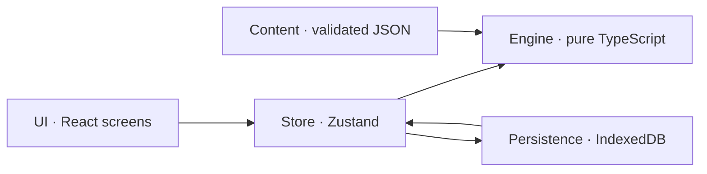
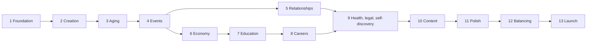

# WIPlife — Technical Plan, Part 2

**Status:** Complete draft (all 4 batches), ready for review.

| Batch | Contents | Status |
|---|---|---|
| 1 | M. Technical architecture · N. Data model | Done |
| 2 | O. Roadmap overview · P. Stage gates, stages 0–5 | Done |
| 3 | P. Stage gates, stages 6–14 | Done |
| 4 | Q. Testing strategy · Content pipeline · R. Future expansion · Open questions | Draft for review |

---

## M. Technical Architecture

### Summary

WIPlife is a **static, installable web app with no server**. Everything runs on the player's device. That follows directly from the design decisions: the game is free, has no accounts, saves locally, and has no sharing in version 1. There's nothing to host except files, which keeps it cheap, fast and simple for a coding AI to work on.



The engine never talks to the UI or to storage directly. The store is the only bridge between the engine, the UI and saving.

### Stack

| Layer | Choice | Why |
|---|---|---|
| Language | TypeScript, strict mode | Types catch mismatches between content and engine; coding AIs work more reliably with them |
| Build | Vite | Fast, simple static output |
| UI | React | Most widely known; coding AIs are strongest with it |
| Styling | Tailwind CSS | Quick mobile-first layouts, design tokens, dark mode |
| UI state | Zustand | Small, simple bridge between engine state and screens |
| State updates | Immer | Readable, safe immutable updates inside the engine |
| Validation | Zod | Checks content files and save files |
| Content format | YAML, compiled to JSON at build | Readable multi-line event text; the build step also validates |
| Storage | IndexedDB via Dexie | More room and reliability than localStorage |
| Offline and install | vite-plugin-pwa | App manifest and service worker |
| Tests | Vitest (engine and units), Playwright (phone-sized end-to-end) | Standard, fast |
| Hosting | Cloudflare Pages or Netlify | Free static hosting with preview links |
| CI | GitHub Actions | Runs every check on every change |

**Not included, on purpose:** backend, database server, authentication, payments and ads. Analytics are also left out of the MVP; if they're added later, they should be cookieless and aggregate only.

### Folder structure

```text
wiplife/
  AGENTS.md              rules for coding AIs (from brief section 14)
  src/
    engine/              pure TypeScript: no React, no DOM, no Math.random
      rng.ts             seeded random number generator
      life.ts            createLife, beginYear, endYear
      systems/           aging, education, career, economy, health,
                         relationships, legal, pacing, selfDiscovery
      events/            eligibility, selection, casting, outcomes, effects/
      conditions.ts      condition language evaluator
      text.ts            template and pronoun renderer
      actions/           management actions (apply, quit, move...)
      selectors.ts       read-only helpers for the UI
      invariants.ts      sanity checks used in dev and tests
    content/             data only, written as YAML
      events/            one folder per life stage
      jobs/ majors/ trades/ grad/ cities/ conditions/ offenses/ names/
      schemas/           Zod schemas for every content type
    store/               Zustand store; calls engine, triggers saves
    persistence/         Dexie database, save/load, migrations, export/import
    ui/
      screens/           one folder per screen
      components/        shared UI pieces (cards, bars, buttons, sheets)
      theme/             design tokens
  tools/
    build-content.ts     compiles YAML to JSON and validates it (runs in CI)
    simulate.ts          runs thousands of lives headless
  tests/                 end-to-end tests
```

### Engine rules

1. **Pure and serializable.** The engine is plain functions over plain JSON data. It never imports React or touches the browser.
2. **All randomness is seeded.** A seeded generator (sfc32) stores its internal state inside the life, so saving and reloading continues the exact same random sequence. `Math.random` and `Date.now` are banned in the engine by a lint rule.
3. **Replayable.** Given the same seed, content version and inputs, a life plays out identically. Every player input (age-ups, choices, management actions) is recorded in the life's input log, so any life can be replayed step by step to reproduce a bug.

### Engine API

| Function | What it does |
|---|---|
| `createLife(options, content)` | Builds a new life from random or custom options |
| `beginYear(state, content)` | Runs the yearly systems and fills the queue of pending events |
| `resolveChoice(state, instanceId, choiceId, content)` | Applies the player's choice to one pending event |
| `endYear(state, content)` | Checks for death, writes the year to history, prepares the recap |
| `performAction(state, actionId, params, content)` | Handles management actions (apply, quit, move, break up...); may queue events |
| `selectors.*` | Read-only helpers, such as `getAvailableActions(state)` |

Because a year is split into begin, choices and end, the game can be saved and reloaded in the middle of a year without losing pending events.

### Year pipeline

`beginYear` runs these steps in a fixed order:

1. Increase age and update life stage.
2. Age NPCs, and check whether any die.
3. Education: update GPA, handle graduation or dropping out.
4. Career: set performance, then check for promotion, raise or firing.
5. Economy: run the yearly ledger.
6. Health: progress conditions and roll for new ones.
7. Relationships: apply drift.
8. Self-discovery: grow inner conflict and check whether latent traits surface.
9. Pacing director: queue due scheduled events first, then pick new events.

After the player resolves every pending event, `endYear` runs the death check, writes history, builds the recap and triggers an autosave.

### Event engine internals

- **Indexing.** On load, events are grouped by life stage and category, so the engine only checks relevant events. This keeps it fast with thousands of events.
- **Eligibility.** Each event's `requires` condition is evaluated against the current state.
- **Weighting.** Base weight times modifiers. Events on cooldown, or one-time events that already fired, get weight zero.
- **Selection.** The pacing director sets how many events this year. Due scheduled events go first, then a weighted random pick without repeats. The picked events are ordered so their tones fit together.
- **Casting.** Each role in an event is filled with an existing person who fits, or a newly generated one.
- **Effects.** Each effect type (stat, money, relationship, memory, flag, schedule, job, education, legal, health, identity, history, death) has its own handler. Adding a new effect type means adding one handler and one schema, without touching existing events.
- **Chance checks.** A choice can roll against weighted stats, with the success chance clamped between 5% and 95%, leading to a success or failure outcome.

### Condition language

Conditions are structured data, not text formulas. They're safer, and the content validator can check them. This replaces the text shorthand in Part 1's event example (which has been updated to match).

```json
{ "all": [
  { "age": { "gte": 18 } },
  { "trait": "kindness", "gt": 60 },
  { "any": [ { "flag": "has_car" }, { "city": "nyc" } ] },
  { "not": { "record": "felony" } },
  { "memory": { "role": "npc", "tag": "lent_money" } }
]}
```

### Text templates and pronouns

- The player is always "you."
- NPC fields use a role name: `{npc.name}`, `{npc.they}`, `{npc.them}`, `{npc.their}`, `{npc.theirs}`, `{npc.themself}`. Capitalized versions like `{npc.They}` start a sentence.
- Verb agreement: `{npc:is|are}` and `{npc:swears|swear}` pick the form that matches the NPC's pronouns.
- The obituary uses `{self.they}` and the other forms for the player character.
- The content validator checks that every placeholder matches a declared cast role.

### Persistence

- **Database tables:** `lives` (the active life), `backups` (the last two autosaves), `archive` (one entry per finished life), `settings`.
- **Autosave** runs after every engine call.
- **Save envelope:** `{ schemaVersion, contentVersion, savedAt, data }`. Older saves are upgraded by migration functions that run in order.
- **Loading** validates the save with Zod. If it's invalid, the game tries the backup. If that fails too, it offers to export the raw data and start a new life.
- **Protection against browser cleanup.** The game requests persistent storage when the first life starts, and suggests installing to the home screen at a natural moment (for example, after the first life ends).
- **Archive entries** are stored in their own envelope with their own schema version and migration list, separate from the active life's. Moving a life into the archive removes the active life and its backups in the same transaction, so an archived life can never load again as active.
- **Export and import:** a single JSON file containing the active life, the archive and settings.

### Content loading and updates

- Content is written as YAML. `npm run content` compiles it to JSON and validates it; this runs in CI and when the dev server starts. The app only ever loads the compiled JSON. The YAML 1.2 parser is used, so values like `no` or `on` aren't accidentally read as true or false.
- Examples in these documents are shown as JSON; the same structure is written in YAML.
- Every save records the content version. If an update removes an event that a save still has scheduled, the engine skips it and logs a warning instead of crashing.

### Error handling

- `assertInvariants(state)` runs in development and tests. It checks things like stats within 0–100, no invalid numbers for money, and no dead person listed as a current partner.
- A UI error boundary offers "Restore last autosave" instead of a blank screen.

### Performance targets

- `beginYear` under 10 ms on a mid-range phone with 1,000 events loaded.
- First load under 2 seconds on 4G.

### Mobile

- Uses the full dynamic viewport height and respects safe areas (notches and home bars).
- Nothing depends on hover.
- Touch targets are at least 44px.
- Respects the reduced-motion and dark mode settings.
- Portrait first. On tablet and desktop, the game shows as a centered column.

### Deployment

The main branch deploys to production. Every pull request gets a preview link. CI runs the type check, lint, unit tests, content validation and a short simulation run, and blocks the merge if any fail.

### Built for coding AIs

- `AGENTS.md` at the root holds the coding rules from the brief, the architecture boundaries and the common commands.
- Lint rules enforce the boundaries (no React in the engine, no unseeded randomness).
- Each system is a small module with its own tests.

---

## N. Data Model

Money is stored as whole dollars (integers). Stats are integers from 0 to 100.

### Saved state (changes during play)

```ts
interface SaveEnvelope {
  schemaVersion: number;
  contentVersion: string;
  savedAt: string;
  data: LifeState;
}

interface LifeState {
  id: Id;
  seed: string;
  rng: RngState;                       // continues across saves
  birthYear: number;
  currentYear: number;
  phase: 'yearStart' | 'events' | 'yearEnd' | 'dead' | 'action';
                                       // 'action': between years, a management action's result event
                                       // waits for the player (Stage 5); finishAction returns to 'yearStart'
  character: Character;
  people: Record<Id, Person>;
  relationships: Record<Id, Relationship>;   // keyed by person id
  education: EducationState;
  career: CareerState;
  finances: FinanceState;
  housing: HousingState;
  health: HealthState;
  legal: LegalState;
  flags: Record<string, number | boolean | string>;
  eventLog: Record<Id, { count: number; lastYear: number }>;
  scheduled: ScheduledEvent[];
  pending: EventInstance[];
  history: HistoryEntry[];
  inputLog: InputRecord[];             // every player input, for exact replay; written by the engine
  recap: YearRecap | null;             // the current or last finished year; null before the first age-up
  death: DeathRecord | null;           // set in the 'dead' phase, or in 'yearEnd' when an event killed the
                                       // character and endYear has yet to close the life
  lifetime: { happinessTotal: number; years: number };  // happiness over finished years (obituary mood)
  lineage: { generation: number; parentLifeId?: Id };  // for heir play later
}

interface YearRecap {
  year: number; age: number;
  statsBefore: Character['stats'];     // when beginYear started
  statsAfter: Character['stats'] | null;  // set by endYear; null mid-year
}

interface DeathRecord { year: number; age: number; causeId: Id }  // cause from content/causes

interface InputRecord {
  year: number;
  kind: 'create' | 'ageUp' | 'choice' | 'action';
  payload: Record<string, unknown>;    // e.g. { instanceId, choiceId } or { actionId, params }
}
```

The input log is written by the engine, not the store: each engine function that takes a player input (`createLife`, and later age-ups, choices and actions) appends its own record, so a life can never be changed without its input being logged.

#### Character

```ts
interface Character {
  name: { first: string; last: string };
  age: number;
  lifeStage: 'early' | 'child' | 'teen' | 'youngAdult' | 'adult' | 'senior';
  identity: Identity;
  latent: {                           // hidden traits that may surface
    identity?: Partial<Identity>;
    personality?: Partial<Personality>;
  };
  appearance: { descriptors: string[] };
  stats: { health; happiness; smarts; looks; fitness; stress };
  personality: Personality;
  hidden: {
    luck; reputation; geneticRisk; vice; innerConflict;
    talent: TalentId | null;
    talentDiscovered: boolean;
  };
  cityId: Id;                          // the city you live in now
  birthCityId: Id;                     // where you were born; never changes (Stage 6)
  familyWealth: 'poor' | 'working' | 'middle' | 'affluent' | 'rich';
  custom: boolean;
}

interface Personality {
  ambition; confidence; kindness; riskTaking; discipline; sociability;
}

interface Identity {
  genderIdentity: string;             // free text, e.g. "woman", "genderfluid"
  genderCategory: 'man' | 'woman' | 'nonbinary';  // used for attraction matching
  genderExpression: string;           // free text
  pronouns: Pronouns;
  attractedTo: ('man' | 'woman' | 'nonbinary')[];  // empty = not attracted to anyone
}

interface Pronouns {
  subject: string; object: string; possessive: string;
  possessivePronoun: string; reflexive: string;
  verbPlural: boolean;                // true for "they are"
}
```

Gender identity and expression are free text so players can write anything. The separate `genderCategory` field (confirmed) lets romance match people by attraction. Custom characters pick the category that fits best.

#### People and relationships

```ts
interface Person {
  id: Id;
  name: { first: string; last: string };
  birthYear: number;
  alive: boolean;
  deathYear?: number;
  identity: Identity;
  traits: Partial<Personality>;
  looks: number;
  smarts: number;
  cityId: Id;
  occupation?: string;
  tags: string[];                      // 'coworker', 'classmate', 'neighbor'
}

interface Relationship {
  personId: Id;
  kind: 'parent' | 'stepparent' | 'sibling' | 'grandparent' | 'friend'
      | 'partner' | 'fiance' | 'spouse' | 'ex' | 'coworker' | 'boss'
      | 'classmate' | 'acquaintance';   // 'child' added with heir play
  status: 'active' | 'estranged' | 'ended';   // 'ended': faded out of your life (pruned)
  affection: number;
  trust: number;
  memories: { tag: string; year: number }[];
  since: number;
  kindSince?: number;                  // year it took its current kind (started dating, married...)
  lastActionYear?: number;             // last management action with this person (one per year)
  wasSpouse?: true;                    // has been your spouse; stays after a divorce (an "Ex-spouse")
}
```

Design H's statuses map onto kind and status: dating is `partner`, engaged is `fiance`, married is `spouse`, an ex is `ex`, and estranged is status `estranged`. A current partner is a living `partner`, `fiance` or `spouse` whose status is `active`; there is never more than one. A spouse who dies keeps the kind `spouse` (a late spouse), so the obituary can name them. The engine sets `wasSpouse` whenever someone becomes your spouse, and every spouse must have it; after a divorce it tells an ex-spouse from an ex you only dated (for the obituary, events about an ex-spouse, and co-parenting later). Save schema version 4 added it: the upgrade from version 3 marks every spouse, and every ex whose memories show the marriage (`married_you` or `divorced`).

#### Education, career and money

```ts
interface EducationState {
  current: Enrollment | null;          // the program you're in now (Stage 7)
  credentials: {
    type: 'hs_diploma' | 'ged' | 'associate' | 'bachelor' | 'trade_license' | 'grad';
    refId?: Id; year: number;          // refId: the major, trade or grad program
    gpa?: number; tier?: 'community' | 'state' | 'elite';   // final GPA; a college degree's tier
  }[];
  admission: null | (SchoolPlace & {   // a place you take up as the next year begins
    scholarship: number; decided: number;
    resume?: { year; lengthYears; gpa; repeats };   // going back to a program you left
  });
  left: null | (Enrollment & { leftYear: number });   // the last program left unfinished (you can go back)
  applied: { option: string; accepted: boolean }[];   // this year's applications, GED tries and major change
  fund: number;                        // scholarship money from events; pays tuition until used up
  lastBill?: { year; tuition; scholarship; family; fund; loan };   // tuition = scholarship + family + fund + loan
}

interface SchoolPlace {
  program: 'elementary' | 'middle' | 'high' | 'college' | 'trade' | 'grad';
  tier?: 'community' | 'state' | 'elite';
  majorId?: Id; tradeId?: Id; gradProgramId?: Id;
}

interface Enrollment extends SchoolPlace {
  year: number; lengthYears: number;
  gpa: number;                         // 0–4, average of the years graded; shown as a letter grade
  boost: number;                       // GPA points events added to this year's grade
  repeats: number;                     // years held back (high school only)
  scholarship: number;                 // share of tuition scholarships cover, set at admission
  since: number;
}
```

A school year starts as a year begins (you enroll and pay tuition) and is graded as the next one begins, so the year's events shape its grade. Elementary, middle and high school follow on their own from the start age; high school ends as you turn 18, or 19 after being held back once. Tuition is paid through the Stage 6 debt system: scholarships (merit by GPA, need by family wealth) and family help take their share, scholarship money from events pays what it can, and the rest joins your student loan (one `student` debt). Student loan payments pause while you're in college, trade school or grad school (interest still grows). Save schema version 6 added `admission`, `left`, `applied`, `fund` and `lastBill`; the upgrade from version 5 gives an adult the high school diploma they would have earned at 18 (without a GPA).

```ts
interface CareerState {
  job: null | { jobId: Id; level: number; yearsAtLevel: number; performance: number; salary: number };
  gig: boolean;
  retired: boolean;
  history: { jobId: Id; fromYear: number; toYear: number;
             endedBy: 'quit' | 'fired' | 'laid_off' | 'retired' | 'moved' }[];
}

interface FinanceState {
  savings: number;                     // never below zero: shortfalls become personal debt
  debts: Debt[];
  lifestyle: 'frugal' | 'comfortable' | 'lavish';
  lastLedger?: { year; gross; retirement; tax; housing; living; debtPayments; interest; debtInterest;
                 borrowed; support; net };   // net = gross + retirement + interest − tax − housing − living − debtPayments
  earnings: { years: number; total: number };  // the retirement benefit's record: years with earned income
                                       // (at least creditIncome) and their total (each year capped). The ledger
                                       // records all earned income (gig pay now, Stage 8 salaries) here
  hardshipYears: number;               // years in a row behind on housing costs (eviction)
  bankruptcyYear?: number;
  debtPlanYear?: number;
}

interface Debt {
  id: Id;
  kind: 'student' | 'personal' | 'mortgage' | 'medical' | 'collections';
  balance: number; annualRate: number; minPayment: number;
  missed: number;                      // missed payments in a row
}
```

#### Housing, health and legal

```ts
interface HousingState {
  kind: 'with_parents' | 'renting' | 'owned' | 'homeless' | 'incarcerated';
  cityId: Id;                          // always character.cityId
  annualCost: number;                  // the ledger's housing line (a mortgage is paid as a debt)
  homeValue?: number;
  mortgageDebtId?: Id;
  since: number;                       // the year you moved in (Stage 6)
  roommate?: true;                     // renting with a roommate (Stage 6)
  partnerId?: Id;                      // your partner or spouse living with you (renting or owned); they pay
                                       // economy.housing.partnerShare of the rent or upkeep; cleared when the
                                       // romance ends
}

interface HealthState {
  conditions: { conditionId: Id; since: number; severity: number; treated: boolean }[];
}

interface LegalState {
  record: { offenseId: Id; year: number; outcome: 'warning' | 'fine' | 'probation' | 'jail' }[];
  probationUntil?: number;
  incarceratedUntil?: number;
}
```

#### Events, history and archive

```ts
interface EventInstance {
  instanceId: Id;
  eventId: Id;
  cast: Record<string, Id>;            // role name -> person id
  resolvedChoiceId?: Id;
  outcomeText?: string;
}

interface ScheduledEvent { eventId: Id; dueYear: number; cast: Record<string, Id> }

interface HistoryEntry {
  year: number; age: number; text: string;
  tags: string[]; importance: 1 | 2 | 3; legendary?: boolean;
}

interface ArchivedLife {
  id: Id; name: string; pronouns: Pronouns;
  birthYear: number; deathYear: number; ageAtDeath: number;
  causeOfDeath: string | null;         // readable text; null when unfinished
  unfinished: boolean;                 // a new life was started before this one ended;
                                       // deathYear and ageAtDeath then give when it was left
  cityId: Id;                          // where the life ended
  birthCityId: Id;                     // where it began (archive schema version 2)
  obituary: string;
  highlights: HistoryEntry[];
  finalNetWorth: number;
  finalStats: Character['stats'];
  seed: string; generation: number; parentLifeId?: Id;
}

interface Settings {
  ageConfirmed: boolean;
  theme: 'system' | 'light' | 'dark';
  persistRequested: boolean;
  installPromptShown: boolean;
}
```

### Content definitions (bundled with the app, never saved)

```ts
interface EventDef {
  id: Id; title: string; text: string;
  tone: 'light' | 'neutral' | 'serious' | 'dark';
  category: string;
  rarity: 'common' | 'uncommon' | 'rare' | 'legendary';
  lifeStages: LifeStage[];
  requires?: Condition;
  weight: { base: number; modifiers?: { if: Condition; x: number }[] };
  cooldownYears?: number;
  once?: boolean;
  followUpOnly?: boolean;              // only happens when scheduled (later steps of a chain)
  cast?: Record<string, CastSpec>;     // how to find or create each role
  choices?: ChoiceDef[];               // none = automatic outcome
  autoOutcome?: Outcome;
}

interface CastSpec {
  kind?: RelationshipKind;             // who fills the role: an existing person with this relationship...
  age?: { min; max };                  // ...of this age,
  ageOffset?: { min; max };            // ...or this age relative to yours
  createIfMissing?: boolean;           // create someone new if nobody fits (friend, classmate, acquaintance only)
  newChance?: number;                  // chance of someone new even when someone fits
  romantic?: boolean;                  // the meeting pool: an adult with attraction both ways, never family;
                                       // someone new is of a plausible age for yours (balance/relationships.yaml meeting)
  support?: boolean;                   // instead of kind: the most trusted close person who would step in
  optional?: boolean;                  // nobody fits: the event happens without this role
}

interface ChoiceDef {
  id: Id; label: string;               // 'continue' is reserved for events without choices
  visibleIf?: Condition;               // e.g. only for risk-takers
  outcome?: Outcome;
  check?: {
    stats: ({ key: string; weight: number }                        // your stat, trait or hidden value
          | { role: string; key: 'affection' | 'trust'; weight: number })[];  // how a cast person feels about you
    base: number;
    success: Outcome;
    failure: Outcome;
  };
}

interface Outcome { text?: string; effects: Effect[] }

type Effect =
  | { type: 'stat'; key: string; delta: number }
  | { type: 'money'; delta: number }   // Stage 6: a cost beyond savings becomes personal debt (adults)
  | { type: 'debt'; action: 'add' | 'forgive' | 'bankruptcy' | 'plan'; kind?; amount?; kinds?; share? }
  | { type: 'housing'; action: 'move_home' | 'rent' | 'homeless' | 'roommate' | 'live_alone' | 'sell'
                     | 'move_in_together'; role?: string }   // role: the partner who moves in
  | { type: 'relationship'; role: string; affection?: number; trust?: number; status?: string; kind?: string }
  | { type: 'memory'; role: string; tag: string }
  | { type: 'flag'; key: string; value: number | boolean | string }
  | { type: 'schedule'; eventId: Id; inYears: [number, number]; cast?: string[] }
  | { type: 'job'; action: 'fire' | 'promote' | 'offer'; jobId?: Id }
  | { type: 'education'; action: 'grades' | 'scholarship' | 'drop_out' | 'expel'; value?: number }
      // Stage 7: grades adds value GPA points (−1 to 1) to this school year's grade; scholarship adds value
      // dollars of scholarship money; drop_out and expel leave high school (from the dropout age; the content
      // build requires that age), college, trade school or grad school
  | { type: 'legal'; offenseId: Id; outcome: string; years?: number }
  | { type: 'health'; conditionId: Id; severity: number }
  | { type: 'identity'; field: string; value: 'fromLatent' | string }
  | { type: 'innerConflict'; delta: number }
  | { type: 'history'; text: string; importance: 1 | 2 | 3 }
  | { type: 'death'; cause: Id };       // a cause from content/causes

// Stage 4 builds these effect types: stat, money (savings only; never below zero), relationship,
// memory, flag, schedule (inYears of at least 1), history and death. The rest arrive with their systems.
// Stage 6: debt and housing effects are adults only (ignored before the independence age; the content
// build requires an adult age or adult life stages).
// Stage 5: a relationship effect's kind change is checked by the engine (adults only, one partner at a
// time, dating before an engagement, family stays family); a change that breaks a rule is ignored.

type Condition =                       // structured, evaluated by src/engine/conditions.ts
  | { all: Condition[] } | { any: Condition[] } | { not: Condition }
  | { age: Compare } | { lifeStage: LifeStage[] } | { money: Compare }
  | { stat: StatKey } & Compare | { trait: PersonalityKey } & Compare | { hidden: 'luck' | 'reputation' | 'vice' } & Compare
  | { city: Id } | { familyWealth: FamilyWealth[] } | { flag: string; eq?: number | boolean | string }
  | { fired: EventId } | { relative: { kind: RelationshipKind; alive?: boolean } }
  | { romance: ('single' | 'dating' | 'engaged' | 'married')[] }   // your current situation
  | { finances: { debt?: Compare; missed?: Compare; collections?: boolean; kinds?: DebtKind[];
                  lifestyle?: Lifestyle[]; gig?: boolean; bankruptWithin?: number; planWithin?: number;
                  income?: Compare } }                         // Stage 6
  | { home: { kind?: HousingKind[]; years?: Compare; roommate?: boolean; relocated?: boolean; partner?: boolean } }
  | { education: { program?: (Program | 'none')[]; tier?: Tier[]; major?: Id[]; trade?: Id[]; year?: Compare;
                   final?: boolean; gpa?: Compare; credential?: CredentialType[]; left?: boolean; admission?: boolean } }   // Stage 7
  | { memory: { role: string; tag: string } }       // about cast roles: checked once the event is cast
  | { role: string; alive?: boolean; age?: Compare; affection?: Compare; trust?: Compare;
      kind?: RelationshipKind[]; status?: RelationshipStatus[]; years?: Compare };  // years: in its current kind
// Compare = { gt?, gte?, lt?, lte?, eq? }
```

The other content types follow the same pattern:

| Type | Key fields |
|---|---|
| `JobDef` | id, title, category (professional, trade, gig), requires (condition), levels (title and base salary), performance stats |
| `MajorDef` | id, name, subject, blurb, careers (text), difficulty (1–5). Jobs point at majors (Stage 8), not the other way round |
| `TradeDef` | id, name, subject, license, blurb, careers (text), years, difficulty |
| `GradProgramDef` | id, name, subject, degree, blurb, careers (text), years, difficulty, majors (a bachelor's in one of these; any when left out). Tuition and admission odds live in `balance/education.yaml` |
| `CityDef` | id, countryId (always "us" for now, so more countries can be added later), name, cost-of-living multiplier, base rent, base home price, salary multiplier, job market strength by category, school names by program (Stage 7) |
| `ConditionDef` | id, name, who gets it and how often, yearly effects, treatable, mortality |
| `OffenseDef` | id, name, severity, misdemeanor or felony, likely outcomes |
| `NamePool` | first names by gender category, last names |

### Which systems write and read each part

| Data | Written by | Read by |
|---|---|---|
| Character stats | Events, health, economy (lifestyle), relationships, aging | Nearly every system |
| Personality | Creation, events (slow drift), self-discovery | Events (visibility, weights, checks), career, relationships |
| Hidden values | Creation, events, self-discovery | Events, health, career, pacing |
| Identity and latent | Creation, self-discovery, identity effects | Text renderer, relationships (matching), events |
| People | Casting, family generation, aging | UI, events, relationships |
| Relationships | Events, relationship drift, management actions | Events (conditions, casting), UI, support in crises |
| Education | Education system, events, actions | Career (requirements), events, UI |
| Career | Career system, events, actions | Economy, events, UI |
| Finances | Economy, events, actions | Events (conditions), housing, UI |
| Housing | Actions, economy (eviction), legal | Economy, events, UI |
| Health | Health system, events | Death check, career performance, events |
| Legal | Events | Career (hiring), housing, events, pacing |
| Flags and event log | Events | Events (conditions, cooldowns) |
| Scheduled and pending | Event engine | Pacing director, UI |
| Input log | Engine (each engine function records its own input) | Replay tool, diagnostic report |
| History | Event engine, systems (milestones) | Life history screen, obituary, archive |

### Ready for heir play

Heir play comes after the MVP, but the model already allows for it. `lineage` records the generation and the parent's life. Adding children only requires a new relationship kind. When a character dies, the game will be able to start a new `LifeState` from one of their children as a `Person`, carrying over money, assets and relationships.

---

## Decisions from batch 1 review

1. **Content format:** YAML, compiled to JSON at build. Event text is long, and YAML is much easier to read and edit by hand. The extra build step is small, and it doubles as the validation step.
2. **Gender category for matching:** confirmed (man, woman, nonbinary), alongside free-text gender identity.

---

## O. Development Roadmap

### How the roadmap works

- **One stage at a time.** Each stage ends with something playable and has to pass its gate before the next begins.
- **The design lives in the repo.** Before Stage 1, save Part 1 as `docs/design.md` and this document as `docs/technical.md`. Every coding-AI prompt points to them.
- **Content grows with the systems.** Each stage adds the events it needs, rather than writing them all at the end.
- **The simulation runner starts early.** It arrives in Stage 4 and gets extended by every stage after that.

### Stages

| Stage | Name | After this stage, the player can... |
|---|---|---|
| 0 | Discovery | *(Planning only; done)* |
| 1 | Foundation | Open and install the app, pass the age gate, change settings |
| 2 | Character creation | Create a random or custom character and continue it after reopening |
| 3 | Time & aging | Age from birth to death, read an obituary, browse the archive, start again |
| 4 | Event engine | Make choices in events every year; see a year recap; see consequences return |
| 5 | Relationships | Build family ties, friendships and romance (adults), marry, divorce |
| 6 | Economy & housing | Manage money, lifestyle, debt, gig work, renting and moving cities |
| 7 | Education | Go through school with a GPA, then college, trade school or grad school |
| 8 | Careers | Search and apply for jobs, get promoted or fired, face workplace events |
| 9 | Health, legal & self-discovery | Face illness, see doctors, deal with crime consequences, discover identity |
| 10 | Content completion | Play through about 300 events, including secret legendary ones |
| 11 | Polish | Enjoy a finished-feeling app: animation, accessibility, visual design |
| 12 | Balancing | Play lives that feel fair and varied, backed by large simulation runs |
| 13 | Launch | Use the public, stable version |
| 14 | Post-launch | Get version 1 features: children, heir play and more |



Economy comes before education and careers on purpose. Student loans need the debt system, and salaries need the yearly ledger, so building economy first avoids a temporary money system that would have to be replaced later.

### Event content by stage

| Stage | New events | Running total |
|---|---|---|
| 4 | 40 starter events, including early-childhood family events, 3 chains and 1 legendary | 40 |
| 5 | 40 relationship events | 80 |
| 6 | 25 money and housing events | 105 |
| 7 | 35 school events | 140 |
| 8 | 40 work events | 180 |
| 9 | 40 health, crime and self-discovery events | 220 |
| 10 | 80+ events filling gaps the simulation runner finds, plus remaining legendary events | 300+ |

---

## P. Stage Gates

Each gate lists: objective, player experience, systems, data, UI, dependencies, acceptance criteria, testing, common failure modes, and a prompt for a coding AI that covers only that stage.

### AGENTS.md (created in Stage 1)

Every coding-AI prompt assumes this file exists at the repo root.

```markdown
# AGENTS.md — rules for working on WIPlife

## Read first
- docs/design.md (game design) and docs/technical.md (architecture, data model, stage gates).
- Inspect the existing code before changing anything.

## Scope
- Implement only the stage you were asked to implement. Never start the next stage.
- Do not rewrite working systems. Do not create a second system that does the same job as an existing one.
- If something is ambiguous or would change the architecture, stop and ask.

## Architecture boundaries
- src/engine is pure TypeScript: no React, no DOM, no browser APIs, no Math.random, no Date.now.
- All randomness goes through the seeded rng stored in the life state.
- Game content lives in src/content as YAML. Never hardcode events, jobs, names or other content in code or UI.
- Exception: fixed interface words for built-in values (wealth levels, relationship labels such as Mother, Father or Parent, housing types) live in one file, src/ui/labels.ts. Anything story-like belongs in content.
- Tuning numbers (rates, curves, budgets, prices, odds) live in src/content/balance as YAML, never inline in code.
- The UI reads state through selectors and changes it only through store actions that call the engine.
- Persistence code lives only in src/persistence.

## Quality
- TypeScript strict mode. No `any` without a comment explaining why.
- Validate every player input and every loaded save.
- Every new system gets unit tests. Every new screen gets a phone-sized end-to-end test.
- Run lint, type check, tests and content build before finishing. All must pass.
- Mobile first: touch targets at least 44px, respect safe areas, nothing depends on hover.

## Content rules
- Mature and taboo themes are allowed and must carry consequences. Write frankly, suggestive rather than graphic.
- No romantic or sexual content involving anyone under 18. Dating and romance are for adults only.
- Childhood mistreatment is never sexual and never graphic.
- Sexual violence is never a player choice.
- The player is "you". Use pronoun placeholders for every NPC; never hardcode he or she.

## Commands
See README.md for build, test and check commands.

## Git workflow
- Branch from the latest main. Open pull requests into main only, never into another feature branch.
- One stage (or one follow-up task) per pull request. Don't bring in unrelated commits.
- At the end of every stage, open its pull request into main without asking.
- A pull request merges only when CI is green.

## When finished
Report what you built, any deviations from the docs and why, anything left undone, and open questions.
Only report facts you checked in the code, tests, files or CI logs. Label anything you didn't check as unverified.
```

---

### Stage 0 — Discovery

- **Objective:** Define the game and the technical plan.
- **Player experience:** None; planning only.
- **Output:** `docs/design.md` (Part 1) and `docs/technical.md` (Part 2).
- **Acceptance criteria:** Part 1 approved; Part 2 approved after batch 4.
- **Coding-AI prompt:** None, since there's no code.

---

### Stage 1 — Foundation

**Objective:** Build the project skeleton that every later stage depends on.

**Player experience:** Open the site on a phone, add it to the home screen, pass the age gate and content notice, see the title screen, and change the theme in Settings. New Life shows a "coming soon" state.

**Systems**
- Vite, React, TypeScript (strict), Tailwind, Zustand, Immer, Zod, Dexie, vite-plugin-pwa.
- Lint rules that enforce the engine boundaries.
- CI running lint, type check, tests and content build.
- Seeded random number generator (sfc32) with serializable state.
- Persistence: Dexie database, save envelope, migration framework, settings table.
- Content pipeline: YAML to JSON compile and Zod validation, proven with the five city files.
- Service worker with an "update available" prompt.
- `AGENTS.md` (above).

**Data:** `Settings`, `SaveEnvelope`, `RngState`, `CityDef` schema and the five cities.

**UI:** App shell with bottom navigation (placeholder tabs), title screen, age gate, Settings (theme, view content notice, reset all data), design tokens, and base components (Button, Card, Sheet, StatBar, Screen layout).

**Dependencies:** Stage 0.

**Acceptance criteria**
- `dev`, `build`, `test`, `lint`, `typecheck` and `content` scripts all work, and CI runs them on every pull request.
- A preview deploy is installable as an app and works offline after the first load.
- The age gate shows once and is remembered after reload.
- The theme follows the system setting by default, can be changed, and persists.
- The same seed produces the same random sequence, and saved generator state resumes identically.
- Lint fails if the engine imports React or uses `Math.random` or `Date.now`.
- The content build rejects a deliberately broken city file with a clear error.
- Layouts are correct at 360×640, 390×844, tablet and desktop sizes, including safe areas.

**Testing:** Generator unit tests, persistence round-trip test, content validator tests, end-to-end test of age gate and settings at phone size.

**Common failure modes**
- Building screens with fake game logic ahead of time.
- A service worker that keeps serving an old build.
- Notch and home-bar layout bugs on iPhone.
- Lint boundary rules that are configured but never actually trigger.

**Coding-AI prompt**

```text
You are implementing Stage 1 (Foundation) of WIPlife, a mobile-first life simulation web app.

Read docs/design.md and docs/technical.md fully before writing code. Section M describes the architecture; section P, Stage 1, lists exactly what to build and the acceptance criteria.

Build only Stage 1:
- Set up Vite + React + TypeScript (strict) + Tailwind + Zustand + Immer + Zod + Dexie + vite-plugin-pwa, using the folder structure in section M.
- Create AGENTS.md at the repo root with the exact contents given in section P.
- Add lint rules that fail if src/engine imports React or the DOM, or uses Math.random or Date.now.
- Implement the seeded sfc32 random number generator in src/engine/rng.ts with serializable state.
- Implement persistence: Dexie database, save envelope, migration framework, settings table.
- Implement the content pipeline: YAML files in src/content compiled to JSON and validated with Zod. Add the five cities from docs/design.md section J as the first content.
- Build the app shell with bottom navigation (placeholder tabs), title screen, one-time age gate with content notice, and Settings (theme, content notice, reset data). New Life shows "coming soon".
- Add a service worker with an update prompt, and CI (GitHub Actions) running lint, typecheck, tests and the content build.

Do not implement character creation, aging, events or any game systems.

Meet every Stage 1 acceptance criterion and write the listed tests. When finished, run all checks and report what you built, any deviations and why, and open questions.
```

---

### Stage 2 — Character Creation

**Objective:** Create a character and start a life that saves and reloads.

**Player experience:** Tap New Life, then either Random (one tap) or Custom (identity → family → city → stats and personality). The Home screen shows the character at age 0 with name, city, family and stat bars. Closing and reopening the app offers Continue.

**Systems**
- `createLife` for random and custom starts.
- Family generator: parents and possibly siblings, each with an identity, pronouns, age and a few traits, with ages that make sense.
- Name pools.
- Rolls for hidden values, talent and latent traits (for both random and custom characters).
- Store connection and autosave.
- Input log recording from the first input: `createLife` records its own options as the first entry.

**Data:** `LifeState` (every later system's section present with empty defaults), `Character`, `Identity`, `Pronouns`, `Person`, `Relationship` (family only), `NamePool`.

**UI**
- New Life screen.
- Custom creation steps: name, gender identity (free text), gender category, expression, pronouns (presets plus fully custom entry for all five forms), attraction, appearance, family setup, city, family wealth, and sliders for every stat and personality trait with no restrictions.
- Home screen: header, stat bars without numbers, empty history feed.
- Continue on the title screen.
- Remove the Stage 1 "Preview the game layout" button from the New Life screen.

**Dependencies:** Stage 1.

**Acceptance criteria**
- A random life starts in one tap, in under a second.
- Custom creation validates input: names aren't empty and have a sensible length, and all five pronoun forms are filled. Any stat value from 0 to 100 is allowed.
- Generated families are believable: parents' ages fit, siblings' ages are plausible, and everyone has complete pronouns.
- Latent traits are rolled for both random and custom characters.
- Saving and reloading gives an identical state.
- Creating 10,000 random lives produces zero invariant failures.
- Long names and custom pronouns don't break any layout.

**Testing:** `createLife` unit tests with fixed seeds, a 10,000-seed test of invariants, input validation tests, end-to-end tests of both creation paths at phone size.

**Common failure modes**
- Names or options hardcoded in the UI instead of content files.
- Pronoun presets missing the object or reflexive form.
- Impossible family ages.
- Starting aging or events early.

**Coding-AI prompt**

```text
You are implementing Stage 2 (Character Creation) of WIPlife.

Read AGENTS.md, docs/design.md (sections D, F, L) and docs/technical.md (sections M, N, and Stage 2 in section P). Inspect the existing Stage 1 code before changing anything.

Build only Stage 2:
- Implement createLife in src/engine/life.ts for random and custom starts, using the LifeState, Character, Identity, Pronouns, Person and Relationship types from section N. Initialize every other section of LifeState with empty defaults.
- Implement the family generator (parents, optional siblings) with believable ages and full identities.
- Add name pools as YAML content with Zod schemas.
- Roll hidden values, talent and latent traits for both random and custom characters.
- Connect the store to the engine and autosave through the persistence module. Each engine function records its own player input in the life's inputLog (section N); the store does not write it.
- Build the New Life screen, the multi-step Custom creation flow (free-text gender identity and expression, gender category, pronoun presets plus fully custom entry, attraction, family, city, family wealth, unrestricted stat and personality sliders), the Home screen with stat bars (no numbers), and Continue on the title screen.
- Remove the Stage 1 "Preview the game layout" button from the New Life screen.

Do not implement aging, age-up, events or any yearly systems.

Meet every Stage 2 acceptance criterion and write the listed tests, including the 10,000-seed invariant test. When finished, run all checks and report what you built, any deviations and why, and open questions.
```

---

### Stage 3 — Time & Aging

**Objective:** Complete the whole life loop — birth, aging, death, archive, new life — before any events exist.

**Player experience:** Press Age Up and watch the years pass, with life stages changing. Family members age and eventually die. The character dies at some point, the player reads a short obituary, the life goes into the archive, and a new life can start. Past lives can be browsed from the title screen.

**Systems**
- Year pipeline skeleton: `beginYear` and `endYear` with the phase field and each step from section M in place (empty for systems that don't exist yet).
- Aging and life stages.
- Mortality model: an age-based curve adjusted by health and genetic risk.
- Health slowly declining with age.
- NPC aging and death.
- History entries for milestones (new life stage, family deaths).
- Obituary generator, version 1 (templates).
- Archive.
- Starting a new life while one is in progress archives the current life, marked as unfinished, instead of discarding it.

**Data:** `HistoryEntry`, `ArchivedLife`, phase handling.

**UI:** Age Up button, Home history feed, simple year recap, Life history screen, Death and Obituary screen, Archive list and detail.

**Dependencies:** Stage 2.

**Acceptance criteria**
- Pipeline steps run in the order listed in section M.
- Across 10,000 average lives, the median age at death is between 72 and 82, and no one lives past 120.
- Death always ends the life and moves it into the archive.
- Starting a new life over one in progress moves the old life into the archive, marked as unfinished.
- The archive survives reloads and grows with each life.
- Saving and reloading in the middle of a year is safe.
- Rapid tapping of Age Up can't advance two years at once.
- The same seed and the same actions produce the same life.

**Testing:** 10,000-life lifespan distribution test, invariant checks every year, end-to-end test of a full life through archive and restart.

**Common failure modes**
- Characters dying far too early or too late.
- The history log growing without limit.
- Double-advancing years on repeated taps.
- Building the obituary so rigidly that later stages can't add to it.

**Coding-AI prompt**

```text
You are implementing Stage 3 (Time & Aging) of WIPlife.

Read AGENTS.md and docs/technical.md (sections M and N, and Stage 3 in section P). Inspect the existing code first.

Build only Stage 3:
- Implement beginYear and endYear with the phase field. Add every step of the year pipeline from section M in order, leaving steps for systems that don't exist yet as clearly marked empty functions.
- Implement aging, life stages, an age-based mortality curve adjusted by health and genetic risk, and slow age-related health decline.
- Age NPCs and let them die.
- Write history entries for milestones.
- Build obituary generation (template based, designed so later stages can add to it) and the archive, stored through the persistence module.
- When the player starts a new life while one is in progress, archive the current life (marked as unfinished) instead of discarding it, and update the Stage 2 confirmation sheet to say so.
- Build the Age Up button (guarded against double taps), the Home history feed, a simple year recap, the Life history screen, the Death and Obituary screen, and Archive list and detail screens.

Do not implement events, relationships beyond aging family members, money, school or jobs.

Meet every Stage 3 acceptance criterion, including the 10,000-life lifespan test. When finished, run all checks and report what you built, any deviations and why, and open questions.
```

---

### Stage 4 — Event Engine

**Objective:** Build the heart of the game: events, choices and consequences.

**Player experience:** After Age Up, zero to six event cards appear. The player makes choices and sees results immediately. Events use family members' names and pronouns correctly. A recap closes the year. Some choices come back years later.

**Systems**
- Condition evaluator.
- Text renderer with pronouns, verb agreement and capitalization.
- Event index, eligibility, weights, cooldowns and one-time events.
- Pacing director: stage budgets, a volatility bonus, the cap of 6, and tone ordering.
- Casting: use existing people or create new ones.
- Effect handlers: stat, money (savings number only for now), relationship, memory, flag, schedule, history, death, and chance checks.
- Scheduled follow-up events and the event log.
- Lifetime happiness tracking (a running average), used by the obituary's mood line.
- Simulation runner, version 1 (`tools/simulate.ts`).

**Content:** 40 starter events across every life stage, including early-childhood family events (parents fighting, divorce, neglect), 3 multi-step chains and 1 legendary event. All follow the content rules in `AGENTS.md`.

**Data:** `EventDef`, `ChoiceDef`, `Outcome`, `Effect`, `Condition`, `CastSpec`, `EventInstance`, `ScheduledEvent`.

**UI:** Event card sheet, outcome display, tone accent colors. After a year with events, the year recap is the last card in the event sheet; after a quiet year, the Home recap card updates as in Stage 3.

**Dependencies:** Stage 3.

**Acceptance criteria**
- The content build catches bad references, unknown placeholders, unknown effect types and invalid conditions.
- The same seed and choices produce identical lives.
- No event appears twice in one year, and cooldowns and one-time rules hold.
- Event counts per year stay within each stage's range, never above 6.
- Scheduled follow-ups fire within their delay window if their conditions still hold.
- Reloading while events are pending keeps the same queue.
- Text renders correctly for she/her, he/him, they/them and at least one neopronoun set.
- A 1,000-life simulation run finishes with zero invariant failures and reports how often each event fired.
- Adding a new event only requires adding a YAML file.

**Testing:** Unit tests for every effect handler, the condition evaluator, the text renderer and the pacing director; end-to-end test of the event choice flow; simulation runner in CI (small run).

**Common failure modes**
- Event logic creeping into UI components.
- Text-formula conditions sneaking back in.
- Starter events that are too generic to show off the systems.
- The same few events repeating.
- Tone whiplash (a joke right after a death).
- Pronoun and verb-agreement errors.

**Coding-AI prompt**

```text
You are implementing Stage 4 (Event Engine) of WIPlife. This is the most important system in the game.

Read AGENTS.md, docs/design.md (sections C, G) and docs/technical.md (sections M and N, and Stage 4 in section P). Inspect the existing code first.

Build only Stage 4:
- The structured condition evaluator, the text renderer (pronouns, verb agreement, capitalization), and event indexing, eligibility, weighting, cooldowns and one-time events.
- The pacing director with the stage budgets from docs/design.md section G, a volatility bonus, a cap of 6, and tone ordering.
- Casting (reuse existing people or create new ones) and effect handlers for stat, money (savings only), relationship, memory, flag, schedule, history and death, plus chance checks clamped to 5–95%.
- Scheduled follow-up events and the event log.
- Lifetime happiness tracking (a running average) for the obituary's mood line.
- Extend the content build to validate events, including references and placeholders.
- tools/simulate.ts: run N lives with random choices; report invariant failures, lifespans and how often each event fired.
- UI: event card sheet, outcome display, tone accents. After a year with events, the recap is the last card in the event sheet; after a quiet year, the Home recap card updates as in Stage 3.
- Write 40 starter events in YAML across all life stages, including early-childhood family events, 3 chains and 1 legendary event. Follow the content rules in AGENTS.md exactly.

Do not implement relationship management, money systems, school, jobs, health conditions, crime or self-discovery.

Meet every Stage 4 acceptance criterion. When finished, run all checks plus a 1,000-life simulation, and report what you built, the simulation summary, any deviations and why, and open questions.
```

---

### Stage 5 — Relationships

**Objective:** Make the people in a life matter.

**Player experience:** The People tab lists family and friends with affection and trust bars. Each person's page shows their shared memories as readable lines. The player meets friends through events, and from age 18 meets potential partners. Management actions include ask out, propose, marry, break up, divorce, cut contact and try to reconcile. Partners and family age and die. People with high trust step in during hard times.

**Systems**
- Relationship drift.
- Meeting pool: generating new people through events, with two-way attraction matching.
- Management actions that queue a result event.
- Memory display text registry.
- Support in crises from high-trust people.
- Marriage and divorce states.

**Content:** 40 relationship events, including family dynamics, friendship, dating, marriage and breakup events, and follow-ups that check memories.

**Data:** Full relationship kinds and statuses, memory tag registry (tag → display text) as content.

**UI:** People list (grouped by family, friends, romance, work), person detail page, action buttons that appear only when valid, and confirmation sheets for actions that can't be undone.

**Dependencies:** Stage 4.

**Acceptance criteria**
- The engine blocks any romance action or romance event unless both people are 18 or older, regardless of content. The content build also rejects romance events without an adult-only requirement.
- Attraction matches in both directions (the player's and the NPC's).
- Actions only appear when valid; dead people have no actions.
- No one can be married to two people at once.
- Breakups and divorces update both statuses correctly.
- Drift never moves values outside 0–100.
- Later events can check memories, and at least 5 events do.
- In a 1,000-life simulation, marriage and divorce rates look plausible and invariants hold.

**Testing:** Unit tests for attraction matching, the age rule, action availability and drift; end-to-end test of dating to marriage to divorce; simulation run.

**Common failure modes**
- The People list filling with forgettable acquaintances (needs a cap or pruning).
- Drift that feels too harsh because there's no activities menu.
- Matching that ignores the NPC's orientation.
- Romance events that bypass the age rule.

**Coding-AI prompt**

```text
You are implementing Stage 5 (Relationships) of WIPlife.

Read AGENTS.md, docs/design.md (section H) and docs/technical.md (sections M and N, and Stage 5 in section P). Inspect the existing code, especially the event engine, before changing anything. Extend existing systems; do not duplicate them.

Build only Stage 5:
- Relationship drift, the meeting pool with two-way attraction matching, marriage and divorce states, and support from high-trust people in crisis events.
- An engine-level rule that blocks any romance action or romance event unless both people are 18 or older, plus a content-build check that romance events include an adult-only requirement.
- Management actions (ask out, propose, marry, break up, divorce, cut contact, reconcile) that queue a result event through the existing event engine.
- A memory tag registry in content that maps tags to readable text.
- UI: People list grouped by family, friends, romance and work; person detail with bars (no numbers) and memories; action buttons shown only when valid; confirmation sheets for irreversible actions.
- 40 relationship events in YAML, following the content rules in AGENTS.md, with at least 5 checking memories.
- Extend tools/simulate.ts to report marriage and divorce rates.

Do not implement money, housing, school, jobs, health conditions, crime or self-discovery.

Meet every Stage 5 acceptance criterion. When finished, run all checks plus a 1,000-life simulation and report what you built, the simulation summary, any deviations and why, and open questions.
```

---

### Stage 6 — Economy & Housing

**Objective:** Make money matter, and give adults a place to live.

**Player experience:** The Money tab shows savings, debts, last year's breakdown and a lifestyle choice (frugal, comfortable, lavish). The year recap includes a money line. From 16, the player can do gig work. From 18, they can move out, rent, relocate to another city, or buy a home with a mortgage. Missing payments leads to collections, garnishment, eviction and possibly bankruptcy, with ways back such as moving home or finding a roommate.

**Systems**
- Yearly ledger: gross income, estimated tax, housing, living costs (lifestyle × city), debt payments, interest on savings and debt.
- Debt system: student, personal, mortgage, medical and collections debt. Later stages reuse it.
- Shortfalls become debt, so savings never go below zero.
- Missed-payment tracking that triggers event chains.
- Housing: living with parents (with support based on family wealth), renting, owning, homeless.
- Relocation to another city.
- The birth city, stored separately from the current city, for the obituary and archive.
- Gig work, as the first income source, inside the career module.
- Retirement benefit (like Social Security) from an earnings record every income source feeds, paid as its own ledger line.
- Living together: a partner or spouse who moves in pays their share of the housing cost, and moves out on a breakup or divorce.
- Lifestyle effects on happiness and stress.
- A net worth selector.

**Content:** Tax function and money settings in `balance`, full city costs and multipliers, 25 money and housing events.

**Data:** `FinanceState`, `Debt`, ledger, `HousingState`, extended `CityDef`.

**UI:** Money tab, More → Home (move out, rent, buy, relocate), money line in the year recap, gig work option on the Work tab.

**Dependencies:** Stage 4 (events). Stage 5 is helpful but not required.

**Acceptance criteria**
- Ledger math is exact and unit-tested, using whole dollars with no invalid values.
- Savings never go negative; any shortfall becomes debt.
- Interest is applied correctly to savings and debt.
- Buying a home requires a down payment, and the mortgage is paid through the debt system.
- Relocating updates costs from the next year on, with no double charge.
- Every harsh money situation has at least one recovery path (moving home, a roommate, a debt plan, bankruptcy).
- A 1,000-life run shows no runaway money growth from any repeatable choice, and no value exceeds safe integer limits.

**Testing:** Ledger unit tests for every line, debt and interest tests, end-to-end tests of moving out and relocating, simulation report on savings and debt over a lifetime.

**Common failure modes**
- Rounding errors from decimal math.
- Double-charging in the year someone moves.
- Debt spirals with no way out.
- Gig-only lives that can't survive in any city.
- A tax model that grows too complex for the "simple money" decision.

**Coding-AI prompt**

```text
You are implementing Stage 6 (Economy & Housing) of WIPlife.

Read AGENTS.md, docs/design.md (section J) and docs/technical.md (sections M and N, and Stage 6 in section P). Inspect the existing code first. Extend existing systems; do not duplicate them.

Build only Stage 6:
- The yearly ledger in the economy step of the year pipeline, using whole dollars. Put the tax function, living costs, lifestyle multipliers and interest rates in src/content/balance.
- A debt system (student, personal, mortgage, medical, collections) that later stages will reuse. Shortfalls become debt.
- Missed-payment tracking that triggers event chains, with recovery paths.
- Housing: living with parents (support based on family wealth), renting, owning with a down payment and mortgage, homeless. Relocation between cities. Store the birth city separately from the current city, for the obituary and archive.
- Gig work from age 16 as an income source in the career module, and lifestyle effects on happiness and stress.
- UI: Money tab, More → Home, money line in the year recap, gig option on the Work tab.
- 25 money and housing events in YAML, following AGENTS.md.
- Extend tools/simulate.ts to report savings, debt and net worth over lifetimes.

Do not implement school, full careers, health conditions, crime or self-discovery.

Meet every Stage 6 acceptance criterion. When finished, run all checks plus a 1,000-life simulation and report what you built, the simulation summary, any deviations and why, and open questions.
```

---

### Stage 7 — Education

**Objective:** Make school choices shape the rest of life.

**Player experience:** Elementary and middle school pass automatically, with events along the way. High school has a GPA, shown as a letter grade. Near 18, the player chooses college (community, state or elite, with acceptance based on their record), trade school, or neither. They pick a major or trade, and pay with family help, scholarships or student loans. They can drop out, get a GED later, or go to grad school later in life.

**Systems**
- Yearly education step: GPA from Smarts, Discipline, stress and events.
- Graduation, dropping out and GED.
- Admission model (GPA, stats, luck) for each tier.
- Tuition by tier and program, stored in `balance`.
- Paying for school: family help, scholarships and student loans through the Stage 6 debt system.
- Majors, trades and grad programs as content.
- Credentials record.
- Education actions: apply, choose a major, drop out, go back.

**Content:** About 10 majors, 6 trades, 4 grad programs, and 35 school events (teen events follow the content rules: friendships, family, trouble and identity, but no romance).

**Data:** `EducationState`, `MajorDef`, `TradeDef`, `GradProgramDef`.

**UI:** School view on the Work/School tab, an application and choice sheet, a major picker, and student loans shown on the Money tab.

**Dependencies:** Stages 4 and 6.

**Acceptance criteria**
- Programs follow the rules: grad school requires a bachelor's degree, and a trade license requires finishing trade school.
- Student loans use the existing debt system, with no separate loan logic.
- Admission odds respond to GPA and stats, but an elite university is never guaranteed and never impossible for a strong record.
- School ends properly at 18 or 19, and returning later works at any adult age.
- In a 1,000-life run, most characters finish high school, and college attendance varies with family wealth and GPA.

**Testing:** Unit tests for GPA, admissions, tuition and loans; end-to-end test from high school to a college degree; simulation report on education outcomes.

**Common failure modes**
- A second loan system alongside the debt system.
- School years falling out of step with age.
- Admissions that are fully decided by stats.
- Teen events that drift into romance.

**Coding-AI prompt**

```text
You are implementing Stage 7 (Education) of WIPlife.

Read AGENTS.md, docs/design.md (section I) and docs/technical.md (sections M and N, and Stage 7 in section P). Inspect the existing code first. Use the existing debt system for student loans; do not create a new one.

Build only Stage 7:
- The education step in the year pipeline: automatic elementary and middle school, high school GPA (shown as a letter grade) from Smarts, Discipline, stress and events, graduation, dropping out and GED.
- An admission model for community, state and elite tiers, tuition in src/content/balance, and payment through family help, scholarships and student loans.
- Majors, trades and grad programs as YAML content with schemas, plus the credentials record.
- Education actions: apply, choose a major or trade, drop out, return later.
- UI: school view on the Work/School tab, application and choice sheet, major picker; show student loans on the Money tab.
- 35 school events in YAML, following AGENTS.md (no romance for anyone under 18).
- Extend tools/simulate.ts to report graduation and college rates by family wealth.

Do not implement jobs beyond gig work, health conditions, crime or self-discovery.

Meet every Stage 7 acceptance criterion. When finished, run all checks plus a 1,000-life simulation and report what you built, the simulation summary, any deviations and why, and open questions.
```

---

### Stage 8 — Careers

**Objective:** Give adult life a career path.

**Player experience:** The Work tab shows the current job with its level, a performance bar and salary. Job search lists openings the player qualifies for in their city. Applying leads to an interview event. Over the years come promotions, raises, layoffs and firing, plus workplace events with coworkers and bosses who become real people in their life. The player can quit, ask for a raise or retire. Gig work stays available as a fallback.

**Systems**
- About 30 job tracks as content.
- Job market by city: how many openings, of which kinds.
- Application odds from qualifications, Confidence, Looks, reputation and luck.
- Yearly performance from weighted stats, stress and events.
- Promotion, raise, layoff and firing rules.
- Salary by level times city multiplier, feeding the ledger. Salaries are earned income, so they go into the Stage 6 earnings record (`finances.earnings`) that the retirement benefit is based on; no second retirement calculation.
- Retirement (leaving work) and unemployment. The retirement benefit itself already exists (Stage 6) and keeps paying from its earnings record.
- Job requirements can check the criminal record (records themselves arrive in Stage 9).
- Coworkers and bosses cast as people.

**Content:** 30 job tracks (professional, trade, gig) and 40 work events.

**Data:** `CareerState`, `JobDef`.

**UI:** Work tab (job card and actions), job search list with filters, career history in Life history.

**Dependencies:** Stages 5, 6 and 7.

**Acceptance criteria**
- Only jobs the player qualifies for appear in job search.
- Salaries flow through the existing ledger.
- Every job track has at least 3 reachable levels, and no job has requirements that can't be met.
- Relocating ends the current job and opens the new city's market.
- A 1,000-life run shows degrees raising average income without guaranteeing it, and promotion and firing rates within the targets set in `balance`.

**Testing:** Unit tests for eligibility, application odds, performance and promotion; end-to-end test of search, apply, promotion and quitting; simulation report on income by education path.

**Common failure modes**
- Jobs that can never be reached, or careers with no progression.
- Firing that feels random because performance is hidden too well.
- Pay figures written into code instead of content.
- Job search that shows jobs the player can't get.

**Coding-AI prompt**

```text
You are implementing Stage 8 (Careers) of WIPlife.

Read AGENTS.md, docs/design.md (section I) and docs/technical.md (sections M and N, and Stage 8 in section P). Inspect the existing code first. Extend the career module that already handles gig work; do not replace it.

Build only Stage 8:
- About 30 job tracks as YAML content with schemas (professional, trade, gig), each with requirements, 3–6 levels and base salaries.
- A job market per city, application odds, yearly performance, and promotion, raise, layoff and firing rules, with all numbers in src/content/balance.
- Salaries by level times city multiplier, paid through the existing ledger. Retirement and unemployment.
- Job requirements may check the criminal record through the condition language.
- Coworkers and bosses cast as people through the existing relationship system.
- UI: Work tab job card and actions (quit, ask for a raise, retire), job search with filters, career history in Life history.
- 40 work events in YAML, following AGENTS.md.
- Extend tools/simulate.ts to report income by education path, promotion rates and firing rates.

Do not implement health conditions, crime consequences or self-discovery.

Meet every Stage 8 acceptance criterion. When finished, run all checks plus a 1,000-life simulation and report what you built, the simulation summary, any deviations and why, and open questions.
```

---

### Stage 9 — Health, Legal & Self-Discovery

**Objective:** Add risk, consequences and personal growth: the systems that make lives most different from each other.

**Player experience**
- **Health:** Illnesses and injuries appear. Seeing a doctor costs money and may help. Vices can escalate into addiction depending on the character.
- **Legal:** Crime events lead to warnings, fines, probation or jail. Jail skips time with a few prison events. A record makes jobs and housing harder to get.
- **Self-discovery:** Latent identity or personality traits surface. The player accepts or suppresses them. Suppression builds inner conflict, and accepted changes lead to coming-out events with family reactions. Hidden talents can be discovered.

**Systems**
- Health conditions: onset by age, genetic risk, Fitness and vice; yearly effects; mortality risk.
- "See a doctor" action with costs and medical debt through the debt system.
- Vice escalation.
- Legal system: offense outcomes, criminal record, probation, and incarceration as a reduced year pipeline (job lost, housing set to incarcerated, only prison events eligible) ending in a release event.
- Self-discovery: surfacing weights, accept and suppress, inner conflict growth and its effects, resurfacing, identity effects using `fromLatent`, try-it-and-decide events for adults only, and talent discovery.
- Profile sheet (from the Home header) showing identity and personality bars. The player can edit pronouns, gender identity and expression at any time. An edit takes effect immediately, reduces inner conflict if it matches a latent trait (and clears that trait), and offers an optional coming-out event the next year.

**Content:** About 12 conditions, about 10 offenses, and 40 events covering health, crime, prison, self-discovery and talent.

**Data:** `HealthState`, `LegalState`, `ConditionDef`, `OffenseDef`, inner conflict, latent traits.

**UI:** More → Health (conditions, See a doctor), status banners for probation and jail, Profile sheet.

**Dependencies:** Stages 5 and 8.

**Acceptance criteria**
- Jail time skips the right number of years. During it, only the allowed actions and prison events are available, and release restores normal play.
- Try-it-and-decide and other encounter events are tagged as romance and blocked unless both people are adults, through the existing Stage 5 rule.
- Suppressing raises inner conflict, which measurably affects stress and happiness, and the feeling resurfaces later.
- Accepting a change updates identity (and pronouns if the player chooses) and triggers family reactions based on affection and trust.
- Editing identity from the Profile sheet works at any age, updates all later text immediately, and never forces a coming-out event.
- Medical costs go through the existing debt system.
- In a 10,000-life run, the median lifespan stays between 72 and 82, and each condition, offense and discovery type appears at the rates set in `balance`.

**Testing:** Unit tests for condition onset, treatment, sentencing, the incarceration pipeline and self-discovery; end-to-end tests of arrest to release and of a discovery accepted and suppressed; simulation report on health, legal and discovery outcomes.

**Common failure modes**
- Jail that breaks the year pipeline or leaves stale jobs.
- Illness that feels random and unfair.
- Self-discovery events that fire too often and feel like a gimmick.
- Heavy topics written without the room for recovery the design calls for.

**Coding-AI prompt**

```text
You are implementing Stage 9 (Health, Legal & Self-Discovery) of WIPlife.

Read AGENTS.md, docs/design.md (sections F, G and H) and docs/technical.md (sections M and N, and Stage 9 in section P). Inspect the existing code first. Reuse the debt system, the event engine and the Stage 5 adult-only romance rule; do not duplicate them.

Build only Stage 9:
- Health: conditions as YAML content (onset by age, genetic risk, Fitness and vice; yearly effects; mortality risk), a See a doctor action with costs through the debt system, and vice escalation.
- Legal: offenses as YAML content, sentencing outcomes, criminal record, probation, and incarceration as a reduced year pipeline with only prison events eligible, ending in a release event.
- Self-discovery: surfacing of latent identity and personality traits, accept and suppress choices, inner conflict growth and effects, resurfacing, identity effects using fromLatent, try-it-and-decide events tagged as romance (adult only through the existing rule), and hidden talent discovery.
- UI: More → Health, probation and jail banners, and a Profile sheet from the Home header where the player can edit pronouns, gender identity and expression at any time (immediate effect; reduces inner conflict and clears a matching latent trait; offers an optional coming-out event next year).
- 40 events in YAML, following AGENTS.md exactly.
- Extend tools/simulate.ts to report health, legal and discovery outcomes, and keep the median lifespan between 72 and 82.

Do not start content completion, polish or balancing work.

Meet every Stage 9 acceptance criterion. When finished, run all checks plus a 10,000-life simulation and report what you built, the simulation summary, any deviations and why, and open questions.
```

---

### Stage 10 — Content Completion

**Objective:** Reach at least 300 events and close the gaps the simulation finds.

**Player experience:** Lives rarely repeat events, every stage of life feels full, the secret legendary events exist, and obituaries read like real, personal summaries.

**Systems**
- Content coverage report: events per stage, category and tone; how many events are eligible in typical years; "dry spots" where few events qualify; per-life repetition; memory tags written but never read; flags set but never checked; chains that can't be reached.
- Obituary version 2: highlights (important entries, legendary events, career peak, marriages, cause of death) with varied, tone-matched phrasing.
- Event sandbox: a development-only screen that previews any event with any cast, pronoun set and character state.

**Content:** 80+ new events (300+ total), 5–10 legendary events in all, and an editing pass over all text for pronouns, tone tags and grammar.

**Dependencies:** Stage 9.

**Acceptance criteria**
- At least 300 events validate.
- In most simulated years, at least 15 events are eligible.
- No non-legendary event makes up more than 3% of all events fired across a 10,000-life run.
- Every memory tag that's written is read by at least one event, and every flag that's set is checked by at least one condition.
- Every chain is reachable.
- **Human gate:** you read 20 sampled simulated lives and their obituaries and approve the writing.

**Testing:** Coverage report in CI, a 10,000-life run, and a text check that renders every event with four pronoun sets.

**Common failure modes**
- Rushed filler events that all read the same.
- Legendary events that are either never reachable or not rare enough.
- Obituaries that list facts instead of telling a story.

**Coding-AI prompt**

```text
You are implementing Stage 10 (Content Completion) of WIPlife.

Read AGENTS.md, docs/design.md (sections B, C and G) and docs/technical.md (Stage 10 in section P). Inspect the existing content and tools first.

Build only Stage 10:
- A content coverage report (tools/coverage.ts, run in CI): events per stage, category and tone; eligible events in typical simulated years; dry spots; per-life repetition; memory tags never read; flags never checked; unreachable chains.
- Obituary version 2 with highlights and varied, tone-matched phrasing.
- A development-only event sandbox screen that previews any event with any cast, pronoun set and character state.
- Write 80+ new events in YAML, reaching at least 300 total, guided by the coverage report's gaps. Bring legendary events to 5–10 in total. Follow AGENTS.md exactly.
- Edit all existing event text for pronoun placeholders, tone tags and grammar.
- Produce 20 sample lives with obituaries as a readable file for human review.

Do not change engine architecture, UI design or balance numbers beyond what new content strictly needs.

Meet every Stage 10 acceptance criterion. When finished, report the coverage summary, the 10,000-life simulation summary, the sample lives file location, and open questions.
```

---

### Stage 11 — Polish

**Objective:** Make it feel like a finished mobile game.

**Player experience:** Smooth card transitions, stat bars that animate when they change, a clear visual identity, three short tips during the first life, sensible empty and loading states, and full support for screen readers, larger text and reduced motion.

**Systems and UI**
- Visual design pass: typography, color, icons and tone-based accents.
- Motion: card transitions and bar animations that respect reduced motion.
- Light haptics where the device supports them.
- Accessibility: labels, focus order, AA contrast, and word descriptions of every bar for screen readers ("Health: good") while bars stay visual only.
- First-life tips and install prompt timing.
- Performance budget for bundle size and load time.
- Remove the theme flash on load: cache the theme choice where it can be read before the first screen appears.

**Dependencies:** Stage 10.

**Acceptance criteria**
- Lighthouse on mobile: accessibility at least 95, performance at least 90.
- All text and controls meet WCAG AA contrast.
- A full life can be played with a screen reader.
- No layout shift, and smooth transitions on a mid-range phone.
- **Human gate:** you play 3 lives on your own phone and approve the feel.

**Testing:** Lighthouse in CI, automated accessibility checks, end-to-end runs with reduced motion and large text.

**Common failure modes**
- Animations that slow down fast players.
- Polish work that quietly changes game logic.
- Design choices that only look right on one screen size.

**Coding-AI prompt**

```text
You are implementing Stage 11 (Polish) of WIPlife.

Read AGENTS.md, docs/design.md (section K) and docs/technical.md (Stage 11 in section P). Inspect the existing UI first. Do not change engine logic, content or balance.

Build only Stage 11:
- A visual design pass (typography, color, icons, tone-based accents) using the existing design tokens.
- Card transitions and animated bar changes that respect reduced motion, and light haptics where supported.
- Accessibility: labels, focus order, AA contrast, and screen-reader word descriptions for every bar.
- Three first-life tips, install prompt timing, empty and loading states.
- A performance budget checked in CI.
- Remove the theme flash on load by caching the theme choice where it can be read before the first screen appears.

Meet every Stage 11 acceptance criterion. When finished, report Lighthouse scores, accessibility results, any deviations and why, and open questions.
```

---

### Stage 12 — Balancing

**Objective:** Make lives fair, varied and free of exploits.

**Player experience:** No single strategy dominates, failure leads to new stories rather than dead ends, and lives feel clearly different from each other.

**Systems**
- Simulation runner at scale (10,000–100,000 lives) with strategy bots: random, money-focused, reckless, cautious, and maxed custom stats.
- Reports on lifespan, net worth by education and career, event frequency, dead ends, money outliers, broken states and the life diversity score (defined in batch 4).
- Tuning only through `balance` files.

**Dependencies:** Stage 11.

**Acceptance criteria**
- Zero invariant failures across 100,000 lives.
- Each bot's results fall within the target ranges set in `balance`, and no strategy produces runaway wealth.
- No non-legendary event exceeds 3% of events fired.
- The life diversity score meets its target.
- **Human gate:** you play 5 lives and confirm the balance feels right.

**Testing:** Large simulation runs, with a smaller version in CI to catch regressions.

**Common failure modes**
- Tuning numbers in code instead of `balance`.
- Balancing for averages and ignoring extremes.
- Over-tuning until every life feels the same.

**Coding-AI prompt**

```text
You are implementing Stage 12 (Balancing) of WIPlife.

Read AGENTS.md and docs/technical.md (section Q and Stage 12 in section P). Inspect tools/simulate.ts and src/content/balance first.

Build only Stage 12:
- Extend tools/simulate.ts to run 10,000–100,000 lives with strategy bots (random, money-focused, reckless, cautious, maxed custom stats).
- Add reports for lifespan, net worth by education and career, event frequency, dead ends, money outliers, broken states and the life diversity score from section Q.
- Tune only through src/content/balance until every acceptance criterion is met. Record each change and the reason in docs/balance-log.md.

Do not change engine architecture, UI or event text.

When finished, report before-and-after results for every metric, the balance log, and open questions.
```

---

### Stage 13 — Launch

**Objective:** Release a public, reliable version.

**Player experience:** The game is live on its own address, installs on iPhone and Android, keeps saves safe, and explains clearly that no data leaves the device.

**Work**
- Production deploy and domain.
- Save reliability: persistent storage request, backup rotation, export and import tested on every target browser, and clear messaging if the browser clears data.
- Migration tests from every earlier save version.
- A "Copy diagnostic report" button in Settings, since there's no server for error logs.
- Final age gate and content notice text, and a short privacy page stating that nothing is collected.
- Link previews (title, description, image), a 404 page, offline behavior, and the update flow.

**Dependencies:** Stage 12.

**Acceptance criteria**
- Passes on iOS Safari, Android Chrome, and desktop Chrome, Firefox and Safari.
- Installs and plays offline on iOS and Android.
- Saves from every earlier schema version load correctly.
- No console errors during a full life.
- A release checklist is complete.

**Testing:** Cross-browser end-to-end runs, migration tests, manual install tests on real phones.

**Common failure modes**
- iOS storage cleanup wiping archives.
- A service worker serving a stale build after launch.
- Launch-week fixes that skip the test suite.

**Coding-AI prompt**

```text
You are implementing Stage 13 (Launch) of WIPlife.

Read AGENTS.md and docs/technical.md (sections M and Q, and Stage 13 in section P). Inspect the persistence module and deployment setup first.

Build only Stage 13:
- Production deploy configuration and domain setup instructions.
- Save reliability: verify the persistent storage request, backup rotation and export/import on every target browser; add clear messaging if data was cleared.
- Migration tests from every earlier save schema version.
- A "Copy diagnostic report" button in Settings.
- Final age gate and content notice text, a privacy page, link preview tags, a 404 page, and a checked offline and update flow.
- A release checklist in docs/release-checklist.md.

Do not add new game features or content.

Meet every Stage 13 acceptance criterion. When finished, report test results per browser, the completed checklist, and open questions.
```

---

### Stage 14 — Post-Launch

**Objective:** Grow the game with version 1 features and regular content updates.

Each feature below is its own mini-stage using the same gate format (objective, player experience, systems, data, UI, dependencies, acceptance criteria, testing, failure modes, prompt). Suggested order:

| Order | Feature | Why here |
|---|---|---|
| 14a | Children and parenting | Needed for heir play |
| 14b | Heir play and inheritance | Uses the lineage fields already in the data model |
| 14c | Playable prison | Builds on the Stage 9 incarceration pipeline |
| 14d | Criminal careers | Builds on legal and careers |
| 14e | Entertainment, sports and fame | New career type plus a fame value |
| 14f | Pets and vehicles | Small, self-contained |
| 14g | Credit score, detailed taxes, insurance | Deepens the economy |
| 14h | Politics, military, business ownership | Larger systems |
| 14i | More cities | Content only |
| 14j | Life summary sharing | First social feature |
| 14k | UI themes | Cosmetic |
| 14l | Expanded childhood hardship: foster care, custody, child services | Builds on children and legal |

Content rule reminder for 14a: the player's children follow the same content rules as every other character under 18.

**Mini-stage prompt template**

```text
You are implementing Stage 14[letter] ([feature name]) of WIPlife.

Read AGENTS.md, docs/design.md, docs/technical.md, and the gate for this feature in docs/post-launch/[feature].md. Inspect the existing code first. Extend existing systems; do not duplicate them. Migrate saves so existing lives keep working.

Build only this feature, as described in its gate. Meet every acceptance criterion, extend tools/simulate.ts to report on the new system, and run a 10,000-life simulation.

When finished, report what you built, the simulation summary, any deviations and why, and open questions.
```

---

## Decisions from batch 3 review

1. **Editing identity directly:** yes. The Profile sheet lets players change pronouns, gender identity and expression at any time (added to Stage 9).
2. **GPA display:** letter grade, confirmed.

---

## Q. Testing Strategy

### Test layers

| Layer | Tool | What it covers | When it runs |
|---|---|---|---|
| Unit | Vitest | Every engine function, effect handler, condition, renderer, ledger line | Every pull request |
| Invariant fuzzing | Vitest + seeds | Thousands of random lives checked by `assertInvariants` every year | Every pull request (small), nightly (large) |
| Content | Content build + coverage report | Schemas, references, placeholders; every event rendered with four pronoun sets | Every pull request |
| Scenario | Vitest + state builder | Specific situations set up directly (for example, age 45, broke, divorced) | Every pull request |
| Golden lives | Vitest | Fixed seeds and scripted inputs; the final state must match a saved snapshot | Every pull request |
| End-to-end | Playwright at phone size | Real screens: creation, age-up, events, actions, death, archive, settings. Flow tests play a small fixed test content pack; one smoke test plays real content | Every pull request |
| Simulation | `tools/simulate.ts` | Balance, frequency, exploits, diversity | 500 lives per pull request, 10,000 nightly, 100,000 before release |
| Human gates | You | Writing quality, feel, balance | Stages 10, 11, 12 and before launch |

### End-to-end test content pack

Flow tests (events, death, archive) run on a small fixed content pack in `tests/e2e/content`, so adding or tuning real events never breaks unrelated tests. `npm run content` lays it over `src/content` (its `events/` replaces every real event; other files replace the file at the same path) and builds `src/content/compiled/test-content.json`. Test builds load it with `?content=test`; normal builds compile it away. One smoke test plays years of real content and only checks that nothing breaks.

### Scenario state builder

A test helper, `makeState({ age: 45, savings: 0, debts: [...], spouse: true })`, builds any situation directly, so edge cases don't need a full simulated life to reach them.

### Golden lives

About 10 fixed lives (set seeds and scripted inputs) are replayed on every change, and their final states are compared to saved snapshots. If a change alters a golden life on purpose, the snapshot is updated along with a note explaining why. Unexpected differences point straight to regressions.

### Replaying bugs

The input log plus the seed and content version reproduce any life exactly. "Copy diagnostic report" in Settings (Stage 13) includes all three, and `tools/replay.ts` replays the life step by step in a test.

### Coverage by area

| Area | Key tests |
|---|---|
| Character creation | Random and custom paths, input validation, family ages, latent rolls, long and Unicode names, custom pronoun sets |
| Aging | Stage transitions, NPC aging, pipeline order, no double-advance |
| Death | Mortality distribution, death during pending events, death while in jail, archive entry always written |
| Relationships | Drift bounds, two-way attraction, adult-only romance, no double marriage, dead people excluded |
| Marriage and divorce | Status changes on both sides, effects on money and housing |
| Children (post-MVP) | Added with Stage 14a |
| Careers | Eligibility, application odds, performance, promotion, firing, relocation ends job |
| Income and expenses | Every ledger line, tax function, city and lifestyle multipliers |
| Events | Eligibility, weights, cooldowns, one-time rules, casting, each effect type |
| Event chains | Follow-ups fire within their window; skipped cleanly if their conditions fail or the event was retired |
| Stat changes | Clamping to 0–100, integer values, slow personality drift |
| Randomness | Same seed and inputs give identical lives; generator state survives save and load |
| Save and load | Round trip, mid-year saves, backups, corrupted saves, every old schema version, export and import |
| Self-discovery | Surfacing, accept, suppress, inner conflict effects, direct identity edits |
| Legal | Sentencing, jail time skip, release, record restrictions |

### Edge cases that must be tested

- A life reaching the maximum age of 120.
- Extreme wealth near the money cap (safe integer limit).
- No money and heavy debt for decades.
- Every stat at 0, and every stat at 100.
- Contradictory traits, such as maximum Risk-taking with maximum Discipline.
- No living family at all.
- Everyone the character knows has died.
- Relocating while in school, and while on probation.
- Dying with events still pending.
- A save that references an event which was later retired.
- A corrupted save, and storage that's full.

### Invariants (checked every simulated year)

- Stats are integers from 0 to 100; money values are finite integers; savings are never negative.
- No one is married to two people; every partner is alive and an adult; every romance involves only adults.
- Every age matches its birth year; history years only go forward.
- Pending and scheduled events reference existing events and people; no scheduled event is due in the past.
- Education matches age and credentials; every job's requirements are met.
- Being in jail means housing is set to incarcerated and there is no job.
- A dead character is in the `dead` phase and has no pending events.

### What the simulation looks for

Target numbers live in `src/content/balance/targets.yaml`, so they can be adjusted without changing code.

| Problem | How it's detected | Starting target |
|---|---|---|
| Broken or impossible states | Invariant failures | Zero |
| Overpowered strategies | Each strategy bot's outcomes compared with target ranges | No bot's median net worth above its range |
| Dead-end careers | Share of people entering a job track who ever reach level 2 | At least 30% for every track |
| Events that are too common | Share of all events fired | No non-legendary event above 3% |
| Events that are too rare | Lives in which the event ever fires | Every non-legendary event fires in at least 0.5% of lives |
| Legendary events | Lives in which the event fires | Rare but reachable: in roughly 0.1–2% of lives |
| Money exploits | Repeatable choices with guaranteed positive money; outlier net worth growth | None found |
| Unbalanced outcomes | Distributions of lifespan, net worth, education and marriage | Within the ranges in `targets.yaml` |

### Measuring life diversity

The brief asks for a way to measure whether lives are actually different. Each simulated life gets a **fingerprint**: cities lived in, education outcome, career categories, highest job level, number of marriages and divorces, jail (yes or no), health conditions, net worth bucket at 40 and at death, lifespan bucket, identity changes, and the set of important events.

Three measures come from those fingerprints:

1. **Pairwise difference.** The average difference between the fingerprints of randomly paired lives (Jaccard distance). Starting target: at least 0.6.
2. **Life archetypes.** Lives are grouped by education × career category × wealth bucket × family status. Starting target: at least 25 groups that each hold 1% or more of lives, and no group holding more than 15%.
3. **Event overlap.** The share of events two random lives have in common. Starting target: a median of 25% or less.

The same measures run separately for each strategy bot, so it's clear whether variety comes from player choices or only from randomness.

### CI pipeline

| When | Runs |
|---|---|
| Every pull request | Lint, type check, unit, scenario and golden-life tests, content build, coverage report, phone-sized end-to-end tests, 500-life simulation |
| Nightly | 10,000-life lifespan and invariant test (every pull request runs 2,500 of those lives), 10,000-life simulation, with the report saved (`.github/workflows/nightly.yml`) |
| Before a release | 100,000-life simulation, the cross-browser test matrix, migration tests |

---

## Content Pipeline

### Goal

New careers, events, cities, majors, conditions, offenses and similar content are added as YAML files, with no engine changes. Code changes are needed only for new kinds of behavior.

### Folder layout

```text
src/content/
  balance/        creation.yaml, aging.yaml, mortality.yaml, pacing.yaml, events.yaml (weights by
                  rarity, chance checks, people casting creates), relationships.yaml (adult age,
                  drift, pruning, action timing, partner ages, support), economy.yaml (tax brackets,
                  living costs, lifestyle tiers, family support, interest, debt terms, missed payments,
                  housing, ownership, gig pay), careers.yaml,
                  education.yaml (school ages, grades and letter grades, admission
                  odds, tuition, scholarships, family help, the GED), health.yaml,
                  legal.yaml, targets.yaml
  causes/         causes of death, one per file ("natural causes", "a stroke")
  cities/         nyc.yaml, los_angeles.yaml, chicago.yaml, houston.yaml, small_town.yaml
  events/
    early/ child/ teen/ youngAdult/ adult/ senior/ any/
      <category>/<event_id>.yaml      one event per file
      <category>/<chain_id>.chain.yaml  a chain's events together in one file
  jobs/ majors/ trades/ grad/ conditions/ offenses/
  names/          name pools
  text/           story text that isn't an event: history.yaml (milestone entries),
                  obituary.yaml (obituary sections), relations.yaml ("your mother")
  registries/
    memories.yaml   every memory tag, with its readable text (a template about {npc})
    flags.yaml      every flag, with a one-line description
    categories.yaml event categories (romance: true marks adults-only categories)
    actions.yaml    the events that answer each management action
    triggers.yaml   the events that answer money trouble (missed payment, collections,
                    garnishment, eviction, foreclosure); the economy step queues one
```

The registries let the content build catch typos. An effect that writes a memory tag or flag that isn't registered fails the build.

### What needs code and what doesn't

| Adding... | Where | Code change? |
|---|---|---|
| An event or chain | `events/` | No |
| A job, major, trade or grad program | Its folder | No |
| A city | `cities/` plus its `balance` entries | No |
| A health condition or offense | Its folder | No |
| A memory tag or flag | `registries/` | No |
| A new effect type | Handler in `engine/events/effects/` plus schema | Yes, small |
| A new condition type | Evaluator case in `conditions.ts` plus schema | Yes, small |
| A whole new system | A new roadmap stage | Yes |

### IDs, retiring and renaming

- IDs are unique, lowercase snake_case, and match the file name.
- **Never delete shipped content**, since saves may reference it. Mark it `retired: true`; it stops appearing, and scheduled references are skipped cleanly.
- To rename, add the old ID to an `aliases` list on the new definition.

### Workflow for adding an event

1. Check the coverage report for a gap (life stage, category or tone).
2. Copy the event template, write it, and register any new memory tags or flags.
3. Preview it in the event sandbox with several pronoun sets and character states.
4. Run `npm run content` and `npm run coverage`.
5. Run a quick simulation to see how often it fires, then adjust its weight.

### Event template

```yaml
id: example_event_id
title: Short title
text: >
  What happens, in second person. Use {npc.name}, {npc.they}, {npc:is|are}
  for everyone else.
tone: light            # light | neutral | serious | dark
category: work
rarity: common         # common | uncommon | rare | legendary
lifeStages: [youngAdult, adult]
requires:
  all:
    - employed: true
weight:
  base: 10
cooldownYears: 5
cast:
  npc: { kind: coworker, createIfMissing: true }
choices:
  - id: option_a
    label: First option
    outcome:
      text: What happens next.
      effects:
        - { type: stat, key: happiness, delta: 3 }
  - id: option_b
    label: Second option
    outcome:
      effects:
        - { type: relationship, role: npc, affection: -3 }
```

### Writing guide

- **Every choice is a trade-off.** Two to four choices, and no obviously correct one.
- **Major events leave a mark.** Anything important writes a memory, a flag, a scheduled follow-up or a history entry, not just stat changes.
- **Use the character.** Prefer events that check the character's circumstances, personality or past over events anyone could get.
- **Tone is tagged honestly,** so the pacing director can space heavy moments.
- **Consequences are real, and so is recovery.** Heavy themes carry weight and leave a way back.
- **Pronouns always use placeholders.** The player is "you."
- **Follow the content rules in AGENTS.md.**

### Checklist for new content

- [ ] Content build passes.
- [ ] Previewed in the sandbox with at least she/her, he/him, they/them and one neopronoun set.
- [ ] New memory tags and flags are registered, and at least one other event reads them.
- [ ] Coverage report shows no new unreachable chains.
- [ ] Simulated frequency is within targets.

---

## R. Future Expansion

| Expansion | What it adds | Impact on architecture |
|---|---|---|
| More countries | Laws, schools, currency and costs per country | Medium. Cities already carry a `countryId`; a `CountryDef` would hold legal ages, currency and tax rules |
| Stocks and real estate market | Investing, property values that move over time | Medium. New finance systems using the ledger and debt system |
| Business simulation | Starting and running a company | Medium to high. A new system with its own yearly step |
| Optional accounts and cloud saves | Play on several devices | High. Adds the first server. Local saves would stay the default, with sync as an extra |
| Community scenarios | Shareable starting setups ("born into a crime family") | Low. A scenario is a custom-creation preset plus optional content |
| Content packs and mods | Themed event bundles | Low to medium. The content build would load several packs, with ID namespaces |
| Translation | Other languages | Medium. Text already lives in content; it would need language keys |
| Regular event drops | New events after launch | Low. Uses the content pipeline as is |
| App store versions | iOS and Android store releases | Medium. A native wrapper (such as Capacitor) around the same web app. Store ratings and review rules for mature content would need checking first |

---

## S. Open Questions for Part 2

1. **Who writes the event content?** You, a coding AI, a writer, or a mix? If AI writes most events, it would help to add a review step before content is merged, since writing quality is one of the game's pillars.
2. **Hosting.** Cloudflare Pages and Netlify are both free and suitable. Is there one you already use?
3. **Domain.** Do you want a domain for WIPlife, or is a free hosting address fine to start?
