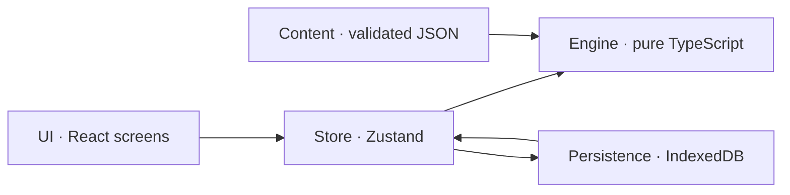
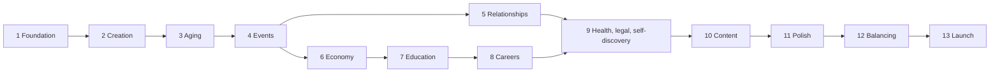

# WIPlife — Technical Plan, Part 2

**Status:** Complete draft (all 4 batches), ready for review.

| Batch | Contents | Status |
|---|---|---|
| 1 | M. Technical architecture · N. Data model | Done |
| 2 | O. Roadmap overview · P. Stage gates, stages 0–5 | Done |
| 3 | P. Stage gates, stages 6–14 | Done |
| 4 | Q. Testing strategy · Content pipeline · R. Future expansion · Open questions | Draft for review |

---

## M. Technical Architecture

### Summary

WIPlife is a **static, installable web app with no server**. Everything runs on the player's device. That follows directly from the design decisions: the game is free, has no accounts, saves locally, and has no sharing in version 1. There's nothing to host except files, which keeps it cheap, fast and simple for a coding AI to work on.



The engine never talks to the UI or to storage directly. The store is the only bridge between the engine, the UI and saving.

### Stack

| Layer | Choice | Why |
|---|---|---|
| Language | TypeScript, strict mode | Types catch mismatches between content and engine; coding AIs work more reliably with them |
| Build | Vite | Fast, simple static output |
| UI | React | Most widely known; coding AIs are strongest with it |
| Styling | Tailwind CSS | Quick mobile-first layouts, design tokens, dark mode |
| UI state | Zustand | Small, simple bridge between engine state and screens |
| State updates | Immer | Readable, safe immutable updates inside the engine |
| Validation | Zod | Checks content files and save files |
| Content format | YAML, compiled to JSON at build | Readable multi-line event text; the build step also validates |
| Storage | IndexedDB via Dexie | More room and reliability than localStorage |
| Offline and install | vite-plugin-pwa | App manifest and service worker |
| Tests | Vitest (engine and units), Playwright (phone-sized end-to-end) | Standard, fast |
| Hosting | Cloudflare Pages or Netlify | Free static hosting with preview links |
| CI | GitHub Actions | Runs every check on every change |

**Not included, on purpose:** backend, database server, authentication, payments and ads. Analytics are also left out of the MVP; if they're added later, they should be cookieless and aggregate only.

### Folder structure

```text
wiplife/
  AGENTS.md              rules for coding AIs (from brief section 14)
  src/
    engine/              pure TypeScript: no React, no DOM, no Math.random
      rng.ts             seeded random number generator
      life.ts            createLife, beginYear, endYear
      systems/           aging, education, career, economy, health,
                         relationships, legal, pacing, selfDiscovery
      events/            eligibility, selection, casting, outcomes, effects/
      conditions.ts      condition language evaluator
      text.ts            template and pronoun renderer
      actions/           management actions (apply, quit, move...)
      selectors.ts       read-only helpers for the UI
      invariants.ts      sanity checks used in dev and tests
    content/             data only, written as YAML
      events/            one folder per life stage
      jobs/ majors/ trades/ grad/ cities/ conditions/ offenses/ names/
      schemas/           Zod schemas for every content type
    store/               Zustand store; calls engine, triggers saves
    persistence/         Dexie database, save/load, migrations, export/import
    ui/
      screens/           one folder per screen
      components/        shared UI pieces (cards, bars, buttons, sheets)
      theme/             design tokens
  tools/
    build-content.ts     compiles YAML to JSON and validates it (runs in CI)
    simulate.ts          runs thousands of lives headless
  tests/                 end-to-end tests
```

### Engine rules

1. **Pure and serializable.** The engine is plain functions over plain JSON data. It never imports React or touches the browser.
2. **All randomness is seeded.** A seeded generator (sfc32) stores its internal state inside the life, so saving and reloading continues the exact same random sequence. `Math.random` and `Date.now` are banned in the engine by a lint rule.
3. **Replayable.** Given the same seed, content version and inputs, a life plays out identically. Every player input (age-ups, choices, management actions) is recorded in the life's input log, so any life can be replayed step by step to reproduce a bug.

### Engine API

| Function | What it does |
|---|---|
| `createLife(options, content)` | Builds a new life from random or custom options |
| `beginYear(state, content)` | Runs the yearly systems and fills the queue of pending events |
| `resolveChoice(state, instanceId, choiceId, content)` | Applies the player's choice to one pending event |
| `endYear(state, content)` | Checks for death, writes the year to history, prepares the recap |
| `performAction(state, actionId, params, content)` | Handles management actions (apply, quit, move, break up...); may queue events |
| `selectors.*` | Read-only helpers, such as `getAvailableActions(state)` |

Because a year is split into begin, choices and end, the game can be saved and reloaded in the middle of a year without losing pending events.

### Year pipeline

`beginYear` runs these steps in a fixed order:

1. Increase age and update life stage.
2. Age NPCs, and check whether any die.
3. Legal (Stage 9): release from prison when the sentence is served, prison's toll on stats, the end of probation, and now and then a probation event.
4. Education: update GPA, handle graduation or dropping out.
5. Career: set performance, then check for promotion, raise or firing.
6. Economy: run the yearly ledger.
7. Health: progress conditions and roll for new ones.
8. Relationships: apply drift.
9. Self-discovery: grow inner conflict and check whether latent traits surface.
10. Pacing director: queue due scheduled events first, then pick new events.

After the player resolves every pending event, `endYear` runs the death check (age, Health and genetic risk, plus each health condition's own chance), writes history, builds the recap and triggers an autosave.

**Prison is a reduced year (Stage 9).** The legal step comes before school and work, so a release opens them again in the same year. While you're in prison the same steps run with less to do: no school, no job or gig work and no job openings, no housing or living costs (debts still grow), no discoveries surfacing, and the pacing director picks from prison events only (a prison budget from `balance/legal.yaml`); follow-ups that fall due inside wait for your release. Only a few actions are available (paying debts, a debt plan, editing your identity; on a person's page, breaking up, divorcing, cutting contact and reconciling).

### Event engine internals

- **Indexing.** On load, events are grouped by life stage and category, so the engine only checks relevant events. This keeps it fast with thousands of events.
- **Eligibility.** Each event's `requires` condition is evaluated against the current state.
- **Weighting.** Base weight times modifiers. Events on cooldown, or one-time events that already fired, get weight zero.
- **Selection.** The pacing director sets how many events this year. Due scheduled events go first, then a weighted random pick without repeats. The picked events are ordered so their tones fit together.
- **Casting.** Each role in an event is filled with an existing person who fits, or a newly generated one.
- **Effects.** Each effect type (stat, money, relationship, memory, flag, schedule, job, education, legal, health, identity, history, death) has its own handler. Adding a new effect type means adding one handler and one schema, without touching existing events.
- **Chance checks.** A choice can roll against weighted stats, with the success chance clamped between 5% and 95%, leading to a success or failure outcome.

### Condition language

Conditions are structured data, not text formulas. They're safer, and the content validator can check them. This replaces the text shorthand in Part 1's event example (which has been updated to match).

```json
{ "all": [
  { "age": { "gte": 18 } },
  { "trait": "kindness", "gt": 60 },
  { "any": [ { "flag": "has_car" }, { "city": "nyc" } ] },
  { "not": { "record": "felony" } },
  { "memory": { "role": "npc", "tag": "lent_money" } }
]}
```

### Text templates and pronouns

- The player is always "you." Event text can also use `{self.they}` and the other forms (Stage 9), for what others say about you; they follow your pronouns as they are now.
- Event text values: `{age}`; from Stage 9 `{talent}`, `{latentPeople}`, `{latentGender}`, `{latentExpression}`, `{latentTrait}` (self-discovery) and `{sentence}` (what a court just handed down, only in an outcome with a legal effect).
- NPC fields use a role name: `{npc.name}`, `{npc.they}`, `{npc.them}`, `{npc.their}`, `{npc.theirs}`, `{npc.themself}`. Capitalized versions like `{npc.They}` start a sentence.
- Verb agreement: `{npc:is|are}` and `{npc:swears|swear}` pick the form that matches the NPC's pronouns.
- The obituary uses `{self.they}` and the other forms for the player character.
- The content validator checks that every placeholder matches a declared cast role.

### Persistence

- **Database tables:** `lives` (the active life), `backups` (the last two autosaves), `archive` (one entry per finished life), `settings`.
- **Autosave** runs after every engine call.
- **Save envelope:** `{ schemaVersion, contentVersion, savedAt, data }`. Older saves are upgraded by migration functions that run in order.
- **Loading** validates the save with Zod. If it's invalid, the game tries the backup. If that fails too, it offers to export the raw data and start a new life.
- **Protection against browser cleanup.** The game requests persistent storage when the first life starts, and suggests installing to the home screen at a natural moment (for example, after the first life ends).
- **Archive entries** are stored in their own envelope with their own schema version and migration list, separate from the active life's. Moving a life into the archive removes the active life and its backups in the same transaction, so an archived life can never load again as active.
- **Export and import:** a single JSON file containing the active life, the archive and settings.

### Content loading and updates

- Content is written as YAML. `npm run content` compiles it to JSON and validates it; this runs in CI and when the dev server starts. The app only ever loads the compiled JSON. The YAML 1.2 parser is used, so values like `no` or `on` aren't accidentally read as true or false.
- Examples in these documents are shown as JSON; the same structure is written in YAML.
- Every save records the content version. If an update removes an event that a save still has scheduled, the engine skips it and logs a warning instead of crashing.

### Error handling

- `assertInvariants(state)` runs in development and tests. It checks things like stats within 0–100, no invalid numbers for money, and no dead person listed as a current partner.
- A UI error boundary offers "Restore last autosave" instead of a blank screen.

### Performance targets

- `beginYear` under 10 ms on a mid-range phone with 1,000 events loaded.
- First load under 2 seconds on 4G.

### Mobile

- Uses the full dynamic viewport height and respects safe areas (notches and home bars).
- Nothing depends on hover.
- Touch targets are at least 44px.
- Respects the reduced-motion and dark mode settings.
- Portrait first. On tablet and desktop, the game shows as a centered column.

### Deployment

The main branch deploys to production. Every pull request gets a preview link. CI runs the type check, lint, unit tests, content validation and a short simulation run, and blocks the merge if any fail.

### Built for coding AIs

- `AGENTS.md` at the root holds the coding rules from the brief, the architecture boundaries and the common commands.
- Lint rules enforce the boundaries (no React in the engine, no unseeded randomness).
- Each system is a small module with its own tests.

---

## N. Data Model

Money is stored as whole dollars (integers). Stats are integers from 0 to 100.

### Saved state (changes during play)

```ts
interface SaveEnvelope {
  schemaVersion: number;
  contentVersion: string;
  savedAt: string;
  data: LifeState;
}

interface LifeState {
  id: Id;
  seed: string;
  rng: RngState;                       // continues across saves
  birthYear: number;
  currentYear: number;
  phase: 'yearStart' | 'events' | 'yearEnd' | 'dead' | 'action';
                                       // 'action': between years, a management action's result event
                                       // waits for the player (Stage 5); finishAction returns to 'yearStart'
  character: Character;
  people: Record<Id, Person>;
  relationships: Record<Id, Relationship>;   // keyed by person id
  education: EducationState;
  career: CareerState;
  finances: FinanceState;
  housing: HousingState;
  health: HealthState;
  legal: LegalState;
  flags: Record<string, number | boolean | string>;
  eventLog: Record<Id, { count: number; lastYear: number }>;
  scheduled: ScheduledEvent[];
  pending: EventInstance[];
  history: HistoryEntry[];
  inputLog: InputRecord[];             // every player input, for exact replay; written by the engine
  recap: YearRecap | null;             // the current or last finished year; null before the first age-up
  death: DeathRecord | null;           // set in the 'dead' phase, or in 'yearEnd' when an event killed the
                                       // character and endYear has yet to close the life
  lifetime: { happinessTotal: number; years: number };  // happiness over finished years (obituary mood)
  will: Will | null;                   // E2b: who the estate goes to, as percentage shares
  estate: Settlement | null;           // E2b: how the estate was settled; set at death
  lineage: Lineage;                    // E2b: generation, the parent's life, the family line, reputation, deeds
}

interface Will { shares: { kind: 'person' | 'cause'; id: Id; percent: number }[]; year: number }  // shares add up to 100

interface Lineage {
  generation: number; parentLifeId?: Id;
  lineId: Id;                          // the first life's id, kept by every heir
  familyName: string;
  reputation: number;                  // what the family is known for, 0–100 (50 unremarkable)
  deeds: string[];                     // the deeds it is known for (newest last)
  previously?: { parentName: string; lines: string[] };  // an heir's card, until their first age-up
}

interface YearRecap {
  year: number; age: number;
  statsBefore: Character['stats'];     // when beginYear started
  statsAfter: Character['stats'] | null;  // set by endYear; null mid-year
}

interface DeathRecord { year: number; age: number; causeId: Id }  // cause from content/causes

interface InputRecord {
  year: number;
  kind: 'create' | 'ageUp' | 'choice' | 'action';
  payload: Record<string, unknown>;    // e.g. { instanceId, choiceId } or { actionId, params }
}
```

The input log is written by the engine, not the store: each engine function that takes a player input (`createLife`, and later age-ups, choices and actions) appends its own record, so a life can never be changed without its input being logged.

#### Character

```ts
interface Character {
  name: { first: string; last: string };
  age: number;
  lifeStage: 'early' | 'child' | 'teen' | 'youngAdult' | 'adult' | 'senior';
  identity: Identity;
  latent: {                           // hidden traits that may surface
    identity?: Partial<Identity>;
    personality?: Partial<Personality>;
  };
  appearance: { descriptors: string[] };
  stats: { health; happiness; smarts; looks; fitness; stress };
  personality: Personality;
  hidden: {
    luck; reputation; geneticRisk; vice; innerConflict;
    happinessBaseline;                 // C1: Happiness drifts toward it each year (balance/aging.yaml happinessDrift)
    talent: TalentId | null;
    talentDiscovered: boolean;
  };
  cityId: Id;                          // the city you live in now
  birthCityId: Id;                     // where you were born; never changes (Stage 6)
  familyWealth: 'poor' | 'working' | 'middle' | 'affluent' | 'rich';
  custom: boolean;
}

interface Personality {
  ambition; confidence; kindness; riskTaking; discipline; sociability;
}

interface Identity {
  genderIdentity: string;             // free text, e.g. "woman", "genderfluid"
  genderCategory: 'man' | 'woman' | 'nonbinary';  // used for attraction matching
  genderExpression: string;           // free text
  pronouns: Pronouns;
  attractedTo: ('man' | 'woman' | 'nonbinary')[];  // empty = not attracted to anyone
}

interface Pronouns {
  subject: string; object: string; possessive: string;
  possessivePronoun: string; reflexive: string;
  verbPlural: boolean;                // true for "they are"
}
```

Gender identity and expression are free text so players can write anything. The separate `genderCategory` field (confirmed) lets romance match people by attraction. Custom characters pick the category that fits best.

#### People and relationships

```ts
interface Person {
  id: Id;
  name: { first: string; last: string };
  birthYear: number;
  alive: boolean;
  deathYear?: number;
  identity: Identity;
  traits: Partial<Personality>;
  looks: number;
  smarts: number;
  cityId: Id;
  occupation?: string;
  tags: string[];                      // 'coworker', 'classmate', 'neighbor'
}

interface Relationship {
  personId: Id;
  kind: 'parent' | 'stepparent' | 'sibling' | 'grandparent' | 'friend'
      | 'partner' | 'fiance' | 'spouse' | 'ex' | 'coworker' | 'boss'
      | 'classmate' | 'acquaintance' | 'child' | 'stepchild';   // E2a; heir play (E2b) is not built
  status: 'active' | 'estranged' | 'ended';   // 'ended': faded out of your life (pruned)
  affection: number;
  trust: number;
  memories: { tag: string; year: number }[];
  since: number;
  kindSince?: number;                  // year it took its current kind (started dating, married...)
  lastActionYear?: number;             // last management action with this person (one per year)
  wasSpouse?: true;                    // has been your spouse; stays after a divorce (an "Ex-spouse")
}
```

Design H's statuses map onto kind and status: dating is `partner`, engaged is `fiance`, married is `spouse`, an ex is `ex`, and estranged is status `estranged`. A current partner is a living `partner`, `fiance` or `spouse` whose status is `active`; there is never more than one. A spouse who dies keeps the kind `spouse` (a late spouse), so the obituary can name them. The engine sets `wasSpouse` whenever someone becomes your spouse, and every spouse must have it; after a divorce it tells an ex-spouse from an ex you only dated (for the obituary, events about an ex-spouse, and co-parenting later). Save schema version 4 added it: the upgrade from version 3 marks every spouse, and every ex whose memories show the marriage (`married_you` or `divorced`).

#### Education, career and money

```ts
interface EducationState {
  current: Enrollment | null;          // the program you're in now (Stage 7)
  credentials: {
    type: 'hs_diploma' | 'ged' | 'associate' | 'bachelor' | 'trade_license' | 'grad';
    refId?: Id; year: number;          // refId: the major, trade or grad program
    gpa?: number; tier?: 'community' | 'state' | 'elite';   // final GPA; a college degree's tier
  }[];
  admission: null | (SchoolPlace & {   // a place you take up as the next year begins
    scholarship: number; decided: number;
    resume?: { year; lengthYears; gpa; repeats };   // going back to a program you left
  });
  left: null | (Enrollment & { leftYear: number });   // the last program left unfinished (you can go back)
  applied: { option: string; accepted: boolean }[];   // this year's applications, GED tries and major change
  fund: number;                        // scholarship money from events; pays tuition until used up
  lastBill?: { year; tuition; scholarship; family; fund; loan };   // tuition = scholarship + family + fund + loan
}

interface SchoolPlace {
  program: 'elementary' | 'middle' | 'high' | 'college' | 'trade' | 'grad';
  tier?: 'community' | 'state' | 'elite';
  majorId?: Id; tradeId?: Id; gradProgramId?: Id;
}

interface Enrollment extends SchoolPlace {
  year: number; lengthYears: number;
  gpa: number;                         // 0–4, average of the years graded; shown as a letter grade
  boost: number;                       // GPA points events added to this year's grade
  repeats: number;                     // years held back (high school only)
  scholarship: number;                 // share of tuition scholarships cover, set at admission
  since: number;
}
```

A school year starts as a year begins (you enroll and pay tuition) and is graded as the next one begins, so the year's events shape its grade. Elementary, middle and high school follow on their own from the start age; high school ends as you turn 18, or 19 after being held back once. Tuition is paid through the Stage 6 debt system: scholarships (merit by GPA, need by family wealth) and family help take their share, scholarship money from events pays what it can, and the rest joins your student loan (one `student` debt). Student loan payments pause while you're in college, trade school or grad school (interest still grows). Gig pay is halved while you're enrolled in college, trade school or grad school (`studentGigShare` in `balance/education.yaml`; `gigPay` in the career module applies it). Save schema version 6 added `admission`, `left`, `applied`, `fund` and `lastBill`; the upgrade from version 5 gives an adult the high school diploma they would have earned at 18 (without a GPA).

Careers (Stage 8): each year (from the hiring age) and whenever you move city, each job track is hiring in your city with a chance set by the city's job market for its category (`openings`). Job search lists only openings you qualify for. You can apply while you're out of school, or in the final year of a program (its credential counts; the job falls through if your plans change before you finish). The employer decides by the balance odds (category base, Confidence, Looks, Smarts, reputation, luck, experience in the track, degree tier, a criminal record, the city's market), and the interview is a result event from `registries/work.yaml`. Hired between years, your first year of pay is the next year's ledger; the yearly review comes after a full year worked: performance (the job's stat weights, stress, health, a swing, part of last year's), then a layoff (by market), firing (by performance), a promotion (by performance and Ambition, after a level's minimum years) or a merit raise. Salaries are a level's base salary × the city's salary multiplier, capped above the level's pay for raises. The year you lose a job at the review you're still paid a share of it (`jobLoss`). Gig work and a job don't mix; school and a job don't either (the job ends when school starts). You can quit, ask for a raise once a year (a result event with a stat check), and retire from `retireAge`. Moving city ends the job. Your boss and coworkers are people (relationship kinds `boss` and `coworker`); your current boss is never pruned; when the job ends they become acquaintances. Save schema version 7 added `since`, `employer`, `raiseYear`, the history's `employer`, `level` and `salary`, `applied` and `openings`; nobody could have a job before, so the upgrade from version 6 only adds empty applications and openings.

```ts
interface CareerState {
  job: null | { jobId: Id; level: number; yearsAtLevel: number; performance: number; salary: number;
                since: number;                 // the year you were hired; your first year of pay is the next one
                employer: string;              // a fictional employer from the job's content
                raiseYear?: number };          // the last year you asked for a raise (Stage 8)
  gig: boolean;
  retired: boolean;
  history: { jobId: Id; employer: string; fromYear: number; toYear: number;
             level: number; salary: number;   // when it ended (Stage 8)
             endedBy: 'quit' | 'fired' | 'laid_off' | 'retired' | 'moved' }[];
  applied: { jobId: Id; hired: boolean }[];   // this year's job applications (Stage 8)
  openings: Id[];                      // job tracks hiring in your city this year (Stage 8)
}

interface FinanceState {
  savings: number;                     // never below zero: shortfalls become personal debt
  debts: Debt[];
  lifestyle: 'frugal' | 'comfortable' | 'lavish';
  lastLedger?: { year; gross; retirement; tax; housing; living; debtPayments; interest; debtInterest;
                 borrowed; support; net };   // net = gross + retirement + interest − tax − housing − living − debtPayments
  earnings: { years: number; total: number };  // the retirement benefit's record: years with earned income
                                       // (at least creditIncome) and their total (each year capped). The ledger
                                       // records all earned income (gig pay and salaries) here
  hardshipYears: number;               // years in a row behind on housing costs (eviction)
  bankruptcyYear?: number;
  debtPlanYear?: number;
}

interface Debt {
  id: Id;
  kind: 'student' | 'personal' | 'mortgage' | 'medical' | 'collections';
  balance: number; annualRate: number; minPayment: number;
  missed: number;                      // missed payments in a row
}
```

#### Housing, health and legal

```ts
interface HousingState {
  kind: 'with_parents' | 'renting' | 'owned' | 'homeless' | 'incarcerated';
  cityId: Id;                          // always character.cityId
  annualCost: number;                  // the ledger's housing line (a mortgage is paid as a debt)
  homeValue?: number;
  mortgageDebtId?: Id;
  since: number;                       // the year you moved in (Stage 6)
  roommate?: true;                     // renting with a roommate (Stage 6)
  partnerId?: Id;                      // your partner or spouse living with you (renting or owned); they pay
                                       // economy.housing.partnerShare of the rent or upkeep; cleared when the
                                       // romance ends
  rentFactor?: number;                 // C1: a rental's rent as a multiple of the city's base rent after rent
                                       // changes (rent_change); within economy.housing.rentFactor; reset by a move
}

interface HealthState {
  conditions: { conditionId: Id; since: number;
                severity: number;              // 1–100 (Stage 9); a condition at 0 is gone
                treated: boolean }[];
  lastVisit?: number;                  // the last year you saw a doctor (once a year; Stage 9)
}

interface LegalState {
  record: { offenseId: Id; year: number; outcome: 'warning' | 'fine' | 'probation' | 'jail';
            amount?: number; years?: number }[];   // a fine's amount; years of probation or prison (Stage 9)
  probationUntil?: number;             // the last year of probation
  incarceratedUntil?: number;          // the last year inside; released as the next year begins
}

interface DiscoveryState {             // Stage 9
  surfaced: Partial<Record<'attraction' | 'gender' | 'expression' | 'personality' | 'talent',
                           { year: number; times: number }>>;   // came to the surface: last year, how often
  crisisYear?: number;                 // the last inner crisis
}
```

Health, legal and self-discovery (Stage 9). Health conditions are content (`ConditionDef`): each year a condition runs its course (severity moves by its untreated or treated rate; at 0 it is gone), pulls on stats by its severity (treatment softens it), costs money (medication through medical debt, an addiction's habit as ordinary spending), and new ones start by their onset chance (age curve × factors such as genetic risk, Fitness, vice or stress, while their requirements hold, up to `maxConditions`). An untreated addiction raises vice each year; treatment lowers it (vice escalation). Seeing a doctor (More → Health, once a year, not from prison) costs a visit plus treatment, paid through the debt system as medical debt (a child's family pays), treats each treatable condition with a chance by its severity, eases untreatable ones, or is a checkup that does Health a little good; its result is an event from `registries/health.yaml`. Each condition adds its own yearly chance of death (mortality × severity, less when treated), and a death from it records its cause. The `legal` effect puts an offense on your record: the court decides (`sentence`: the offense's likely outcomes, ×`priorRecord` for each earlier entry, ×`juvenile` before the independence age) or the event does. A fine is paid (debt for what savings can't cover), probation keeps you from moving city, and jail sends you to prison: your job ends (`jailed`), you leave school, and housing is `incarcerated` until `incarceratedUntil`. A home you own stays yours (housing keeps its value, mortgage and live-in partner while `incarcerated`): its mortgage and upkeep keep running through the ledger, a partner who lives there pays their share as usual, and missed payments follow the usual foreclosure chain (a foreclosure inside leaves you with no home to return to). A rental's lease ends, and a partner who lived there stays behind. You are released to a home you still own, else a parent, a rental or the street, then on parole. A minor never goes to prison (jail becomes probation). A conviction (not a warning) counts against you when hiring, probation or prison makes landlords ask a larger deposit, and a record that breaks your job's requirements costs you the job. From the independence age, offenses from before it stop counting for hiring (job requirements included) and renting; they stay on the record, in life history and in event conditions. Self-discovery: each year a latent trait (or a hidden talent) can surface from its minimum age (registries/discovery.yaml), at most one a year and never in prison; a trait you know about and haven't accepted grows inner conflict (more for each time it came back), which raises Stress and lowers Happiness and fades when you hold nothing back; a trait you pushed down comes back after `afterYears`, more likely the higher your inner conflict, and at high conflict a crisis can come instead. Accepting takes the latent trait (`identity` effects with `fromLatent`), clears it and eases inner conflict; accepting usually schedules a coming-out event (family reactions by affection and trust; "Not yet" is always a choice). "Try it and decide" events cast an `admirer` (an adult attracted to you, of a gender you're not attracted to yet) and are romance events, so the Stage 5 adults-only rule blocks them for anyone under 18. Finding a hidden talent applies its boosts and helps job performance in the jobs it lists. The Profile sheet (from the Home header) edits pronouns, gender identity (and its category, used for matching) and expression at any age, between years: it takes effect at once, an edit that matches a latent trait clears it and eases inner conflict, and a coming-out event is queued for next year only when the player asks. Save schema version 8 added `discovery` (the upgrade from version 7 adds an empty one), `lastVisit`, a record entry's `amount` and `years`, and the job end `jailed`.

#### Events, history and archive

```ts
interface EventInstance {
  instanceId: Id;
  eventId: Id;
  cast: Record<string, Id>;            // role name -> person id
  resolvedChoiceId?: Id;
  outcomeText?: string;
  since?: number;                      // C1: a follow-up: the year the event that scheduled it happened ({since})
  money?: { change: number; balance: number; debtChange: number;   // C1: what the chosen outcome did to your
            familyHelp?: number; housing?: { change: number; annual: number } };  // money, for the outcome card
}

interface ScheduledEvent { eventId: Id; dueYear: number; cast: Record<string, Id>; since?: number }

interface HistoryEntry {
  year: number; age: number; text: string;
  tags: string[]; importance: 1 | 2 | 3; legendary?: boolean;
}

interface ArchivedLife {
  id: Id; name: string; pronouns: Pronouns;
  birthYear: number; deathYear: number; ageAtDeath: number;
  causeOfDeath: string | null;         // readable text; null when unfinished
  unfinished: boolean;                 // a new life was started before this one ended;
                                       // deathYear and ageAtDeath then give when it was left
  cityId: Id;                          // where the life ended
  birthCityId: Id;                     // where it began (archive schema version 2)
  obituary: string;
  highlights: HistoryEntry[];
  finalNetWorth: number;
  finalStats: Character['stats'];
  seed: string; generation: number; parentLifeId?: Id;
  lineId: Id; familyName: string;      // E2b: the family line (archive schema version 3)
  familyReputation: number;            // the line's reputation when this life ended
  heirName?: string;                   // the heir who carried on from it
}

interface Settings {
  ageConfirmed: boolean;
  theme: 'system' | 'light' | 'dark';
  persistRequested: boolean;
  installPromptShown: boolean;
}
```

### Content definitions (bundled with the app, never saved)

```ts
interface EventDef {
  id: Id; title: string; text: string;
  tone: 'light' | 'neutral' | 'serious' | 'dark';
  category: string;
  rarity: 'common' | 'uncommon' | 'rare' | 'legendary';
  lifeStages: LifeStage[];
  requires?: Condition;
  weight: { base: number; modifiers?: { if: Condition; x: number }[] };
  cooldownYears?: number;
  once?: boolean;
  recurring?: true;                    // C1: meant to come back; other events are repeatWeight less likely each
                                       // time they come back (balance/events.yaml)
  justified?: { time?: string; money?: string; past?: string };   // C1: reviewed content-build warnings kept, with why
  followUpOnly?: boolean;              // only happens when scheduled (later steps of a chain)
  cast?: Record<string, CastSpec>;     // how to find or create each role
  choices?: ChoiceDef[];               // none = automatic outcome
  autoOutcome?: Outcome;
}

interface CastSpec {
  kind?: RelationshipKind;             // who fills the role: an existing person with this relationship...
  age?: { min; max };                  // ...of this age,
  ageOffset?: { min; max };            // ...or this age relative to yours
  createIfMissing?: boolean;           // create someone new if nobody fits (friend, classmate, acquaintance only)
  newChance?: number;                  // chance of someone new even when someone fits
  romantic?: boolean;                  // the meeting pool: an adult with attraction both ways, never family;
                                       // someone new is of a plausible age for yours (balance/relationships.yaml meeting)
  support?: boolean;                   // instead of kind: the most trusted close person who would step in
  admirer?: boolean;                   // Stage 9: an adult attracted to you, of a gender you're not attracted to
                                       // (yet; leaning toward a latent one): "try it and decide". A romance role
  optional?: boolean;                  // nobody fits: the event happens without this role
  presence: 'household' | 'city' | 'nearby' | 'elsewhere' | 'anywhere';
                                       // C1, required: where the person must be. household: lives with you (a
                                       // partner you live with; parents and young siblings while you live with your
                                       // parents); city: in your city, not with you; nearby: either; elsewhere:
                                       // another city. Nobody new is created for household
}

interface ChoiceDef {
  id: Id; label: string;               // 'continue' is reserved for events without choices
  visibleIf?: Condition;               // e.g. only for risk-takers
  outcome?: Outcome;
  check?: {
    stats: ({ key: string; weight: number }                        // your stat, trait or hidden value
          | { role: string; key: 'affection' | 'trust'; weight: number }  // how a cast person feels about you
          | { job: 'performance'; weight: number })[];   // your job performance; 50 without a job (Stage 8)
    base: number;
    success: Outcome;
    failure: Outcome;
  };
}

interface Outcome { text?: string; effects: Effect[] }

type Effect =
  | { type: 'stat'; key: string; delta: number }
  | { type: 'money'; delta: number }   // Stage 6: a cost beyond savings becomes personal debt (adults)
  | { type: 'rentMonths'; months: number }   // C1: money worth that many months of your housing cost
  | { type: 'cost'; item: Id }         // C1: a cost item (balance/economy.yaml costs, scaled by city), less
                                       // family help (economy.familyHelp); the rest from savings, then debt
  | { type: 'moveAway'; role: string } // C1: that person moves to another city (not someone who lives with you)
  | { type: 'debt'; action: 'add' | 'forgive' | 'bankruptcy' | 'plan'; kind?; amount?; kinds?; share? }
  | { type: 'housing'; action: 'move_home' | 'rent' | 'homeless' | 'roommate' | 'live_alone' | 'sell'
                     | 'move_in_together' | 'rent_change'; role?: string; percent?: number }
                                       // role: the partner who moves in; percent (rent_change, C1): of the current rent
  | { type: 'relationship'; role: string; affection?: number; trust?: number; status?: string; kind?: string }
  | { type: 'memory'; role: string; tag: string }
  | { type: 'flag'; key: string; value: number | boolean | string }
  | { type: 'schedule'; eventId: Id; inYears: [number, number]; cast?: string[] }
  | { type: 'job'; action: 'performance' | 'raise' | 'promote' | 'fire' | 'quit' | 'offer'; value?: number; jobId?: Id }
      // Stage 8: performance moves job performance by value (−50 to 50); raise gives the asked-for raise
      // (balance careers.yaml raises.asked); promote goes up a level; fire and quit end the job; offer
      // takes job track jobId if you could (old enough, out of school or in its final year, qualified).
      // All but offer need a job.
  | { type: 'education'; action: 'grades' | 'scholarship' | 'drop_out' | 'expel'; value?: number }
      // Stage 7: grades adds value GPA points (−1 to 1) to this school year's grade; scholarship adds value
      // dollars of scholarship money; drop_out and expel leave high school (from the dropout age; the content
      // build requires that age), college, trade school or grad school
  | { type: 'legal'; offenseId: Id; outcome: string; years?: number }
  | { type: 'health'; conditionId: Id; severity: number }
  | { type: 'identity'; field: string; value: 'fromLatent' | string }
  | { type: 'innerConflict'; delta: number }
  | { type: 'history'; text: string; importance: 1 | 2 | 3 }
  | { type: 'death'; cause: Id };       // a cause from content/causes

// Stage 4 builds these effect types: stat, money (savings only; never below zero), relationship,
// memory, flag, schedule (inYears of at least 1), history and death. The rest arrive with their systems.
// Stage 6: debt and housing effects are adults only (ignored before the independence age; the content
// build requires an adult age or adult life stages).
// Stage 5: a relationship effect's kind change is checked by the engine (adults only, one partner at a
// time, dating before an engagement, family stays family); a change that breaks a rule is ignored.
// Stage 9: legal (outcome warning, fine, probation, jail or 'sentence': the court decides; years for
// probation or jail), health ({ conditionId, severity?: −100..100, treated?: boolean }), identity (field
// attraction | gender | expression | pronouns | personality; value 'fromLatent', 'withRole' with a role
// for attraction, a pronoun preset id, or free-text expression), innerConflict and talent ({ type: 'talent' }:
// you find your hidden talent). An outcome's text is written after its effects, so it can use {sentence}.

type Condition =                       // structured, evaluated by src/engine/conditions.ts
  | { all: Condition[] } | { any: Condition[] } | { not: Condition }
  | { age: Compare } | { lifeStage: LifeStage[] } | { money: Compare }
  | { stat: StatKey } & Compare | { trait: PersonalityKey } & Compare | { hidden: 'luck' | 'reputation' | 'vice' } & Compare
  | { city: Id } | { familyWealth: FamilyWealth[] } | { flag: string; eq?: number | boolean | string }
  | { fired: EventId } | { relative: { kind: RelationshipKind; alive?: boolean } }
  | { romance: ('single' | 'dating' | 'engaged' | 'married')[] }   // your current situation
  | { finances: { debt?: Compare; missed?: Compare; collections?: boolean; kinds?: DebtKind[];
                  lifestyle?: Lifestyle[]; gig?: boolean; bankruptWithin?: number; planWithin?: number;
                  income?: Compare } }                         // Stage 6
  | { home: { kind?: HousingKind[]; years?: Compare; roommate?: boolean; relocated?: boolean; partner?: boolean } }
  | { education: { program?: (Program | 'none')[]; tier?: Tier[]; major?: Id[]; trade?: Id[]; year?: Compare;
                   final?: boolean; gpa?: Compare; credential?: CredentialType[]; left?: boolean; admission?: boolean;
                   field?: Id[] } }   // Stage 7; field (Stage 8): a credential (of a type in credential) in one of these majors, trades or grad programs
  | { career: { employed?: boolean; job?: Id[]; level?: Compare; years?: Compare; performance?: Compare;
                retired?: boolean; lostWithin?: number } }    // Stage 8; lostWithin: fired or laid off within this many years
  | { record: { outcome?: ('warning' | 'fine' | 'probation' | 'jail')[]; within?: number } }
      // Stage 8: an entry on your criminal record (records arrive in Stage 9); { record: {} } is any record
  | { health: { conditions?: Id[]; treated?: boolean; severity?: Compare } }      // Stage 9: one condition matching all
  | { legal: { incarcerated?: boolean; probation?: boolean } }                    // Stage 9
  | { discovery: { latent?: LatentKind[]; known?: LatentKind[]; innerConflict?: Compare;
                   talent?: 'hidden' | 'found' | 'none' } }   // Stage 9; known: surfaced and not accepted
  | { memory: { role: string; tag: string } }       // about cast roles: checked once the event is cast
  | { role: string; alive?: boolean; age?: Compare; affection?: Compare; trust?: Compare;
      kind?: RelationshipKind[]; status?: RelationshipStatus[]; years?: Compare;   // years: in its current kind
      where?: ('household' | 'city' | 'elsewhere')[] };   // C1: where the person is now
// Compare = { gt?, gte?, lt?, lte?, eq? }
```

The other content types follow the same pattern:

| Type | Key fields |
|---|---|
| `JobDef` | id, name, category (professional, trade, gig), blurb, requires (condition: degrees and their fields, licenses, age, criminal record), levels (3–6: title as in a sentence, base salary, optional minimum years before promotion), performance (stat weights), employers (fictional). The gig category is hourly and service work anyone can get, with a short ladder; plain gig work (Stage 6) stays the no-ladder fallback |
| `MajorDef` | id, name, subject, blurb, careers (text), difficulty (1–5). Jobs point at majors (Stage 8), not the other way round |
| `TradeDef` | id, name, subject, license, blurb, careers (text), years, difficulty |
| `GradProgramDef` | id, name, subject, degree, blurb, careers (text), years, difficulty, majors (a bachelor's in one of these; any when left out). Tuition and admission odds live in `balance/education.yaml` |
| `CityDef` | id, countryId (always "us" for now, so more countries can be added later), name, cost-of-living multiplier, base rent, base home price, salary multiplier, job market strength by category, school names by program (Stage 7) |
| `ConditionDef` | id, name, noun, kind (illness, chronic, injury, mental, addiction), blurb, onset (chance by age, factors, requires, starting severity), course (severity per year untreated and treated), effects (stat pulls at full severity), treatable, costs (treatment, yearly treated, yearly untreated), mortality (extra yearly chance of death at full severity), cause |
| `OffenseDef` | id, name, class (misdemeanor or felony), severity (1–5), likely outcomes (weights for warning, fine, probation, jail), fine range, probation years, jail years |
| `NamePool` | first names by gender category, last names |

### Which systems write and read each part

| Data | Written by | Read by |
|---|---|---|
| Character stats | Events, health, economy (lifestyle), relationships, aging | Nearly every system |
| Personality | Creation, events (slow drift), self-discovery | Events (visibility, weights, checks), career, relationships |
| Hidden values | Creation, events, self-discovery | Events, health, career, pacing |
| Identity and latent | Creation, self-discovery, identity effects | Text renderer, relationships (matching), events |
| People | Casting, family generation, aging | UI, events, relationships |
| Relationships | Events, relationship drift, management actions | Events (conditions, casting), UI, support in crises |
| Education | Education system, events, actions | Career (requirements), events, UI |
| Career | Career system, events, actions | Economy, events, UI |
| Finances | Economy, events, actions | Events (conditions), housing, UI |
| Housing | Actions, economy (eviction), legal | Economy, events, UI |
| Health | Health system, events | Death check, career performance, events |
| Legal | Events | Career (hiring), housing, events, pacing |
| Flags and event log | Events | Events (conditions, cooldowns) |
| Scheduled and pending | Event engine | Pacing director, UI |
| Input log | Engine (each engine function records its own input) | Replay tool, diagnostic report |
| History | Event engine, systems (milestones) | Life history screen, obituary, archive |

### Ready for heir play

Heir play (E2b) is built: `lineage` records the generation and the parent's life, and when a character dies the game starts a new `LifeState` from one of their children as a `Person`, carrying over money, assets and relationships (see "E2b — Heir Play & Inheritance (as built)").

---

## Decisions from batch 1 review

1. **Content format:** YAML, compiled to JSON at build. Event text is long, and YAML is much easier to read and edit by hand. The extra build step is small, and it doubles as the validation step.
2. **Gender category for matching:** confirmed (man, woman, nonbinary), alongside free-text gender identity.

---

## O. Development Roadmap

### How the roadmap works

- **One stage at a time.** Each stage ends with something playable and has to pass its gate before the next begins.
- **The design lives in the repo.** Before Stage 1, save Part 1 as `docs/design.md` and this document as `docs/technical.md`. Every coding-AI prompt points to them.
- **Content grows with the systems.** Each stage adds the events it needs, rather than writing them all at the end.
- **The simulation runner starts early.** It arrives in Stage 4 and gets extended by every stage after that.

### Stages

| Stage | Name | After this stage, the player can... |
|---|---|---|
| 0 | Discovery | *(Planning only; done)* |
| 1 | Foundation | Open and install the app, pass the age gate, change settings |
| 2 | Character creation | Create a random or custom character and continue it after reopening |
| 3 | Time & aging | Age from birth to death, read an obituary, browse the archive, start again |
| 4 | Event engine | Make choices in events every year; see a year recap; see consequences return |
| 5 | Relationships | Build family ties, friendships and romance (adults), marry, divorce |
| 6 | Economy & housing | Manage money, lifestyle, debt, gig work, renting and moving cities |
| 7 | Education | Go through school with a GPA, then college, trade school or grad school |
| 8 | Careers | Search and apply for jobs, get promoted or fired, face workplace events |
| 9 | Health, legal & self-discovery | Face illness, see doctors, deal with crime consequences, discover identity |
| 10 | Content completion | Play through about 300 events, including secret legendary ones |
| 11 | Polish | Enjoy a finished-feeling app: animation, accessibility, visual design |
| 12 | Balancing | Play lives that feel fair and varied, backed by large simulation runs |
| 13 | Launch | Use the public, stable version |
| 14 | Post-launch | Get version 1 features: children, heir play and more |



Economy comes before education and careers on purpose. Student loans need the debt system, and salaries need the yearly ledger, so building economy first avoids a temporary money system that would have to be replaced later.

### Event content by stage

| Stage | New events | Running total |
|---|---|---|
| 4 | 40 starter events, including early-childhood family events, 3 chains and 1 legendary | 40 |
| 5 | 40 relationship events | 80 |
| 6 | 25 money and housing events | 105 |
| 7 | 35 school events | 140 |
| 8 | 40 work events | 180 |
| 9 | 40 health, crime and self-discovery events | 220 |
| 10 | 80+ events filling gaps the simulation runner finds, plus remaining legendary events | 300+ |

---

## P. Stage Gates

Each gate lists: objective, player experience, systems, data, UI, dependencies, acceptance criteria, testing, common failure modes, and a prompt for a coding AI that covers only that stage.

### AGENTS.md (created in Stage 1)

Every coding-AI prompt assumes this file exists at the repo root.

```markdown
# AGENTS.md — rules for working on WIPlife

## Read first
- docs/design.md (game design) and docs/technical.md (architecture, data model, stage gates).
- Inspect the existing code before changing anything.

## Scope
- Implement only the stage you were asked to implement. Never start the next stage.
- Do not rewrite working systems. Do not create a second system that does the same job as an existing one.
- If something is ambiguous or would change the architecture, stop and ask.

## Architecture boundaries
- src/engine is pure TypeScript: no React, no DOM, no browser APIs, no Math.random, no Date.now.
- All randomness goes through the seeded rng stored in the life state.
- Game content lives in src/content as YAML. Never hardcode events, jobs, names or other content in code or UI.
- Exception: fixed interface words for built-in values (wealth levels, relationship labels such as Mother, Father or Parent, housing types) live in one file, src/ui/labels.ts. Anything story-like belongs in content.
- Tuning numbers (rates, curves, budgets, prices, odds) live in src/content/balance as YAML, never inline in code.
- The UI reads state through selectors and changes it only through store actions that call the engine.
- Persistence code lives only in src/persistence.

## Quality
- TypeScript strict mode. No `any` without a comment explaining why.
- Validate every player input and every loaded save.
- Every new system gets unit tests. Every new screen gets a phone-sized end-to-end test.
- Run lint, type check, tests and content build before finishing. All must pass.
- Mobile first: touch targets at least 44px, respect safe areas, nothing depends on hover.

## Content rules
- Mature and taboo themes are allowed and must carry consequences. Write frankly, suggestive rather than graphic.
- No romantic or sexual content involving anyone under 18. Dating and romance are for adults only.
- Childhood mistreatment is never sexual and never graphic.
- Sexual violence is never a player choice.
- The player is "you". Use pronoun placeholders for every NPC; never hardcode he or she.

## Consistency rules (if it doesn't make sense, it doesn't happen)
- Category contracts: every event category has required conditions, enforced by the content build (school events need enrollment; work events need a current job and no retirement; partner events need a partner). See src/content/registries/categories.yaml.
- Presence: every cast role declares where the person must be (household, city, nearby, elsewhere or anywhere). Casting respects where people live and who lives with you. Never cast a live-in partner as visiting. In-person actions need the same city.
- Evidence: any text that states something about your past (a sport you played, a habit, a debt) must require the flag, memory or earlier event that proves it.
- Time: never write fixed gaps like "years later" in follow-ups. Use the elapsed-time placeholder {since}, or no time phrase.
- Money: any event or interaction that mentions money must change money, and any money change must be shown with the amount and your new balance. Amounts that depend on your situation (rent, wages, big costs) scale with it.
- Household: if you live with a partner, events about your home and wellbeing must account for them (cast them, or branch the text).
- Status-aware text: text that depends on relationship status, job or school must branch on it or require it.
- The content build warns on wording it can't judge exactly (fixed time gaps in follow-ups, money words without money effects, claims about your past without evidence). Fix each warning, or give the reason in the event's `justified` field.

## Commands
See README.md for build, test and check commands.

## Git workflow
- Branch from the latest main. Open pull requests into main only, never into another feature branch.
- One stage (or one follow-up task) per pull request. Don't bring in unrelated commits.
- A pull request merges only when CI is green.
- At the end of every stage or task, open the pull request into main yourself and report the CI result. Don't wait to be asked.

## When finished
Report what you built, any deviations from the docs and why, anything left undone, and open questions.
Only report facts you checked in the code, tests, files or CI logs. Label anything you didn't check as unverified.
```

---

### Stage 0 — Discovery

- **Objective:** Define the game and the technical plan.
- **Player experience:** None; planning only.
- **Output:** `docs/design.md` (Part 1) and `docs/technical.md` (Part 2).
- **Acceptance criteria:** Part 1 approved; Part 2 approved after batch 4.
- **Coding-AI prompt:** None, since there's no code.

---

### Stage 1 — Foundation

**Objective:** Build the project skeleton that every later stage depends on.

**Player experience:** Open the site on a phone, add it to the home screen, pass the age gate and content notice, see the title screen, and change the theme in Settings. New Life shows a "coming soon" state.

**Systems**
- Vite, React, TypeScript (strict), Tailwind, Zustand, Immer, Zod, Dexie, vite-plugin-pwa.
- Lint rules that enforce the engine boundaries.
- CI running lint, type check, tests and content build.
- Seeded random number generator (sfc32) with serializable state.
- Persistence: Dexie database, save envelope, migration framework, settings table.
- Content pipeline: YAML to JSON compile and Zod validation, proven with the five city files.
- Service worker with an "update available" prompt.
- `AGENTS.md` (above).

**Data:** `Settings`, `SaveEnvelope`, `RngState`, `CityDef` schema and the five cities.

**UI:** App shell with bottom navigation (placeholder tabs), title screen, age gate, Settings (theme, view content notice, reset all data), design tokens, and base components (Button, Card, Sheet, StatBar, Screen layout).

**Dependencies:** Stage 0.

**Acceptance criteria**
- `dev`, `build`, `test`, `lint`, `typecheck` and `content` scripts all work, and CI runs them on every pull request.
- A preview deploy is installable as an app and works offline after the first load.
- The age gate shows once and is remembered after reload.
- The theme follows the system setting by default, can be changed, and persists.
- The same seed produces the same random sequence, and saved generator state resumes identically.
- Lint fails if the engine imports React or uses `Math.random` or `Date.now`.
- The content build rejects a deliberately broken city file with a clear error.
- Layouts are correct at 360×640, 390×844, tablet and desktop sizes, including safe areas.

**Testing:** Generator unit tests, persistence round-trip test, content validator tests, end-to-end test of age gate and settings at phone size.

**Common failure modes**
- Building screens with fake game logic ahead of time.
- A service worker that keeps serving an old build.
- Notch and home-bar layout bugs on iPhone.
- Lint boundary rules that are configured but never actually trigger.

**Coding-AI prompt**

```text
You are implementing Stage 1 (Foundation) of WIPlife, a mobile-first life simulation web app.

Read docs/design.md and docs/technical.md fully before writing code. Section M describes the architecture; section P, Stage 1, lists exactly what to build and the acceptance criteria.

Build only Stage 1:
- Set up Vite + React + TypeScript (strict) + Tailwind + Zustand + Immer + Zod + Dexie + vite-plugin-pwa, using the folder structure in section M.
- Create AGENTS.md at the repo root with the exact contents given in section P.
- Add lint rules that fail if src/engine imports React or the DOM, or uses Math.random or Date.now.
- Implement the seeded sfc32 random number generator in src/engine/rng.ts with serializable state.
- Implement persistence: Dexie database, save envelope, migration framework, settings table.
- Implement the content pipeline: YAML files in src/content compiled to JSON and validated with Zod. Add the five cities from docs/design.md section J as the first content.
- Build the app shell with bottom navigation (placeholder tabs), title screen, one-time age gate with content notice, and Settings (theme, content notice, reset data). New Life shows "coming soon".
- Add a service worker with an update prompt, and CI (GitHub Actions) running lint, typecheck, tests and the content build.

Do not implement character creation, aging, events or any game systems.

Meet every Stage 1 acceptance criterion and write the listed tests. When finished, run all checks and report what you built, any deviations and why, and open questions.
```

---

### Stage 2 — Character Creation

**Objective:** Create a character and start a life that saves and reloads.

**Player experience:** Tap New Life, then either Random (one tap) or Custom (identity → family → city → stats and personality). The Home screen shows the character at age 0 with name, city, family and stat bars. Closing and reopening the app offers Continue.

**Systems**
- `createLife` for random and custom starts.
- Family generator: parents and possibly siblings, each with an identity, pronouns, age and a few traits, with ages that make sense.
- Name pools.
- Rolls for hidden values, talent and latent traits (for both random and custom characters).
- Store connection and autosave.
- Input log recording from the first input: `createLife` records its own options as the first entry.

**Data:** `LifeState` (every later system's section present with empty defaults), `Character`, `Identity`, `Pronouns`, `Person`, `Relationship` (family only), `NamePool`.

**UI**
- New Life screen.
- Custom creation steps: name, gender identity (free text), gender category, expression, pronouns (presets plus fully custom entry for all five forms), attraction, appearance, family setup, city, family wealth, and sliders for every stat and personality trait with no restrictions.
- Home screen: header, stat bars without numbers, empty history feed.
- Continue on the title screen.
- Remove the Stage 1 "Preview the game layout" button from the New Life screen.

**Dependencies:** Stage 1.

**Acceptance criteria**
- A random life starts in one tap, in under a second.
- Custom creation validates input: names aren't empty and have a sensible length, and all five pronoun forms are filled. Any stat value from 0 to 100 is allowed.
- Generated families are believable: parents' ages fit, siblings' ages are plausible, and everyone has complete pronouns.
- Latent traits are rolled for both random and custom characters.
- Saving and reloading gives an identical state.
- Creating 10,000 random lives produces zero invariant failures.
- Long names and custom pronouns don't break any layout.

**Testing:** `createLife` unit tests with fixed seeds, a 10,000-seed test of invariants, input validation tests, end-to-end tests of both creation paths at phone size.

**Common failure modes**
- Names or options hardcoded in the UI instead of content files.
- Pronoun presets missing the object or reflexive form.
- Impossible family ages.
- Starting aging or events early.

**Coding-AI prompt**

```text
You are implementing Stage 2 (Character Creation) of WIPlife.

Read AGENTS.md, docs/design.md (sections D, F, L) and docs/technical.md (sections M, N, and Stage 2 in section P). Inspect the existing Stage 1 code before changing anything.

Build only Stage 2:
- Implement createLife in src/engine/life.ts for random and custom starts, using the LifeState, Character, Identity, Pronouns, Person and Relationship types from section N. Initialize every other section of LifeState with empty defaults.
- Implement the family generator (parents, optional siblings) with believable ages and full identities.
- Add name pools as YAML content with Zod schemas.
- Roll hidden values, talent and latent traits for both random and custom characters.
- Connect the store to the engine and autosave through the persistence module. Each engine function records its own player input in the life's inputLog (section N); the store does not write it.
- Build the New Life screen, the multi-step Custom creation flow (free-text gender identity and expression, gender category, pronoun presets plus fully custom entry, attraction, family, city, family wealth, unrestricted stat and personality sliders), the Home screen with stat bars (no numbers), and Continue on the title screen.
- Remove the Stage 1 "Preview the game layout" button from the New Life screen.

Do not implement aging, age-up, events or any yearly systems.

Meet every Stage 2 acceptance criterion and write the listed tests, including the 10,000-seed invariant test. When finished, run all checks and report what you built, any deviations and why, and open questions.
```

---

### Stage 3 — Time & Aging

**Objective:** Complete the whole life loop — birth, aging, death, archive, new life — before any events exist.

**Player experience:** Press Age Up and watch the years pass, with life stages changing. Family members age and eventually die. The character dies at some point, the player reads a short obituary, the life goes into the archive, and a new life can start. Past lives can be browsed from the title screen.

**Systems**
- Year pipeline skeleton: `beginYear` and `endYear` with the phase field and each step from section M in place (empty for systems that don't exist yet).
- Aging and life stages.
- Mortality model: an age-based curve adjusted by health and genetic risk.
- Health slowly declining with age.
- NPC aging and death.
- History entries for milestones (new life stage, family deaths).
- Obituary generator, version 1 (templates).
- Archive.
- Starting a new life while one is in progress archives the current life, marked as unfinished, instead of discarding it.

**Data:** `HistoryEntry`, `ArchivedLife`, phase handling.

**UI:** Age Up button, Home history feed, simple year recap, Life history screen, Death and Obituary screen, Archive list and detail.

**Dependencies:** Stage 2.

**Acceptance criteria**
- Pipeline steps run in the order listed in section M.
- Across 10,000 average lives, the median age at death is between 72 and 82, and no one lives past 120.
- Death always ends the life and moves it into the archive.
- Starting a new life over one in progress moves the old life into the archive, marked as unfinished.
- The archive survives reloads and grows with each life.
- Saving and reloading in the middle of a year is safe.
- Rapid tapping of Age Up can't advance two years at once.
- The same seed and the same actions produce the same life.

**Testing:** 10,000-life lifespan distribution test, invariant checks every year, end-to-end test of a full life through archive and restart.

**Common failure modes**
- Characters dying far too early or too late.
- The history log growing without limit.
- Double-advancing years on repeated taps.
- Building the obituary so rigidly that later stages can't add to it.

**Coding-AI prompt**

```text
You are implementing Stage 3 (Time & Aging) of WIPlife.

Read AGENTS.md and docs/technical.md (sections M and N, and Stage 3 in section P). Inspect the existing code first.

Build only Stage 3:
- Implement beginYear and endYear with the phase field. Add every step of the year pipeline from section M in order, leaving steps for systems that don't exist yet as clearly marked empty functions.
- Implement aging, life stages, an age-based mortality curve adjusted by health and genetic risk, and slow age-related health decline.
- Age NPCs and let them die.
- Write history entries for milestones.
- Build obituary generation (template based, designed so later stages can add to it) and the archive, stored through the persistence module.
- When the player starts a new life while one is in progress, archive the current life (marked as unfinished) instead of discarding it, and update the Stage 2 confirmation sheet to say so.
- Build the Age Up button (guarded against double taps), the Home history feed, a simple year recap, the Life history screen, the Death and Obituary screen, and Archive list and detail screens.

Do not implement events, relationships beyond aging family members, money, school or jobs.

Meet every Stage 3 acceptance criterion, including the 10,000-life lifespan test. When finished, run all checks and report what you built, any deviations and why, and open questions.
```

---

### Stage 4 — Event Engine

**Objective:** Build the heart of the game: events, choices and consequences.

**Player experience:** After Age Up, zero to six event cards appear. The player makes choices and sees results immediately. Events use family members' names and pronouns correctly. A recap closes the year. Some choices come back years later.

**Systems**
- Condition evaluator.
- Text renderer with pronouns, verb agreement and capitalization.
- Event index, eligibility, weights, cooldowns and one-time events.
- Pacing director: stage budgets, a volatility bonus, the cap of 6, and tone ordering.
- Casting: use existing people or create new ones.
- Effect handlers: stat, money (savings number only for now), relationship, memory, flag, schedule, history, death, and chance checks.
- Scheduled follow-up events and the event log.
- Lifetime happiness tracking (a running average), used by the obituary's mood line.
- Simulation runner, version 1 (`tools/simulate.ts`).

**Content:** 40 starter events across every life stage, including early-childhood family events (parents fighting, divorce, neglect), 3 multi-step chains and 1 legendary event. All follow the content rules in `AGENTS.md`.

**Data:** `EventDef`, `ChoiceDef`, `Outcome`, `Effect`, `Condition`, `CastSpec`, `EventInstance`, `ScheduledEvent`.

**UI:** Event card sheet, outcome display, tone accent colors. After a year with events, the year recap is the last card in the event sheet; after a quiet year, the Home recap card updates as in Stage 3.

**Dependencies:** Stage 3.

**Acceptance criteria**
- The content build catches bad references, unknown placeholders, unknown effect types and invalid conditions.
- The same seed and choices produce identical lives.
- No event appears twice in one year, and cooldowns and one-time rules hold.
- Event counts per year stay within each stage's range, never above 6.
- Scheduled follow-ups fire within their delay window if their conditions still hold.
- Reloading while events are pending keeps the same queue.
- Text renders correctly for she/her, he/him, they/them and at least one neopronoun set.
- A 1,000-life simulation run finishes with zero invariant failures and reports how often each event fired.
- Adding a new event only requires adding a YAML file.

**Testing:** Unit tests for every effect handler, the condition evaluator, the text renderer and the pacing director; end-to-end test of the event choice flow; simulation runner in CI (small run).

**Common failure modes**
- Event logic creeping into UI components.
- Text-formula conditions sneaking back in.
- Starter events that are too generic to show off the systems.
- The same few events repeating.
- Tone whiplash (a joke right after a death).
- Pronoun and verb-agreement errors.

**Coding-AI prompt**

```text
You are implementing Stage 4 (Event Engine) of WIPlife. This is the most important system in the game.

Read AGENTS.md, docs/design.md (sections C, G) and docs/technical.md (sections M and N, and Stage 4 in section P). Inspect the existing code first.

Build only Stage 4:
- The structured condition evaluator, the text renderer (pronouns, verb agreement, capitalization), and event indexing, eligibility, weighting, cooldowns and one-time events.
- The pacing director with the stage budgets from docs/design.md section G, a volatility bonus, a cap of 6, and tone ordering.
- Casting (reuse existing people or create new ones) and effect handlers for stat, money (savings only), relationship, memory, flag, schedule, history and death, plus chance checks clamped to 5–95%.
- Scheduled follow-up events and the event log.
- Lifetime happiness tracking (a running average) for the obituary's mood line.
- Extend the content build to validate events, including references and placeholders.
- tools/simulate.ts: run N lives with random choices; report invariant failures, lifespans and how often each event fired.
- UI: event card sheet, outcome display, tone accents. After a year with events, the recap is the last card in the event sheet; after a quiet year, the Home recap card updates as in Stage 3.
- Write 40 starter events in YAML across all life stages, including early-childhood family events, 3 chains and 1 legendary event. Follow the content rules in AGENTS.md exactly.

Do not implement relationship management, money systems, school, jobs, health conditions, crime or self-discovery.

Meet every Stage 4 acceptance criterion. When finished, run all checks plus a 1,000-life simulation, and report what you built, the simulation summary, any deviations and why, and open questions.
```

---

### Stage 5 — Relationships

**Objective:** Make the people in a life matter.

**Player experience:** The People tab lists family and friends with affection and trust bars. Each person's page shows their shared memories as readable lines. The player meets friends through events, and from age 18 meets potential partners. Management actions include ask out, propose, marry, break up, divorce, cut contact and try to reconcile. Partners and family age and die. People with high trust step in during hard times.

**Systems**
- Relationship drift.
- Meeting pool: generating new people through events, with two-way attraction matching.
- Management actions that queue a result event.
- Memory display text registry.
- Support in crises from high-trust people.
- Marriage and divorce states.

**Content:** 40 relationship events, including family dynamics, friendship, dating, marriage and breakup events, and follow-ups that check memories.

**Data:** Full relationship kinds and statuses, memory tag registry (tag → display text) as content.

**UI:** People list (grouped by family, friends, romance, work), person detail page, action buttons that appear only when valid, and confirmation sheets for actions that can't be undone.

**Dependencies:** Stage 4.

**Acceptance criteria**
- The engine blocks any romance action or romance event unless both people are 18 or older, regardless of content. The content build also rejects romance events without an adult-only requirement.
- Attraction matches in both directions (the player's and the NPC's).
- Actions only appear when valid; dead people have no actions.
- No one can be married to two people at once.
- Breakups and divorces update both statuses correctly.
- Drift never moves values outside 0–100.
- Later events can check memories, and at least 5 events do.
- In a 1,000-life simulation, marriage and divorce rates look plausible and invariants hold.

**Testing:** Unit tests for attraction matching, the age rule, action availability and drift; end-to-end test of dating to marriage to divorce; simulation run.

**Common failure modes**
- The People list filling with forgettable acquaintances (needs a cap or pruning).
- Drift that feels too harsh because there's no activities menu.
- Matching that ignores the NPC's orientation.
- Romance events that bypass the age rule.

**Coding-AI prompt**

```text
You are implementing Stage 5 (Relationships) of WIPlife.

Read AGENTS.md, docs/design.md (section H) and docs/technical.md (sections M and N, and Stage 5 in section P). Inspect the existing code, especially the event engine, before changing anything. Extend existing systems; do not duplicate them.

Build only Stage 5:
- Relationship drift, the meeting pool with two-way attraction matching, marriage and divorce states, and support from high-trust people in crisis events.
- An engine-level rule that blocks any romance action or romance event unless both people are 18 or older, plus a content-build check that romance events include an adult-only requirement.
- Management actions (ask out, propose, marry, break up, divorce, cut contact, reconcile) that queue a result event through the existing event engine.
- A memory tag registry in content that maps tags to readable text.
- UI: People list grouped by family, friends, romance and work; person detail with bars (no numbers) and memories; action buttons shown only when valid; confirmation sheets for irreversible actions.
- 40 relationship events in YAML, following the content rules in AGENTS.md, with at least 5 checking memories.
- Extend tools/simulate.ts to report marriage and divorce rates.

Do not implement money, housing, school, jobs, health conditions, crime or self-discovery.

Meet every Stage 5 acceptance criterion. When finished, run all checks plus a 1,000-life simulation and report what you built, the simulation summary, any deviations and why, and open questions.
```

---

### Stage 6 — Economy & Housing

**Objective:** Make money matter, and give adults a place to live.

**Player experience:** The Money tab shows savings, debts, last year's breakdown and a lifestyle choice (frugal, comfortable, lavish). The year recap includes a money line. From 16, the player can do gig work. From 18, they can move out, rent, relocate to another city, or buy a home with a mortgage. Missing payments leads to collections, garnishment, eviction and possibly bankruptcy, with ways back such as moving home or finding a roommate.

**Systems**
- Yearly ledger: gross income, estimated tax, housing, living costs (lifestyle × city), debt payments, interest on savings and debt.
- Debt system: student, personal, mortgage, medical and collections debt. Later stages reuse it.
- Shortfalls become debt, so savings never go below zero.
- Missed-payment tracking that triggers event chains.
- Housing: living with parents (with support based on family wealth), renting, owning, homeless.
- Relocation to another city.
- The birth city, stored separately from the current city, for the obituary and archive.
- Gig work, as the first income source, inside the career module.
- Retirement benefit (like Social Security) from an earnings record every income source feeds, paid as its own ledger line.
- Living together: a partner or spouse who moves in pays their share of the housing cost, and moves out on a breakup or divorce.
- Lifestyle effects on happiness and stress.
- A net worth selector.

**Content:** Tax function and money settings in `balance`, full city costs and multipliers, 25 money and housing events.

**Data:** `FinanceState`, `Debt`, ledger, `HousingState`, extended `CityDef`.

**UI:** Money tab, More → Home (move out, rent, buy, relocate), money line in the year recap, gig work option on the Work tab.

**Dependencies:** Stage 4 (events). Stage 5 is helpful but not required.

**Acceptance criteria**
- Ledger math is exact and unit-tested, using whole dollars with no invalid values.
- Savings never go negative; any shortfall becomes debt.
- Interest is applied correctly to savings and debt.
- Buying a home requires a down payment, and the mortgage is paid through the debt system.
- Relocating updates costs from the next year on, with no double charge.
- Every harsh money situation has at least one recovery path (moving home, a roommate, a debt plan, bankruptcy).
- A 1,000-life run shows no runaway money growth from any repeatable choice, and no value exceeds safe integer limits.

**Testing:** Ledger unit tests for every line, debt and interest tests, end-to-end tests of moving out and relocating, simulation report on savings and debt over a lifetime.

**Common failure modes**
- Rounding errors from decimal math.
- Double-charging in the year someone moves.
- Debt spirals with no way out.
- Gig-only lives that can't survive in any city.
- A tax model that grows too complex for the "simple money" decision.

**Coding-AI prompt**

```text
You are implementing Stage 6 (Economy & Housing) of WIPlife.

Read AGENTS.md, docs/design.md (section J) and docs/technical.md (sections M and N, and Stage 6 in section P). Inspect the existing code first. Extend existing systems; do not duplicate them.

Build only Stage 6:
- The yearly ledger in the economy step of the year pipeline, using whole dollars. Put the tax function, living costs, lifestyle multipliers and interest rates in src/content/balance.
- A debt system (student, personal, mortgage, medical, collections) that later stages will reuse. Shortfalls become debt.
- Missed-payment tracking that triggers event chains, with recovery paths.
- Housing: living with parents (support based on family wealth), renting, owning with a down payment and mortgage, homeless. Relocation between cities. Store the birth city separately from the current city, for the obituary and archive.
- Gig work from age 16 as an income source in the career module, and lifestyle effects on happiness and stress.
- UI: Money tab, More → Home, money line in the year recap, gig option on the Work tab.
- 25 money and housing events in YAML, following AGENTS.md.
- Extend tools/simulate.ts to report savings, debt and net worth over lifetimes.

Do not implement school, full careers, health conditions, crime or self-discovery.

Meet every Stage 6 acceptance criterion. When finished, run all checks plus a 1,000-life simulation and report what you built, the simulation summary, any deviations and why, and open questions.
```

---

### Stage 7 — Education

**Objective:** Make school choices shape the rest of life.

**Player experience:** Elementary and middle school pass automatically, with events along the way. High school has a GPA, shown as a letter grade. Near 18, the player chooses college (community, state or elite, with acceptance based on their record), trade school, or neither. They pick a major or trade, and pay with family help, scholarships or student loans. They can drop out, get a GED later, or go to grad school later in life.

**Systems**
- Yearly education step: GPA from Smarts, Discipline, stress and events.
- Graduation, dropping out and GED.
- Admission model (GPA, stats, luck) for each tier.
- Tuition by tier and program, stored in `balance`.
- Paying for school: family help, scholarships and student loans through the Stage 6 debt system.
- While enrolled in college, trade school or grad school, gig work is part-time: gig pay × `studentGigShare` (0.5).
- Majors, trades and grad programs as content.
- Credentials record.
- Education actions: apply, choose a major, drop out, go back.

**Content:** About 10 majors, 6 trades, 4 grad programs, and 35 school events (teen events follow the content rules: friendships, family, trouble and identity, but no romance).

**Data:** `EducationState`, `MajorDef`, `TradeDef`, `GradProgramDef`.

**UI:** School view on the Work/School tab, an application and choice sheet, a major picker, and student loans shown on the Money tab.

**Dependencies:** Stages 4 and 6.

**Acceptance criteria**
- Programs follow the rules: grad school requires a bachelor's degree, and a trade license requires finishing trade school.
- Student loans use the existing debt system, with no separate loan logic.
- Admission odds respond to GPA and stats, but an elite university is never guaranteed and never impossible for a strong record.
- School ends properly at 18 or 19, and returning later works at any adult age.
- In a 1,000-life run, most characters finish high school, and college attendance varies with family wealth and GPA.

**Testing:** Unit tests for GPA, admissions, tuition and loans; end-to-end test from high school to a college degree; simulation report on education outcomes.

**Common failure modes**
- A second loan system alongside the debt system.
- School years falling out of step with age.
- Admissions that are fully decided by stats.
- Teen events that drift into romance.

**Coding-AI prompt**

```text
You are implementing Stage 7 (Education) of WIPlife.

Read AGENTS.md, docs/design.md (section I) and docs/technical.md (sections M and N, and Stage 7 in section P). Inspect the existing code first. Use the existing debt system for student loans; do not create a new one.

Build only Stage 7:
- The education step in the year pipeline: automatic elementary and middle school, high school GPA (shown as a letter grade) from Smarts, Discipline, stress and events, graduation, dropping out and GED.
- An admission model for community, state and elite tiers, tuition in src/content/balance, and payment through family help, scholarships and student loans.
- Majors, trades and grad programs as YAML content with schemas, plus the credentials record.
- Education actions: apply, choose a major or trade, drop out, return later.
- UI: school view on the Work/School tab, application and choice sheet, major picker; show student loans on the Money tab.
- 35 school events in YAML, following AGENTS.md (no romance for anyone under 18).
- Extend tools/simulate.ts to report graduation and college rates by family wealth.

Do not implement jobs beyond gig work, health conditions, crime or self-discovery.

Meet every Stage 7 acceptance criterion. When finished, run all checks plus a 1,000-life simulation and report what you built, the simulation summary, any deviations and why, and open questions.
```

---

### Stage 8 — Careers

**Objective:** Give adult life a career path.

**Player experience:** The Work tab shows the current job with its level, a performance bar and salary. Job search lists openings the player qualifies for in their city. Applying leads to an interview event. Over the years come promotions, raises, layoffs and firing, plus workplace events with coworkers and bosses who become real people in their life. The player can quit, ask for a raise or retire. Gig work stays available as a fallback.

**Systems**
- About 30 job tracks as content.
- Job market by city: how many openings, of which kinds.
- Application odds from qualifications, Confidence, Looks, reputation and luck.
- Yearly performance from weighted stats, stress and events.
- Promotion, raise, layoff and firing rules.
- Salary by level times city multiplier, feeding the ledger. Salaries are earned income, so they go into the Stage 6 earnings record (`finances.earnings`) that the retirement benefit is based on; no second retirement calculation.
- Retirement (leaving work) and unemployment. The retirement benefit itself already exists (Stage 6) and keeps paying from its earnings record.
- Job requirements can check the criminal record (records themselves arrive in Stage 9).
- Coworkers and bosses cast as people.

**Content:** 30 job tracks (professional, trade, gig) and 40 work events.

**Data:** `CareerState`, `JobDef`.

**UI:** Work tab (job card and actions), job search list with filters, career history in Life history.

**Dependencies:** Stages 5, 6 and 7.

**Acceptance criteria**
- Only jobs the player qualifies for appear in job search.
- Salaries flow through the existing ledger.
- Every job track has at least 3 reachable levels, and no job has requirements that can't be met.
- Relocating ends the current job and opens the new city's market.
- A 1,000-life run shows degrees raising average income without guaranteeing it, and promotion and firing rates within the targets set in `balance`.
- With careers in place, a 1,000-life run meets the targets in `src/content/balance/targets.yaml`:
  - Bankruptcy in no more than about 15% of lives that reach adulthood (`money.maxBankruptLives`).
  - Roughly half or more of adults have owned a home by 50 (`money.minHomeOwners`, `money.homeOwnershipAge`).
  - Bachelor's degree holders earn clearly more over a lifetime on average (`careers.minBachelorEarningsRatio`: at least 1.3 times lives that stopped at high school), but it isn't guaranteed (`careers.minBachelorBelowHighSchoolMedian`: at least 10% of them earn less than the median high-school-only life).
  - `tools/simulate.ts` reports each of these against its target.

**Testing:** Unit tests for eligibility, application odds, performance and promotion; end-to-end test of search, apply, promotion and quitting; simulation report on income by education path.

**Common failure modes**
- Jobs that can never be reached, or careers with no progression.
- Firing that feels random because performance is hidden too well.
- Pay figures written into code instead of content.
- Job search that shows jobs the player can't get.

**Coding-AI prompt**

```text
You are implementing Stage 8 (Careers) of WIPlife.

Read AGENTS.md, docs/design.md (section I) and docs/technical.md (sections M and N, and Stage 8 in section P). Inspect the existing code first. Extend the career module that already handles gig work; do not replace it.

Build only Stage 8:
- About 30 job tracks as YAML content with schemas (professional, trade, gig), each with requirements, 3–6 levels and base salaries.
- A job market per city, application odds, yearly performance, and promotion, raise, layoff and firing rules, with all numbers in src/content/balance.
- Salaries by level times city multiplier, paid through the existing ledger. Retirement and unemployment.
- Job requirements may check the criminal record through the condition language.
- Coworkers and bosses cast as people through the existing relationship system.
- UI: Work tab job card and actions (quit, ask for a raise, retire), job search with filters, career history in Life history.
- 40 work events in YAML, following AGENTS.md.
- Extend tools/simulate.ts to report income by education path, promotion rates and firing rates.

Do not implement health conditions, crime consequences or self-discovery.

Meet every Stage 8 acceptance criterion. When finished, run all checks plus a 1,000-life simulation and report what you built, the simulation summary, any deviations and why, and open questions.
```

---

### Stage 9 — Health, Legal & Self-Discovery

**Objective:** Add risk, consequences and personal growth: the systems that make lives most different from each other.

**Player experience**
- **Health:** Illnesses and injuries appear. Seeing a doctor costs money and may help. Vices can escalate into addiction depending on the character.
- **Legal:** Crime events lead to warnings, fines, probation or jail. Jail skips time with a few prison events. A record makes jobs and housing harder to get.
- **Self-discovery:** Latent identity or personality traits surface. The player accepts or suppresses them. Suppression builds inner conflict, and accepted changes lead to coming-out events with family reactions. Hidden talents can be discovered.

**Systems**
- Health conditions: onset by age, genetic risk, Fitness and vice; yearly effects; mortality risk.
- "See a doctor" action with costs and medical debt through the debt system.
- Vice escalation.
- Legal system: offense outcomes, criminal record, probation, and incarceration as a reduced year pipeline (job lost, housing set to incarcerated, only prison events eligible) ending in a release event.
- Self-discovery: surfacing weights, accept and suppress, inner conflict growth and its effects, resurfacing, identity effects using `fromLatent`, try-it-and-decide events for adults only, and talent discovery.
- Profile sheet (from the Home header) showing identity and personality bars. The player can edit pronouns, gender identity and expression at any time. An edit takes effect immediately, reduces inner conflict if it matches a latent trait (and clears that trait), and offers an optional coming-out event the next year.

**Content:** About 12 conditions, about 10 offenses, and 40 events covering health, crime, prison, self-discovery and talent.

**Data:** `HealthState`, `LegalState`, `ConditionDef`, `OffenseDef`, inner conflict, latent traits.

**UI:** More → Health (conditions, See a doctor), status banners for probation and jail, Profile sheet.

**Dependencies:** Stages 5 and 8.

**Acceptance criteria**
- Jail time skips the right number of years. During it, only the allowed actions and prison events are available, and release restores normal play.
- Try-it-and-decide and other encounter events are tagged as romance and blocked unless both people are adults, through the existing Stage 5 rule.
- Suppressing raises inner conflict, which measurably affects stress and happiness, and the feeling resurfaces later.
- Accepting a change updates identity (and pronouns if the player chooses) and triggers family reactions based on affection and trust.
- Editing identity from the Profile sheet works at any age, updates all later text immediately, and never forces a coming-out event.
- Medical costs go through the existing debt system.
- In a 10,000-life run, the median lifespan stays between 72 and 82, and each condition, offense and discovery type appears at the rates set in `balance`.

**Testing:** Unit tests for condition onset, treatment, sentencing, the incarceration pipeline and self-discovery; end-to-end tests of arrest to release and of a discovery accepted and suppressed; simulation report on health, legal and discovery outcomes.

**Common failure modes**
- Jail that breaks the year pipeline or leaves stale jobs.
- Illness that feels random and unfair.
- Self-discovery events that fire too often and feel like a gimmick.
- Heavy topics written without the room for recovery the design calls for.

**Coding-AI prompt**

```text
You are implementing Stage 9 (Health, Legal & Self-Discovery) of WIPlife.

Read AGENTS.md, docs/design.md (sections F, G and H) and docs/technical.md (sections M and N, and Stage 9 in section P). Inspect the existing code first. Reuse the debt system, the event engine and the Stage 5 adult-only romance rule; do not duplicate them.

Build only Stage 9:
- Health: conditions as YAML content (onset by age, genetic risk, Fitness and vice; yearly effects; mortality risk), a See a doctor action with costs through the debt system, and vice escalation.
- Legal: offenses as YAML content, sentencing outcomes, criminal record, probation, and incarceration as a reduced year pipeline with only prison events eligible, ending in a release event.
- Self-discovery: surfacing of latent identity and personality traits, accept and suppress choices, inner conflict growth and effects, resurfacing, identity effects using fromLatent, try-it-and-decide events tagged as romance (adult only through the existing rule), and hidden talent discovery.
- UI: More → Health, probation and jail banners, and a Profile sheet from the Home header where the player can edit pronouns, gender identity and expression at any time (immediate effect; reduces inner conflict and clears a matching latent trait; offers an optional coming-out event next year).
- 40 events in YAML, following AGENTS.md exactly.
- Extend tools/simulate.ts to report health, legal and discovery outcomes, and keep the median lifespan between 72 and 82.

Do not start content completion, polish or balancing work.

Meet every Stage 9 acceptance criterion. When finished, run all checks plus a 10,000-life simulation and report what you built, the simulation summary, any deviations and why, and open questions.
```

---

### Stage 10 — Content Completion

**Objective:** Reach at least 300 events and close the gaps the simulation finds.

**Player experience:** Lives rarely repeat events, every stage of life feels full, the secret legendary events exist, and obituaries read like real, personal summaries.

**Systems**
- Content coverage report: events per stage, category and tone; how many events are eligible in typical years; "dry spots" where few events qualify; per-life repetition; memory tags written but never read; flags set but never checked; chains that can't be reached.
- Obituary version 2: highlights (important entries, legendary events, career peak, marriages, cause of death) with varied, tone-matched phrasing.
- Event sandbox: a development-only screen that previews any event with any cast, pronoun set and character state.

**Content:** 80+ new events (300+ total), 5–10 legendary events in all, and an editing pass over all text for pronouns, tone tags and grammar.

**Dependencies:** Stage 9.

**Acceptance criteria**
- At least 300 events validate.
- In most simulated years, at least 15 events are eligible.
- No non-legendary event makes up more than 3% of all events fired across a 10,000-life run.
- Every memory tag that's written is read by at least one event, and every flag that's set is checked by at least one condition.
- Every chain is reachable.
- **Human gate:** you read 20 sampled simulated lives and their obituaries and approve the writing.

**Testing:** Coverage report in CI, a 10,000-life run, and a text check that renders every event with four pronoun sets.

**As built (Stage 10)**
- **Coverage report:** `npm run coverage` (`tools/coverage.ts`, with `tools/coverage/static.ts`, `dynamic.ts` and `report.ts`). The static part reads the content: events by stage, category, tone and rarity; memory tags written but never read and read but never written; flags set but never checked (by an event condition, a job's or condition's requirements, or the admission flags in `balance/education.yaml`) and checked but never set; and events nothing can reach (a breadth-first walk of schedule effects from every event that can happen on its own and every registry event). The simulated part plays lives with the simulation's careful player (through `onYear` and `onLife` hooks on `runSimulation`) and counts, each year outside prison, the events that could happen (requirements, cooldowns, one-time rules and the adults-only rule; cast roles aren't tried), by life stage, age and situation (dry spots), plus how often events repeat within a life and their shares of all events fired. Its checks are `coverage` in `balance/targets.yaml`; CI runs it on 300 lives, the nightly workflow on 2,000.
- **Obituary version 2** (`src/engine/obituary.ts`, `text/obituary.yaml`): sections for how the life ended, where it began, the highest credential, the best job (or a first-level one, or none) and retirement, marriages (the last spouse, a widowing, divorces, or never marrying), notable moments (by event id, legendary first) and deeds (by flag), hard chapters (prison, bankruptcy), survivors, the predeceased, mood and a closing line. Openings, career peaks, marriages and closings are written three ways and picked by the life's tone (`lifeTone`): heavy for a life that ended before `youngAge` or averaged under `heavyHappiness`, bright from `brightHappiness`, mixed otherwise (`balance/aging.yaml`, `obituary`). The archive entry keeps the obituary text as before.
- **Event sandbox** (`src/engine/sandbox.ts`, `src/ui/screens/sandbox/`): development and test builds open it with `/?sandbox` (production builds compile it away). It builds a throwaway life from a seed at the chosen age, stats and personality, creates someone for every role with the chosen pronoun set, and shows the card, every choice (marking those the state hides) and the outcome of a visible one. It never touches the saved life.
- **Sample lives:** `npm run samples` writes 20 lives with their obituaries and life histories to `docs/sample-lives.md` for the human gate.
- **Text checks:** the event text test also checks verb agreement after pronoun placeholders, double spaces, and contractions that don't work for every pronoun set ("{npc.they}'s").
- Lives have parents and older siblings only (no grandparents, no younger siblings), so content never casts those. (C1 added grandparents.)

**Common failure modes**
- Rushed filler events that all read the same.
- Legendary events that are either never reachable or not rare enough.
- Obituaries that list facts instead of telling a story.

**Coding-AI prompt**

```text
You are implementing Stage 10 (Content Completion) of WIPlife.

Read AGENTS.md, docs/design.md (sections B, C and G) and docs/technical.md (Stage 10 in section P). Inspect the existing content and tools first.

Build only Stage 10:
- A content coverage report (tools/coverage.ts, run in CI): events per stage, category and tone; eligible events in typical simulated years; dry spots; per-life repetition; memory tags never read; flags never checked; unreachable chains.
- Obituary version 2 with highlights and varied, tone-matched phrasing.
- A development-only event sandbox screen that previews any event with any cast, pronoun set and character state.
- Write 80+ new events in YAML, reaching at least 300 total, guided by the coverage report's gaps. Bring legendary events to 5–10 in total. Follow AGENTS.md exactly.
- Edit all existing event text for pronoun placeholders, tone tags and grammar.
- Produce 20 sample lives with obituaries as a readable file for human review.

Do not change engine architecture, UI design or balance numbers beyond what new content strictly needs.

Meet every Stage 10 acceptance criterion. When finished, report the coverage summary, the 10,000-life simulation summary, the sample lives file location, and open questions.
```

---

### C1 — Consistency Pass (as built)

The plan is in docs/expansion.md (C1); these notes say how it was built. The seven consistency rules are in AGENTS.md and its copy above.

- **Category contracts:** `requires` on a category in `registries/categories.yaml` (school: enrolled; work: a job and not retired; jobless: no job and not retired; retirement: retired; partner: dating, engaged or married; prison: incarcerated). New categories: `career` (finding work), `jobless`, `retirement`, `partner`. The content build rejects an event whose `requires` doesn't imply its category's contract (`tools/content/references.ts`, `meetsContract`).
- **Presence** (`src/engine/presence.ts`): every cast role declares `presence` (household, city, nearby, elsewhere or anywhere). `whereabouts` places a person: elsewhere when they live in another city; household for a partner you live with, and for parents and siblings under the independence age while you live with your parents; city otherwise. People keep their city when you move; a partner you live with moves with you; the `moveAway` effect moves someone to another city. Casting only picks people who fit, never creates someone for household, and creates someone for elsewhere in another city. A role condition can ask `where`. In-person management actions (asking someone out, proposing, marrying) answer with result events whose role needs the person in your city, so they aren't offered for someone who lives elsewhere; the rest (moving in, which brings them to you, breaking up, divorcing, cutting contact, reconciling) work from anywhere.
- **Household:** categories marked `household: true` (home, health, partner) put a partner you live with first for support roles, even below the support thresholds. Wellbeing texts that call or visit someone branch on `where`.
- **Runtime checks:** `consistencyProblems` (contract and presence) is checked when events are picked, when an action queues a result and when a follow-up comes due (one that no longer fits is dropped); `checkInvariants` reports any pending event that breaks them as `consistency:` failures, so development builds and the simulation catch them. The simulation reports them separately (`consistency violations`).
- **Content-build warnings** (`tools/content/consistency.ts`): fixed time phrases in follow-ups, money words in a choice or text whose outcome changes no money, and claims about your past ("you used to", "remember when") without a required flag, memory or earlier event. `npm run content` prints them; an event keeps flagged wording only with a reason in `justified` (a stale one is an error). The test suite fails if any warning is left. The review is in `docs/consistency-review.md`.
- **{since}** (`sinceText`): in a follow-up's text, when the event that scheduled it happened ("last year", "three years ago"; `text/time.yaml`). Scheduled events and their instances carry `since`; the build allows `{since}` only in follow-ups that another event schedules.
- **Money on cards:** `resolveChoice` records `money` on the instance when an outcome changes savings, debt, family help or the yearly housing cost; the outcome card shows the amount and the new balance (`src/ui/labels.ts`). Choice buttons show what they cost or pay when it's known before choosing (a fixed outcome, or a check whose outcomes cost the same), with family help, the part that would go on credit, and rent changes (`knownChoiceMoney`).
- **Costs and rent** (`src/engine/costs.ts`, `housing.ts`): the `cost` effect charges a `balance/economy.yaml` cost item scaled by the city's cost of living, less family help (the share for your family's wealth times your closeness to your closest living parent); savings pay first and the rest becomes personal debt. Weddings offer courthouse, small and big. `rent_change` multiplies a rental's `rentFactor`, which `housingCost` uses every year until you move; `rentMonths` pays or refunds months of your housing cost.
- **Report a problem:** development and test builds show a button on event cards that copies (and shows) the event ID, choice, cast with where each person is, and a short state summary (`problemReport`).
- **Happiness drift:** each year Happiness moves `happinessDrift.rate` of the way toward the life's `happinessBaseline` (rolled at birth; `balance/creation.yaml`). Obituary tone thresholds are back to 70 (bright) and 40 (heavy), mood bands 70 and 40. Target: `consistency.lifetimeHappiness` in `balance/targets.yaml`.
- **Grandparents:** `generateFamily` creates each parent's two parents, a generation older; whether they died before you were born follows the NPC mortality odds; a living one lives in your city by `grandparents.sameCityChance`. The three grandparent events are back.
- **Repeats:** events marked `recurring` may come back freely; any other event is `repeatWeight` (balance/events.yaml) times less likely for each earlier time. Answers to your own actions and to system triggers count as recurring. Target: `consistency.maxRepeatShare`, measured by the simulation and the coverage report.
- **Saves:** schema version 9. The migration from 8 gives an older life the average Happiness baseline (50); the other new fields are optional.

### E1 — Interaction Menu (as built)

The plan is in docs/expansion.md (E1); these notes say how it was built.

- **Content:** `InteractionDef` (`src/content/schemas/interactions.ts`, one YAML file per interaction in `src/content/interactions/`, 19 of them). It names a group (everyday, conflict, romance, practical), a reaction `profile`, `inPerson` (needs the person in your city), `visit` (possible from prison), `availability` (relationship kinds and statuses, your age and theirs, and an optional condition with the person cast as `person`) and outcome tiers great, good, neutral, bad and backfire. A tier has 2–3 text variants, `affection`, `trust` and `mood` changes, `effects` (the existing effect handlers; interactions may use stat, relationship, memory, flag, history, health, legal, education grades, innerConflict, schedule, and two new ones below), `extras` (effects that happen when a condition holds and/or a named chance in `balance/interactions.yaml` comes up, with a note for the card) and optionally a `choice` of 2–3 options with their own consequences. Good, neutral and bad are required; a missing great counts as good and a missing backfire as bad.
- **New effects:** `moneyFromPerson` (a person gives or lends you money by their wealth level; a loan is a personal debt through `addDebt`, a child is only given pocket money; it writes `lent_you_money` or `gave_you_money`) and `infidelity` (with a partner who isn't the person: the partner gets `cheated_on_them`, the person gets `affair_with_you` or `flirted_behind_their_back`, the `unfaithful` flag is set, and the registry's follow-up event may be scheduled to find you out). The `relationship` effect gained `mood`. Events can use the same effects.
- **Reaction roll** (`src/engine/interactions/reaction.ts`): a score from the profile's base, their affection, trust and mood (weights in `reaction.weights`), their personality and your stats (per profile), recent memories (per profile, capped), minus points for each earlier use of this interaction (`repeat.same`) and of any interaction (`repeat.total`) with this person this year, plus a gift's tier score times how much it means to someone of their wealth; a normal roll (`noiseSd`) is added and `thresholds` pick the tier. It draws from the life's seeded generator.
- **Diminishing returns:** gains (affection, trust, mood, your own stat gains) are multiplied by `returns.same` for each earlier use of the same interaction this year and `returns.total` for each earlier interaction of any kind, and by `returns.byLevel` (a curve on how high affection or trust already is), and one person can't gain more than `returns.yearlyCap` affection and trust from your interactions in a year. Losses are never reduced. Counters live on the relationship (`interactions`: the year of the last interaction, counts per interaction, what was gained, and whether they're annoyed); a new year starts from nothing. Repeating raises the chance of annoyance twice over: the repeat points lower the score, and a profile's `repeatTrust` takes trust for every repeat of asking.
- **Mood** (`src/engine/interactions/mood.ts`): `Person.mood` and `Person.moodBase`. The year pipeline step `moods` (after `relationships`) gives each person in your life a new baseline (personality, wealth, age, how they feel about you, being estranged, you being in prison, plus a normal swing) and closes `mood.drift` of the gap. Interactions and events (`relationship` effect `mood`) move it. `moodView` gives the word's band (great, good, okay, low, bad) and whether they're annoyed with you, only for close people: family, your current partner and anyone whose affection reaches `mood.closeAffection`. The words are in `src/ui/labels.ts`.
- **Wealth** (`src/engine/interactions/wealth.ts`): `Person.wealthLevel` (poor to rich) and `Person.occupation` (a job track). Relatives share your family's background (no random draw); people you meet roll a background (yours by `peerChance`, else the family-wealth odds) and, working-age adults often a job (your coworkers and boss work in your own field), whose starting pay blends with the background by `occupationWeight`.
- **Doing one** (`src/engine/interactions/perform.ts`): `performInteraction` validates, records an `interact` input, rolls, applies the tier and leaves the outcome card in `LifeState.pendingInteraction`; `resolveInteractionChoice` records `interactChoice`; `closeInteraction` records `interactClose`. A card with a choice waiting blocks other interactions and ageing. Availability is `src/engine/interactions/availability.ts`: between years, alive, kind, status, ages, same city for in-person ones, only `visit` ones from prison, and for romance both of you adults, not family, and (outside a current romance) attraction both ways, checked by the engine whatever the content says. `src/engine/replay.ts` rebuilds a life from its input log.
- **Links:** gifts spend real money (`spend`: savings first, then up to `gifts.maxBorrow` of debt for an adult; prices scale with the city's cost of living and are a fraction for a child); asking for money and loans use `earn` and `addDebt` (`moneyFromPerson`); a fight can break a bone (health system) and, for an adult, lead to an assault charge (`legal` effect and the new `assault` offense), or, for a minor in school, a suspension (`education` grades and the `suspended` flag); being intimate carries a health risk (the new `treatable_infection` and `chronic_infection` conditions, lower if you stop to take precautions) and, with someone who isn't your partner, cheating. Pregnancy waits for E2.
- **Content build** (`checkInteractions` in `tools/content/references.ts`): romance interactions must require both people to be at least the adult age and never include family kinds; being intimate and the romance group must be marked `romance: true`; only romance interactions may be unfaithful; references (profiles, memories, flags, conditions, offenses, follow-up events) must exist; only the `person` role; text can't hardcode pronouns or mention money without a money effect.
- **Events:** 15 new events (`grudge_after_fight`, `sibling_still_angry`, `gift_remembered`, `loan_thanks`, `old_embarrassment`, `cruel_words_echo`, `prank_war`, `advice_paid_off`, `date_night_memory`, `kiss_in_the_kitchen`, `morning_after_friend`, `honest_about_infection`, `guilty_conscience`, and the follow-ups `flirting_found_out` and `cheating_found_out`) check memories and flags the interactions write.
- **UI:** an Interact button on a person's page opens a grouped bottom sheet (`InteractSheet`) with only the available interactions; a gift opens its price tiers with the cost and how much would go on credit; the outcome card (`InteractionCard`) is saved with the life, so it is still there after a reload; a mood word shows on the page and in the People list for close people.
- **Saves:** schema version 10. The migration from 9 gives everyone a mood of 50, a baseline of 50 and your family's wealth level (the one background the life recorded), and no outcome card; the interaction counters are optional.
- **Simulation** (`tools/simulate/interactions.ts`): the careful player does one to four kind interactions a year with the people closest to it; the careless player does random ones (fights and all) and picks random choices; a third, the spammer, is the careful player who also repeats one interaction with one person ten times a year. The report counts interactions per year, tier rates (and by earlier repeats), relationships that reach maximum affection, the most one person gained in a year (against the cap), money given and borrowed, fights, charges and suspensions, health risks and unfaithful acts, and rebuilds one life in a hundred from its input log. Targets for the careful player are in `interactions` in `balance/targets.yaml`. The test content pack replaces `balance/interactions.yaml` so every interaction goes neutral.

### E2a — Children & Parenting (as built)

The plan is in docs/expansion.md (E2a); these notes say how it was built. Heir play, wills and inheritance are E2b (below).

- **Who can carry a pregnancy:** `Character.canCarry` and `Person.canCarry`, set at creation from the gender category (women can, men can't) and never changed afterwards. A nonbinary custom character chooses it (a step in custom creation; a woman or man who sends the opposite value is refused); random nonbinary characters, relatives and people you meet roll `carrying.nonbinaryChance` (only a nonbinary person draws a number, so every other life's random stream is unchanged by this). A natural pregnancy needs a pair in which exactly one can carry (`naturalCarrier`); every other route is a process below.
- **Data:** `LifeState.family` (`pregnancy`, `process`, `support`, `attempts`, `lostChildren`, `miscarriages`); a child is a `Person` with `child` (`ChildData`: origin, other parent, custody, health, happiness, fitness, stress, genetic risk, talent, grades, hidden latent traits, the year they moved out) and a `Relationship` of the new kind `child` (or `stepchild`) with `parenting` (warmth, strictness, involvement, each 0–100). A potential partner's children from before are `Person.priorChildren` (birth years) until you marry them. `Ledger` gained `children`, `supportPaid` and `supportReceived`. Children and stepchildren are family kinds (never romantic, never a support role), and the year pipeline has a new step `family` right after `npcs`; NPC aging skips them, because their deaths belong to the family step.
- **Fertility and pregnancy** (`src/engine/family/carrying.ts`, `pregnancy.ts`): a year of trying has the chance `tryChance` × the carrier's age factor × the other parent's age factor × the carrier's Health factor (+ `planBonus` when you plan around it); "Try for a baby" is a relationship action (`try_for_baby`) on a partner's page, offered when a year of trying has at least `minTryChance`; its result event rolls the chance through the new check stat `family: fertility` and begins the pregnancy with the `pregnancy` effect. An intimate night rolls `conceiveCarefree` or `conceiveCareful` (named `chance` keys in `be_intimate`'s protection choice, worked out by `conceiveChance`, so the numbers are in `balance/family.yaml`), begins a pregnancy waiting for its decision, and closing the outcome card (`closeInteraction`) opens `unplanned_pregnancy` in the `action` phase with all three choices (keep, place for adoption, end); ageing up is refused until it is answered. The pregnancy ends in the family step the next year: a miscarriage (`miscarriageChance`), a placement for adoption, or a birth that creates the child; each queues its event from `registries/family.yaml`.
- **Adoption, IVF and surrogacy** (`src/engine/family/process.ts`, `actions/family.ts`): life actions `start_adoption`, `start_ivf` and `start_surrogacy` (More → Family), each available when `processView` finds no block (age, record, money, housing, who can carry) and each answered by a start event whose choices charge the fees with `cost` effects (new items in `balance/economy.yaml` costs, scaled by city, with family help) and start the process with the `process` effect; backing out costs nothing. After the wait the family step rolls the answer: an adoption brings an adopted child (or falls through), IVF and surrogacy begin a pregnancy (or don't).
- **Stepchildren:** `createPerson` gives a new potential partner children with `stepchildren.chance` by age; marrying them (the `relationship` effect to `spouse`) makes the children stepchildren (`createStepchildren`), who live where their parent does. A stepchild whose parent becomes your ex leaves your life.
- **Genetics** (`src/engine/family/children.ts`): a child's looks, smarts, fitness, genetic risk and personality start at the mean of their biological parents' values (one known parent counts half, the rest from the population) plus `genetics.noiseSd`; an adopted child's are rolled independently. Orientation, gender identity and the hidden `latent` traits are always rolled on their own. Surrogacy and IVF with a partner who can't carry treat the intended parents as the biological ones; a donor is not modelled.
- **Growing up** (`growth.ts`): each year, from your parenting style before that year's drift, `children.*` nudges personality (kindness from warmth, discipline from strictness, and so on), smarts, grades, Happiness, Stress, how they feel about you and trust, weighted by age; Health and Fitness settle; the style then drifts toward its baseline (involvement falls in a year with no interaction at all); a notable style writes a memory on the child's side (`parent_always_there`, `parent_cold_home`...). Grown children may move out (history entry) and get a job. A child's mood baseline follows warmth. Deaths: `children.death` by age (the usual NPC odds from 30), leading to `child_dies_*` and the grief chain (`child` is a `deceased` cast role).
- **Parenting** (`parenting` interaction group): `read_together`, `help_homework`, `praise_them`, `discipline`, `play_together` and `brush_off`, with the new effects `parenting`, `childStat` and `childTrait`; positive style gains shrink with repeats like other gains. Existing everyday interactions (chat, hug, spend time, gifts, apologize and others) now include children; picking a fight, insulting or pranking them don't. Events also move the style and write memories.
- **Money:** `childCosts` (per age by `costs.perChild`, your city, your lifestyle, half in shared custody, your share only when the other parent lives with you) and `childSupportDue` go through `runEconomy` and the ledger. On a breakup or divorce, `custody_hearing` is queued once for the children whose custody is undecided (fight, share or give up; `custodyCase` feeds the fight's odds) and the `custody` effect moves the children and sets child support (you pay a share of your income when they live with the other parent; you receive an amount by their wealth when they live with you; none when shared).
- **Content build** (`checkFamily` in `tools/content/references.ts`): registry events must be followUpOnly and cast only the roles the engine passes in; the unplanned pregnancy must offer keep, adoption and end; `parenting`, `childStat` and `childTrait` need a child role and `custody` an ex; each process starts only from its own event; no event that casts a child may be a romance event or use romantic or sexual wording (`ROMANCE_WORDS`), and no interaction a child can have may be romance or use that wording. The engine also refuses romance with any family kind, and `familyFailures` (`src/engine/family/invariants.ts`) checks pregnancies, processes, children's data and styles.
- **Events:** 62 new events (about 60 in the new categories `pregnancy`, `building`, `parenting`, `grownkids`, `stepfamily`, `grief` and `custody`), written to the E2 guidance: neutral about ending a pregnancy, weight for loss, harsh parenting carrying consequences and never sexual or graphic.
- **UI:** a creation choice for nonbinary characters; a Children group in People and a child's page (style in words, grades, where they live); parenting in the Interact sheet; Home shows a pregnancy or a process under way; More → Family lists adoption, IVF and surrogacy with costs, odds (in words) and why one is blocked; the Money tab shows child costs, child support and custody.
- **Saves:** schema version 11. The migration from 10 gives everyone `canCarry` (women can, men can't; a nonbinary person by the parity of their id number, and a nonbinary character by the parity of their year of birth, since nothing recorded a choice), an empty family record and a ledger with zero child costs and support.
- **Simulation** (`tools/simulate/family.ts`): each simulated life wants children or not and brings a fixed style (warm or cold, strict or relaxed, involved or absent); the careful player acts on it with the parenting interactions, tries for a baby, and sometimes starts an adoption, IVF or surrogacy. The report counts births per life, children by origin, pregnancies and miscarriages, processes started and worked, children lost and whether each loss reached a grief event, custody outcomes, child costs, what each style line did to grades, kindness and discipline, and how starting smarts follow the parents', with targets in `balance/targets.yaml` (`family`).

### E2b — Heir Play & Inheritance (as built)

The plan is in docs/expansion.md (E2b); these notes say how it was built.

- **Data:** `LifeState.will` (`Will`: shares of whole percents that add up to 100, each to a person or a cause), `LifeState.estate` (the `Settlement`, set when the character dies), `LifeState.lineage` (generation, parent's life, `lineId`, `familyName`, `reputation`, `deeds`, and the heir's `previously` card), `FinanceState.trust` (an heir under 18's inherited money, with its release age), and `HousingState.guardianId` and `foster` (who a minor heir lives with). A new relationship kind, `relative` (aunts and uncles), exists only in an heir's life. `ArchivedLife` gained `lineId`, `familyName`, `familyReputation` and `heirName`. The year pipeline has a new step `heritage` right after `family`.
- **Will** (`src/engine/estate/will.ts`, `actions/estate.ts`): the life action `write_will` (More → Write a will; adults, between years, also from prison) takes `shares`; `parseShares` checks them against the people you know (alive, in your life) and the causes in `registries/estate.yaml`: whole percents of 1–100, nobody twice, at most `estate.maxShares`, adding up to 100. An empty list clears it. Shares to people who have died when you do are dropped and the rest scaled up (largest remainder) to 100; with nothing left the default shares apply.
- **Estate settlement** (`src/engine/estate/settle.ts`, run by `endYear` when the character dies, no randomness): funeral (scaled to the city) and settlement costs come off savings (and any money held in trust) first, then debts other than the mortgage; if savings fall short the home is sold (selling costs, then the mortgage, then the shortfall), and what is still owed is written off, never passed on. A home worth less than its mortgage goes back to the lender. Estate tax (`estate.tax`, a share of the whole estate by its size; nothing under $600,000) comes off the cash that is left (a home that would have to be sold to pay it is sold). The home passes with its mortgage to one beneficiary, your spouse first and then the largest share, if their share covers its equity; otherwise it is sold and the equity joins the cash. The rest, cash and equity, is shared by the will, or by the default shares (`estate.default`: spouse and children 50/50 split among children, spouse and nothing else 80 with parents and siblings sharing the rest, children equally, then parents and siblings). `invariants` check that nothing is created or lost (`savings + home − assumed mortgage = costs + debts paid + tax + mortgage paid + selling costs + every share + what nobody received`).
- **E5 extension point** (`src/engine/estate/possessions.ts`): `passPossessions` is called once the cash and home are shared out, with the lines, and its transfers are kept in `Settlement.possessions`; `receivePossessions` gives the heir theirs. Both do nothing until E5 fills them in.
- **Heir conversion** (`src/engine/estate/heir.ts`, `continueAsHeir`): any living child (`heirCandidates`; stepchildren aren't offered) becomes the new character at the age they are, in the same year; their stats, personality, identity, hidden traits and talent are kept and the rest is rolled from a generator seeded from the parent's seed and the child's id (`seed.pN`). Relationships are rebuilt from the heir's side: the parent who died is `parent` (dead, with how they raised the heir as memories `heir_*`), the other biological parent is `parent`, a spouse who isn't their parent is `stepparent`, your other children and your spouse's children are `sibling`, your parents are `grandparent`, your siblings are `relative`; friends and coworkers don't carry over. A grown heir gets savings (the usual start for their wealth level plus their share), a home with its mortgage if the estate passed it to them, a high school diploma and, if they have an occupation they qualify for, that job. A minor's share (and a home sold on their behalf, less selling costs) is held in trust until `heir.trustReleaseAge`, released into savings by the heritage step; they live with a guardian (`chooseGuardian`: a surviving parent, then a stepparent, a grandparent, a relative or an older sibling, within the age and affection limits in `heir.guardian`), or go into foster care: a foster carer is created, `in_foster_care` is set and the foster events follow; foster care ends at 18 with a rental of their own. If a guardian dies, the heritage step finds another or foster care. The input log starts with a snapshot of the life as it began (`payload.snapshot`, `startAge`), so `replayLife` rebuilds an heir exactly.
- **"Previously" and the childhood recap:** the conversion writes the card (`text/heir.yaml` previously: how the parent died, who took the heir in, what they inherited) into `lineage.previously`, shown on Home until the first age-up, and opens the heir's history with the recap (where they came from, how they were raised from their memories, moving out, the loss).
- **Family reputation** (`src/engine/estate/reputation.ts`, `balance/family.yaml` `heir.reputation`): on the line, 0–100. When a life ends it becomes 50 + (old − 50) × `retention` + the life's own reputation (× `personal`), its criminal record, its wealth, generosity in the will and the deeds proven by flags (`reputation.flags`); the deeds the family is known for are kept (at most `maxDeeds`). The heir's own reputation starts at the usual roll plus `carry` of the line's distance from 50; hiring adds `familyReputation` points per point above or below 50 (`balance/careers.yaml`), and a new person joins the heir's life `newPersonAffection` points warmer (or cooler) per point.
- **Events** (30, in the new categories `estate`, `guardianship` and `legacy`, each requiring `family: { heir: true }`): the will read, no will, sibling disputes (with and without a will), an estranged sibling contesting, a stranger named in the will, a charity writing back, being left out, the family home, who took you in (one per kind of guardian), foster care (placement, a dinner, aging out), a parent who resurfaces, the family's name opening or closing doors, being asked about the family, a teacher who knew your parent, a generous family, memories of how you were raised, and a box of your parent's things. `registries/heir.yaml` lists which the conversion schedules; the parent who died is passed in as the deceased role `parent`, and a sibling by id for the disputes. New conditions under `family`: `heir`, `generation`, `reputation`, `deeds`, `guardian`, `trust` and `will`. The content build (`checkHeir`) checks the registry, the roles, the memories and flags the engine writes, the heir text and the balance.
- **UI:** More → Write a will (steps of 5%, a total that must reach 100, split evenly, clear); the Death screen shows the estate being settled and, with living children, who can carry on (any age, with what each would inherit) or a new life; Home shows the "Previously" card and where a minor heir lives; the Money tab shows money held in trust; More → Family shows the family line (generation, reputation in words, deeds); the archive groups lives into family lines with their generations and heirs. A life with living children stays saved (not archived) on the Death screen until an heir is chosen or the player leaves, which archives it; a reload shows the same choice.
- **Saves:** schema version 12 (the migration gives a life no will, no estate and a family line of its own named for its family name, with reputation 50 and no deeds) and archive schema version 3 (each older life is a line of its own).
- **Simulation** (`tools/simulate/heirs.ts`, `generations.ts`): the careful player writes a will in four lives in ten (naming its spouse and children, sometimes a cause or another relative) and, when a life ends with a living child, continues as one of them (the youngest, six times in ten, otherwise any), then again, for `--generations` generations (default 3), each a full simulation of its own. The report counts how often heirs are minors, who took minors in, what heirs inherit, estates by will or default, family wealth at death by generation over the families that lived three generations, how family reputation reaches heirs, and how many heirs see a memory event; targets are in `balance/targets.yaml` (`heirs`).
- **Not built (open questions):** an adult heir's own partner and children aren't modelled before the conversion (a grown heir starts without them), possessions wait for E5, and stepchildren can't be chosen as heirs.

### E3 — People's Own Lives (as built)

The plan is in docs/expansion.md (E3); these notes say how it was built. Relationships between other people, gossip and feuds are E4 (the `gossip` tendency is stored and unused until then).

- **Data:** `Person.life` (`PersonLife`, `src/engine/types.ts`): `tier` (close, near, far), `background` (the family wealth their job's pay is blended with), `level` and `levelSince` (their place in the job track in `Person.occupation`; `Person.wealthLevel` is theirs from E1), `jobLost` and `retired`, `partner` (an `OutsidePartner`: name, gender, birth year, whether they can carry, dating/engaged/married, since when; always off your People list), `ended` (how their last relationship ended, with their ex's first name), `children` (first names and birth years, off your People list), `troubles` (an illness or addiction from the conditions, or one crime case from the offenses), `recovered` (addictions they beat, for relapses), `care` (`needed`, `home`, `paid` or `sibling`), `gossip` and `requestYear`. `LifeState.news` is the capped log: `{ year, lines: { personId, kind, text } }`, newest year last. `Ledger.care` is what looking after relatives cost this year. People get a `life` from the first yearly step that meets them (`defaultLife`: no partner, children or troubles, a level that fits their job and wealth), so nothing in an old save is invented.
- **Pipeline:** a new step `lives` (`src/engine/lives/step.ts`), after self-discovery and just before pacing, so a request it queues is picked up the same year. Everyone alive and still in your life (not `ended`) gets a year, in id order, drawing from the life's generator. `ageNpcs` (step 2) adds the illnesses and addictions someone has to their chance of dying (`troubleDeathChance`, scaled by `trouble.deathScale`).
- **Tiers** (`tierFor`): family and partners are close, and friends who feel at least `closeAffection` for you; the rest of your friends, relatives, exes and the people you work with are near; classmates, acquaintances and anyone you've cut off (estranged) are far. They are recomputed every year. `balance/people.yaml` `domains` says what changes for each tier (close: work, love, moving, children, growing up, trouble; near: all but work; far: love, children, trouble), and `news.major` lists the only kinds of news a near or far person makes. Your partner's love life, moving and children are yours, your children's work and moving belong to the family step (a grown child gets a love life, children and trouble here), exes don't date, and the older generation (parents, stepparents, grandparents, relatives) has no new love life or children of its own until E4 builds the web between people.
- **What changes** (one module each in `src/engine/lives/`):
  - `career.ts`: a year's performance is rolled (`career.performance`) and read through `balance/careers.yaml`: the firing curve by performance, the layoff curve by market, the promotion curve by performance and Ambition after `years` at a level; people without a job find one by age (`career.hire`), at a level that suits their age (`hireLevel`), in a track whose starting pay is near their wealth (`trackFit`; a degree or license only for the sharp, `credentialSmarts`), and retire by age. Their wealth level follows their pay blended with `background` (the E1 `blendWealth`); losing a job drags it down one level at most.
  - `love.ts`: single adults start dating by age, couples get engaged after a year, marry, break up (`love.breakup` by years together) or divorce (`love.divorce` by years married); a partner can die (the NPC death odds). `mayStartRelationship` refuses anyone under the adult age on either side, whatever the numbers say, and `livesFailures` checks every partner and child. A person with a partner of their own isn't a possible partner for you: `isRomanticMatch`, `isAdmirerMatch`, `canChangeKind` and the interaction availability all refuse them.
  - `family.ts`: moving (adults who don't live with you, by age; a move toward your city is `moved_near`), children (couples try by status, then the E2a fertility curves decide: the carrier's age and the other parent's, `carrierFactorFor`), and coming of age at the adult age (news, and a chance to leave for another city).
  - `trouble.ts`: new illnesses and addictions from the conditions' own onset curves (the people you know count as having the balance's typical stats, and their Risk-taking and Discipline set their vice), one draw a year over all conditions; troubles run their `course` (treated or untreated; treatment chance from the doctor curve for illness, `trouble.rehab` for addiction, both scaled by the wealth `access`); an addiction can end in recovery and later relapse; arrests (`crime.rate` by age, Risk-taking and wealth) are decided the next year by the offense's own likely outcomes (warning, fine, probation, prison; no prison for a minor; bail multiplies the weight of jail by `crime.bailJail`); old people come to need care (`care.needChance`, higher with a serious illness).
- **News** (`news` in `step.ts`, text in `text/news.yaml`): each notable change is one line, rendered when it happens. Each person-kind makes it once a year, a person makes at most `perPerson` lines, and the year keeps its biggest `maxPerYear` (major kinds first, then closer people); `keepYears` years are kept. A change that became an event card isn't also a line (the card tells it). The year recap (`YearRecapView.news`) and Home (the newest year) show it.
- **Requests** (`requests.ts`, `registries/people.yaml`): a change can ask something of you (a trigger such as `wedding`, `arrest`, `death` or `careNeeded`). Asks are collected through the year step, ordered by the registry's `priority`, and at most `requests.maxPerYear` become `ScheduledEvent`s due this year, one per person, from people who feel at least `minAffection` for you (a death asks regardless) and haven't asked in `personCooldownYears`; the event is chosen among the trigger's events by weight, among those whose requirements, presence and cooldowns fit. They are ordinary due follow-ups, so the pacing director counts them in the year's budget and the cap of six holds. None are queued while you are in prison. `moneyTrouble` is a yearly chance for each close or near adult who is poor or working class.
- **Effects:** `lifeHelp` (`bail`, `rehab`, `treatment`, `job_lead`, `move_in`, `pay_care`, `leave_care`; `src/engine/lives/help.ts`) acts on the person's own troubles, job and care; `repay` pays you back a share of what a cost item costs in your city; `debt add` can take a cost `item` instead of an `amount` (what you owe when someone you cosigned for defaults, scaled by your city). New conditions: a role's `life` (`tier`, `employed`, `partner`, `ended`, `children`, `trouble`, `serious`, `crime`, `care`, `wealth`, `recovered`). New text fields for a person you know: `{npc.relation}` (sister, friend...), `{npc.partner}` (their partner's first name, or an ex's in the first year after), `{npc.city}` and `{npc.job}` (with its article); the content build requires the situation that makes them true.
- **Care** (`care.ts`): taking a relative in makes them part of your household (`whereabouts`, moving with you), paying for care or taking them in costs `care.cost` a year at the national average, scaled by your city, through the ledger (`Ledger.care`, shown on the Money tab). If you end up without a home of your own (the street, your parents', prison), the family looks after them again. The old random `parent_needs_care` event is retired: the care chain (`care_needed` and its follow-ups) answers a relative who really needs care, and accounts for a partner who lives with you.
- **Content:** 44 events in the new categories `lives` and `care` (`src/content/events/any/lives`, `any/care`), every one a follow-up listed in `registries/people.yaml`: engagement and new-partner news, weddings, divorce, a new baby and godparents, bail and a lawyer, prison visits and release, job loss, a promotion, cosigning and loans (with repayments and defaults as follow-ups), a diagnosis and a hospital vigil, a relapse, an intervention and a sobriety chip, funerals and a eulogy, someone moving away or to your city, turning 18, and the care chain. 62 news templates. Written to the E3 & E4 guidance: requests are real choices with costs either way. `tools/content/people.ts` checks the balance, the news text (values, pronouns, length), the registry (follow-up, casts `npc`, deceased only for a death, only the roles the engine can fill) and the text fields.
- **UI:** a "Their life" card on a person's page (work, where, partner, children, care, troubles); "News from your people" on Home and in the year recap; a Care row on the Money tab.
- **Saves:** schema version 13. The migration from 12 gives a life no news and last year's ledger no care costs; people get their `life` from the first yearly step.
- **Simulation** (`tools/simulate/people.ts`): a watcher compares each year's state before and after `beginYear`, and reports the people's work, love, moves, children and trouble rates beside the player's own in the same run, the cohort of people first seen young (married by 40, children, addiction), requests (per year, by trigger, their share of all events), news (length of the feed), romance under 18 (must be none), and `beginYear` time (each pipeline step, and a full circle of 60 people). Targets are in `balance/targets.yaml` `people`.
- **Not built (open questions):** an heir's own partner and children aren't carried into the heir's life; the older generation has no love life of its own; relationships between other people (E4).

### E4 — Social Web (as built)

The plan is in docs/expansion.md (E4); these notes say how it was built. It extends E3's people (their `gossip` tendency is read here) and E1's interaction menu.

- **Data:** `LifeState.web` (`WebState`, `src/engine/types.ts`): `ties` (one `Tie` per pair, kept under `tieKey(a, b)` with the lower id first, so it is the same from both sides), `items` (`KnowledgeItem`s), `nextItem` and `seen` (what has already become an item, capped, so each fact is recorded once). A `Tie` has a kind (married, dating, siblings, parentChild, inLaw, friends), `affection`, how it began (`origin`: family, partner, context or introduced), and `feud` while feuding (`since`, the `side` you took, `neutral` when you said you'd stay out, and `aware` once it has come to your attention). Its status (close, normal, strained) is read from its affection (`ties.status` in `balance/web.yaml`); a feud is its own state. A `KnowledgeItem` has a `kind`, who it is about (`you` or a person), the `truth` (the version that happened), and `holders`: for each person, the version they believe, the year they heard it, who told them (`you`, `saw` for seeing it themselves, or a person), whether they have `reacted`, and whether you asked them to keep it quiet (`hushed`).
- **Pipeline:** a new step `web` (`src/engine/web/step.ts`) after `lives` and before `pacing`. It works on a copy of the web (reads go through the life as the earlier steps left it) and writes it back. In order: ties to anyone who died or left your circle end; the family's structure gives its ties (`structure.ts`: your parents with each other unless they split, siblings with each other and with their parents, grandparents with a parent, your partner and your ex with your children, your children with each other, all made once for each pair, the same function for a new life, an old save and an heir); your partner meets your family (in-law ties) and your friends (`ties.meet`); a few pairs of friends and classmates in the same city are drawn and may become friends, or a couple (`ties.context`); couples marry or split; every tie drifts toward where its kind settles (higher for two kind people, lower for people unlike each other) with a wobble and now and then a shock, and feuds begin and end; then knowledge is noticed, spread and reacted to (below); finally the year's tie events are picked.
- **Ties:** created only between two different people who are alive and in your circle (`inCircle`: alive, with a relationship that hasn't faded out). A couple tie (`dating`, `married`) needs two adults who are unrelated (`areRelated`: a family tie between them, or both your family other than your two parents), attracted to each other, neither your own partner, neither with a partner of their own (E3's `life.partner` or another couple tie); E3's love step skips someone with a couple tie, and `isRomanticMatch`, `isAdmirerMatch`, `canChangeKind` and the romance interactions refuse them. `webFailures` (`src/engine/web/invariants.ts`, part of `checkInvariants`) checks all of it, plus the item and holder rules.
- **Feuds:** a tie that falls below `feud.start` (not in the year it began) becomes a feud, with a line of news and (`feud.sideChance`) a side-taking event. A feud doesn't drift back to the mean: time heals it slowly (`feud.heal`), it ends when the tie climbs to `feud.end` (news, and an event), and events can mend it. Staying neutral costs you `feud.neutralCost` affection with both sides each year, from the year after it came to your attention (a feud nobody has asked you about costs you nothing); the `tie` effect records `side` (affection changes with both sides are ordinary `relationship` effects beside it), `neutral`, `mend`, `worsen` and `reconcile`. A long feud can bring a mediation event (`feud.mediateAfter`).
- **Knowledge** (`src/engine/web/knowledge.ts`, `registries/web.yaml` kinds): the kinds are secrets (an affair, a crime nobody saw, a hidden debt, an addiction, identity accepted and not shared) and other news (a lost job, an arrest, a breakup, a serious illness). Each year `detectItems` turns what it finds in the life into items, up to `knowledge.newPerYear`: the memory an unfaithful night leaves on the other person, flags for what you did unseen (`sources.flags`), debts, addictions and illnesses past their thresholds, a job lost, a record entry, a relationship that became an ex; and the same news about the people you follow (E3's `life`). Accepting a latent trait (the `identity` effect changing who you are) notes an identity item. A secret starts known only to whoever saw it (`witness` in the registry: the other person, the household, the closest people or random people, each with a chance); other news starts with the people closest to it. `spreadItems` lets each holder tell up to `spread.perHolder` people they are tied to: the chance is `spread.base` times how the tie reads (`closeness`), their gossip tendency (`gossip`), `secret` for secrets, less for someone fond of you (`loyalty`), and `hushed` for a holder you asked to keep it quiet. Holders are read as the year began, so a story doesn't cross the web in a year. Each time it is passed on it may twist (`twist`) into one of the version's `twists`. Items fade (`expireYears`), and the web keeps at most `maxItems`.
- **Reactions:** someone who hears it from another person reacts: how they feel about you changes by the version they believe (its `affection` and `trust`, scaled by what they are to you, `reaction.scale`; for news about someone else, the tie between them moves instead). Up to `reaction.maxEvents` of them a year come to you in an event: the kind's `reactions` (an affair reaches your partner through the existing `affair_discovered` and `cheating_found_out`, and the follow-ups the old way of finding out would have queued are dropped; identity reaches family, friends, siblings and your partner through the `outed_*` events, which answer with the same affection and trust checks, memories and flags as the coming-out events). A secret that most of your circle holds becomes common knowledge (`everyone_knows`, once). A holder you asked to keep it quiet who tells anyway brings `kept_quiet_betrayed`.
- **Events and text:** 38 events in the new category `web` (`src/content/events/any/web`), every one a follow-up listed in `registries/web.yaml`: feuds and side-taking (siblings, parents, friends, in-laws, a couple of friends), mediation (a dinner, carrying messages, staying neutral wearing on you), a feud ending, family tension (a marriage gone quiet, sibling rivalry, a parent who never accepted your partner, a holiday dinner) and the good version of each, your partner meeting your friends, friends who became a couple or married, introductions that worked, went wrong or led to a couple, a promise that was broken, a secret becoming common knowledge, and someone coming to you about what they heard (an affair, a crime, debts, an addiction, being outed to family, a friend, a sibling or your partner, a lost job, the funny version of how you left it, an arrest, a breakup, an illness). A tie's events cast the two people as `a` and `b` (whichever order the requirements accept) and carry `tie` conditions; a reaction casts the person who heard as `npc` and `{heard}` (what they heard, as a phrase) is available where the event requires `heard`. The knowledge item an event or interaction is about travels in the cast under the pseudo-role `@item` (`ITEM_ROLE`; never a person). Events use new conditions (`tie`, and `heard` on a role) and effects (`tie`, `knowledge`: correct, confirm, hush, leak, tell, announce; `introduce`). The coming-out events now tell the person (`knowledge tell`) so telling someone yourself is not gossip, and the affair-discovery events confirm it. Web events are ordinary due follow-ups, so the pacing director counts them and the cap of six holds; the web queues at most `events.maxPerYear` tie events and `reaction.maxEvents` reactions a year. Being outed is written with weight (never played for laughs, always with a way to answer and never forced); twisted versions of serious secrets stay serious; only low-stakes rumors have a `light` version.
- **Interactions** (`src/content/interactions`): Introduce (`other: true`: a picker of people you know in your city, not already tied to them, adults with adults and minors with minors; the tier decides friends, a rivalry, a feud or, on a great one, a couple if the rules allow one), Set the record straight and Ask them to keep it quiet (`topic: distorted` and `topic: secret`: a picker of the stories they have heard that fit; the roll uses the `straight` and `quiet` profiles; the outcomes `correct`, `hush` or `leak`). `performInteraction` takes `otherId` and `itemId` (validated, recorded in the input log and the outcome card); `{heard}` in their cards recounts what they had heard before the outcome changed it.
- **UI:** a Connections card and, for close people, a "What they've heard" card on a person's page (their version of each story, whether you told them, they saw it, or they heard it from someone else, and whether it isn't how it was); the Interact sheet opens a picker for the three new interactions; the words for ties are in `src/ui/labels.ts`.
- **Saves:** schema version 14 (the migration gives a life an empty web; the first yearly step builds the family's ties from what the save already holds, and what people have heard starts from the first year the step notices it). An heir's web is rebuilt at conversion (`continueAsHeir`): from the heir's side, with pairs that were tied the same way in the parent's life keeping how they stood.
- **Simulation** (`tools/simulate/web.ts`): a watcher compares each year's state before and after `beginYear` and reports ties (a time, by kind and how they read, how they began, couples and weddings), feuds (per life, share of tie-years, how long they last, whether they ended, sides taken), knowledge (items, how many were told on, years to the first telling, how far each kind spread, common knowledge, how often stories twist, how people felt about you on hearing it), web events (a year, share of all events) and the invariant counters (couples under 18 or between relatives, ties to people who are gone). The web step has its own time in the step timings. Targets are in `balance/targets.yaml` `web`.
- **Not built (open questions):** divorce and separation of married ties among the people you know (a married tie that falls apart becomes a feud, not a split); ties between your coworkers (excluded by the plan); the older generation's own new love lives.

### M1 — Mental Health (as built)

The plan is in docs/expansion.md (M1); these notes say how it was built. It extends the Stage 9 health system, the C1 Happiness baseline, E2a genetics, E4's knowledge system and the finance module; nothing was duplicated.

- **Conditions** (`src/content/conditions`): depression, anxiety disorder (existing, reworked) and PTSD are kind `mental` (they come and go); ADHD and neurodivergence are kind `neuro` (born with you: no onset, no course). Each names `diagnosableFrom` and which `care` applies; neuro ones carry `strengths` (yearly gains) as well as challenges (`effects`) and the words shown after diagnosis. Onset factors gained `trauma` and `support` (`ONSET_FACTOR_KEYS`); a recovered condition is likelier to return, less so over time (`balance/mental-health.yaml` course.relapse).
- **Data** (`src/engine/types.ts`): `HealthCondition` gained `diagnosed` (year), `diagnosedBy` and `care` (therapy, medication, support); `HealthState.mental` holds trauma, who has noticed (with how they took it), conditions recovered from, crises and the last therapist visit; `Person.neuro` carries born-with conditions between relatives.
- **Naming:** a mental or neuro condition is named only once `diagnosed` is set: the Health page, history and `health: { named }` conditions all follow it. Paths: a doctor visit (new `diagnosed` doctor result), `see_therapist` (once a year, from age 10), an assessment (school testing and adult recognition events, the `mental diagnose` effect) and a crisis. Chances are curves by severity (`diagnosis`), lower for neuro through a doctor or therapist (`neuroMult`).
- **Yearly** (`src/engine/mental`): the health step runs each mental condition's year (`course.ts`: its course, how much care delivers (`course.share`), the support of people who noticed, a swing and flare-ups; recovery at severity 0) and charges care; the new `mental` step after it rolls who notices (`notice.ts`: closeness, where they live, how bad it is) and wears on the people you lean on. Therapy and medication costs are medical costs through `payMedical` (savings, then medical debt; a child's family pays). Therapy's time and ignoring a severe condition feed the job performance aim and the grade (`drag.ts`).
- **Treatment:** `set_care` (More → Health → Mind and mood) starts or stops therapy, medication or leaning on people; leaning on people reaches out to people you trust, and each takes it by personality (`rollReaction`: kindness, sociability, closeness, with luck). The `mental` effect (`trauma`, `diagnose`, `start`, `stop`, `pay`, `crisis`, `confide`) lets events do the same; `confide` schedules the follow-up for how the person took it. Casting can find "someone who noticed" (`noticed` on a cast role) and conditions can read it.
- **Born-with:** `neuro.ts` rolls them at the population rate, times `1 + inheritMult` for each affected biological parent (parents, siblings and grandparents get their own roll at creation; your children and heirs inherit through `Person.neuro`).
- **Secret:** a diagnosis starts a `mentalHealth` knowledge item (`registries/web.yaml`: a true version per condition, twists, three reaction events), so it can stay private or spread; events let you tell one person or everyone.
- **Crisis:** `breaking_point` (rare, weighted by severity, stress and no care) always ends in help: every choice schedules the diagnosis events and `crisis_aftermath`. No event offers suicide or self-harm.
- **Content:** about 48 events (category `mental`, plus school, work and web ones): first signs, diagnosis, therapy, medication, good and hard years, living well, noticing and dismissing, telling people, crisis. Traumatic events already in the game (early mistreatment, bullying, a prison fight, losing a baby) add trauma.
- **Safety check** (`tools/content/mentalSafety.ts`): the content build fails on a choice (label or outcome) that names suicide or self-harm, on any described method or medication dose, and on a mention in a story without a reviewed `justified.safety` reason.
- **Saves:** schema version 15 (`mental` record added; depression and anxiety stay named, treated ones are in therapy; lives from before have no born-with conditions).
- **Simulation** (`tools/simulate/mental.ts`): prevalence, naming (path and delay), inheritance, treatment choices and outcomes, the effect of care and of support on a year, noticing by where people live, crises and where they lead, and the diagnosis as a secret, with `mental` targets in `balance/targets.yaml`. The simulated player sees a therapist when stress is high or happiness low and starts care in its own preferred way.

### E5 — Pets, Vehicles & Homes (as built)

The plan is in docs/expansion.md (E5); these notes say how it was built. It extends finance and debt, housing, health, legal, careers, E1's interaction menu and E2b's estate hook; nothing was duplicated.

- **Possessions** (`src/engine/possessions`, `LifeState.possessions`): one record of items (kind, definition, acquired year, value, condition, pet name) plus vacation homes and insurance claims. The `possessions` year step runs after `economy` and charges yearly upkeep through the ledger (`Ledger.upkeep`, `Ledger.insurance`); `netWorth` counts what you own.
- **Pets** (`src/content/pets`, eight species): personality, health, bond, care costs, vet visits, aging and death. A lifespan is rolled at adoption within the species range; illness can shorten it only to the species minimum. A pet that dies stays one year, then is removed, and `pet_passed_away` or `dog_passed_away` (`registries/possessions.yaml`) is queued with it cast. People tab → Pets; pet interactions live in a separate `petInteractions` collection (play, walk, treat, train) routed through `performInteraction` when the payload has `petId`. Who keeps a pet in a divorce is the event `pet_after_divorce`, scheduled by each `divorce_papers` outcome.
- **Vehicles** (`src/content/vehicles`, eight kinds): buy new or used, with cash or a car loan (new debt kind `auto`), depreciation and condition, maintenance, insurance premiums and claims, accidents (minor, major, total; drunk driving reuses the `dui` offense and links to health and legal), theft and selling. Premiums and accident odds come from `balance/possessions.yaml`.
- **Jobs and cars:** `JobDef.vehicle` (0–1) times `CityDef.carDependence` (0–1) is the dependence. At or above `jobs.requireAt` the job needs a vehicle: applications are blocked (`JobApplyBlock 'vehicle'`), working without one lowers performance, and after `graceYears` the job is lost. This is deliberately outside `meetsJobRequirements`.
- **Homes:** vacation homes are extra owned properties with their own `mortgage` debt; renovations (six kinds) raise value and comfort.
- **Events bind possessions** through pseudo-roles `@pet`, `@vehicle`, `@home` in `cast` (`EventDef.bind`). `belongings` conditions check the bound possession (or any, if none is bound). Text gets `{pet.name}`, `{petKind}`, `{vehicle}`, `{homeCity}`. When an outcome removes the possession, the card keeps its own text (`EventInstance.card`) and the outcome and history text keep the name.
- **Estate:** `planPossessions` runs inside settlement: attached loans pass with the item, an underwater item goes back to the lender, and items with no eligible taker (or in an insolvent estate) are sold into `Settlement.possessionSales`. Pets pass in kind to one beneficiary.
- **Content:** about 38 events (categories `pets`, `vehicles`, `property`), checked by `tools/content/possessions.ts`: an event that binds a possession must require owning it (except the death events), an effect on a possession needs `bind`, and registry events are follow-up only.
- **Saves:** schema version 16 (empty `possessions`, ledger `upkeep` and `insurance` of 0, housing `renovations`).
- **Simulation** (`tools/simulate/possessions.ts`): the bot adopts, buys, insures, services, renovates and plays with pets; a watcher reports ownership, ages, accidents, claims, insurance and upkeep costs, vacation homes (and foreclosures) and renovations, with targets under `possessions` in `balance/targets.yaml`.

### T1 — Teen Years (as built)

The plan is in docs/expansion.md (T1); these notes say how it was built. It extends education (grades), E2a (the three parenting lines), E4 (ties and feuds), E5 (vehicles), self-discovery (talent), the Stage 9 legal, health and addiction systems, and M1's care; nothing was duplicated.

- **Data** (`LifeState.teen`, `TeenState`): the school (`key` = city and program, so moving city or starting high school is a new school), its crowds (`TeenClique`: definition, members, standing, rival), your membership, crowds that turned you away (and teams that cut you) with the year, an invitation, a clash, your standing at school, the yearly focus (chosen between years, so it is stored for the year about to begin; `focusOf` reads it once that year is the current one), passion (0–100), the license (`none`, `permit`, `licensed`, lessons, failures), a teen job, teams and clubs, the rules at home (each parent's style, the rules, who set them, their level, how often broken and caught), punishments in force, the last catch, and totals. A record entry gained `sealed`.
- **Content** (`src/content`): `cliques` (8 made-up crowds: The Lantern Crew, Back Bleacher, The Quiet Hours, The Half-Timers, Afterburn, Signal Fire, Soft Landing, Overtime; none says anything about race, religion, background or money, which the build checks), `activities` (4 teams, 4 clubs), `teenJobs` (9), `houseRules` (9 kinds, one per domain), `balance/teen.yaml`, `registries/teen.yaml` (the events the step queues), `text/teen.yaml` (history lines), two offenses (underage drinking, truancy), six new event categories (crowds, houserules, driving, teenwork, teamsclubs, future) and about 55 new events (in `events/teen` (crowds, rules at home, driving, teen jobs, teams and clubs, trouble, who you are, thinking ahead) and a few changed ones (`learning_to_drive` now adds practice; `first_car_help` needs the license; `lifeguard_job` and `babysitting_gig` hire you).
- **Pipeline:** a `teen` step right after `education`, so the grade points a focus, a crowd, a team or a job gives count toward the year that has begun (`runTeen`, `src/engine/teen/step.ts`). For 13 to 17: the juvenile case answered at home, the rules at home (and what you break unprompted), the crowds at school, the focus, teams and clubs, the job. At 18 the job, teams, crowds and rules end and the juvenile record is sealed. In prison only the record is looked at. A teen job's pay is added to the ledger's income (`teenIncome`).
- **Crowds** (`cliques.ts`): a school draws 4–5 crowds without repeats, weighted by the definition, with rival pairs. A crowd brings its people (3–4 classmates around your age, with the crowd's personality, tied to each other as friends by E4 ties) when you first join it; joining is rolled (`joinChance`: base, how your personality fits what the crowd likes, your standing against its own), turned away means a cool-off, switching costs the old crowd's members some affection and standing and may start a clash (more likely toward the old crowd's rival). A clash is an E4 feud between one of your crowd and one of theirs, with events that can settle it. Belonging gives stat pulls, grade points, friends' affection, passion and a pay multiplier, as the definition says.
- **Focus** (`focus.ts`): `balance/teen.yaml focus` gives each focus its grade points, friend affection for your closest friends, a pay multiplier (and odd-job pay for work with no job), passion and a chance of bringing a hidden talent to light; a year with no focus gives nothing.
- **License** (`license.ts`): a permit from 15, lessons (a fee each, or practice from an event), the test from 16 once, with a chance by lessons, earlier failures and personality. `hasLicense` gates buying a vehicle (E5 `vehicleQuote` answers `license`) and driving accidents; the old `can_drive` flag is still set. Adults at migration or as heirs are taken to hold one; a grown life without one can still get it (More → Driver's license).
- **Jobs, teams and clubs** (`jobs.ts`, `activities.ts`): a job (13–17) pays hours × weeks × wage × your city's salary multiplier × the focus × the crowd's multiplier, less a share the money rule at home takes, and costs grades by its hours; starting one stops gig work. Teams cut people by a chance from stats; clubs take everyone; both cost fees (a minor's family covers what savings can't), pull stats, add grade points, friends and passion, and teams can injure (the existing `broken_bone`).
- **House rules** (`rules.ts`): your parents' style (warmth, strictness, involvement) is worked out once from their personality, how you two get on and what you remember of them (E2a's memories of a warm or cold home, strict or easy rules); each kind of rule's tightness comes from the style and traits, set by the parent who would make it strictest, absent below its threshold and relaxed, usual or strict by two cut-offs. Breaking a rule (an action, an event effect, or unprompted by Risk-taking, Discipline and the crowd) is a thrill; being noticed depends on the parent's involvement and the rule's level; what the parent does (a talk, grounding, a lost privilege, chores) is picked by weights from their warmth, strictness, involvement and affection for you. Asking a parent to loosen a rule is a chance check on the relationship, the parent's style, your grades and how often you were caught, once a year per rule; growing up loosens rules for a parent who likes and trusts you at 15, 16 and 17.
- **Trouble:** teen trouble is events and the existing systems: `legal` effects (offenses and sentences), `health` effects (addiction onset for characters with high Vice), school discipline (`education` effects, the `suspended` flag). Juvenile handling: a minor never goes to prison (existing), a juvenile probation ends at 18, a fine is covered by the family, a new juvenile case costs trust at home and may bring a follow-up event, and at 18 the juvenile record is marked sealed: it stops counting in event conditions and for the court, and (already) for employers and landlords.
- **No romance under 18:** enforced by the engine (relationship kind changes, couples among the people you know, dating interactions and romantic casting need adults, and nobody a crowd creates is anything but a classmate) and checked by `romanceUnderAgeFailures` (part of the invariants and counted by the simulation). The content build rejects, for any event a person under 18 can meet (its life stages include a young one and nothing requires an adult), a romance category, a romantic cast role, romantic or sexual wording, and effects that make someone a partner or an ex; it applies the same wording check to every crowd, activity, job, rule and history line (`tools/content/teen.ts`).
- **Events** use the new `teen` condition (crowd, standing, focus, passion, license, job, teams, rules, caught, grounded, sealed), the `teen` effect (standing, rank, join, leave, clash, settle, break, ground, loosen, tighten, practice, license, passion, hire, quit, enroll, withdraw), the cast flag `crowd` (someone from your crowd or its rival) and the text values `{clique}`, `{rival}`, `{school}`, `{rule}`, `{activity}` and `{job}`, each allowed only where the event requires what it names.
- **UI:** More → Teen years (More → Driver's license for a grown life without one): focus, crowds, driving, a job, teams and clubs, rules at home, with chances in words and the reason when something isn't possible (words in `src/ui/labels.ts`).
- **Saves:** schema version 17. The migration from 16 gives a life an empty teen record, a license to anyone who is an adult or has the `can_drive` flag, and marks an adult's juvenile record entries sealed (without a history entry).
- **Simulation** (`tools/simulate/teen.ts`): each careful life follows one yearly focus plan for the whole teen years (or none), plus its own habits (looking for a crowd, the license, a first car, a job, a team, asking for rules to ease, breaking them). The report counts crowds and members, switches, clashes, the people a crowd brings, each plan's diploma GPA, friend closeness, teen income and talent, licenses, first cars, jobs, teams, rules by the parent's strictness, breaks and catches, how the parent answered by style and by closeness, juvenile cases, addictions and sealing, and romance involving anyone under 18; targets are in `balance/targets.yaml` under `teen`.
- **10,000-life result** (4 runs of 2,500 careful lives, seeds t1-10k-a to d): every T1 target is met except teens with a juvenile case, which ran 25.4–27.0% (target widened from 25% to 30%; real cumulative arrest rates by 18 are near 30%, and two thirds of the cases are warnings). Licensed by 18: 86–87.5%. House rules a year in a home that sets any: 7.15–7.28. Romance involving anyone under 18: 0 in every run. Invariant failures in the T1 checks: 0. The only failures across generations (44, in two runs) are the E5 inherited-pet lifespan bug ("possession ... already past its lifespan"), which is present on main and not part of T1.
- **Not built (open questions):** early fame and sport through a passion (E6b and E6c own them; a passion only leads to a scholarship, a discovered talent and the `passion_scholarship` flag); a teen's own pregnancies and romance are out by design; the older generation's rules for a household with a stepparent use the same lines as a parent; teams do not have seasons or a roster of named teammates beyond your classmates.

### E6a — Crime Careers (as built)

The plan is in docs/expansion.md (E6a); these notes say how it was built. It extends the Stage 9 legal system (sentencing, the record, prison), finance (dirty money beside savings and debt), careers (a legal job keeps its own card and rules), E4's ties, and the event engine; nothing was duplicated.

- **Data** (`LifeState.crime`, `CrimeState`, `src/engine/types.ts`): the crew you are in (`CrimeCrew`: its definition, the city it works in, when you joined, the people in it you know, who runs it while you don't, the rival crew and the people of it you have met, and a member who is informing, if one is), your rank (1 to 5; 0 without a crew), the highest rank held, your standing (0–100), the heat on you (0–100, which stays after you get out), the rival feeling, an open investigation, this year's job count (and last year's), the crews you left (`past`, with how it ended), what has been laundered this year by business, and lifetime totals. `FinanceState.dirty` is the dirty money balance. It is never part of savings, net worth or the yearly ledger. `MoneyChange` (the outcome card) gained `dirty`.
- **Content** (`src/content`): `crews` (5 made-up crews; each works in some cities, has five rank titles, two rivals that share a city with it and a lean in its members' personality), `fronts` (6 made-up cash businesses in three tiers), `balance/crime.yaml`, `registries/crime.yaml` (the year's jobs and the events each trigger queues), `text/crime.yaml` (history lines), five offenses (robbery, burglary, racketeering, money laundering, extortion), five event categories (`crimeoffers`, `crime`, `crimehome`, `crimelaw`, `crimepast`, each with a contract in `registries/categories.yaml`) and 47 events.
- **Adults only:** the engine refuses to join anyone under 18 (`joinBlock`), crew members are made at 20 or older, `checkInvariants` fails a crew, a crime past or dirty money for a life under 18 (`src/engine/crime/invariants.ts`), and the content build (`tools/content/crime.ts`) requires an adult age of every event that joins a crew or pays dirty money, rejects young life stages on any crime content and checks the category contracts. The simulation counts any violation (`underAge`, target 0).
- **Pipeline:** a `crime` step right after `legal` (`src/engine/crime/step.ts`). Heat falls by a share of itself plus a flat amount, by more after a year with no job and faster again once you are out. Then, in a crew: living in another city from the crew (see the follow-ups below) freezes your rank and fades your standing to a floor while what the crew suspects grows; trust slips a little every year and a year with no job costs more; life in a crew pulls on stress and on a legal job's performance; the rival feeling settles; the crew is kept staffed (new friends tied to the rest by E4 ties when members are gone) with someone running it while you don't; an open investigation may turn a member informant. The police then roll an arrest and an investigation from the heat (below). The step queues events for this year, most serious first and up to `jobs.maxQueued`: an arrest, an investigation, being pushed out, a raid or a theft of your stash, a promotion, trouble with the rival, an informant, the past catching up with someone who left, the crew reaching out (or writing you off) while you are away, the welcome home, a rank 4–5 member's yearly cut; then the year's jobs (a count by rank, picked by weight from the registry among those whose requirements fit). In prison, standing slips and heat fades and nothing else happens.
- **Heat and the legal system** (`src/engine/legal.ts`): `investigationChance` and `arrestChance` read the heat on you (curves in `balance/crime.yaml police`). The arrest odds are multiplied by an open investigation, an informant in your crew, each entry on your record (up to a limit) and probation; nobody is arrested in prison. An arrest is an event; every choice in it ends in the existing legal system (`legal` effects: `sentence`, fines, probation, prison, via `sentence()` and `incarcerate()`), a lawyer is a `cost` (`lawyer_fee`), and a deal with the police ends your place in the crew (`leave` with `deal`) and sets the flag `testified_against_crew`. Every arrest outcome takes a share of your dirty money. Heat rises with jobs (by size), with spending dirty money, with a flagged deposit and with events; it falls with lying low.
- **Crews and ties:** joining (`src/engine/crime/crew.ts`) picks a crew that works in your city, makes 3–5 people in it who are friends of yours (E4 ties between them, tagged `crew:<id>`, kept from fading while you are in), the oldest of whom runs it, and picks a rival that works in your city. Whoever brought you in (a friend, an old classmate) joins as one of them. Casting finds them with the new `crew` cast flag (`yours`, `boss`, `informant`, `rival`); a rival person is met, not known: `crew: rival` roles create an acquaintance on the spot and register them as one of the rival crew (a rejected cast removes them again). The five ranks are per crew (rank 5 runs the crew); standing and time at a rank make a promotion possible and the step offers it by event; a long low standing ends in being pushed out.
- **Dirty money** (`src/engine/crime/money.ts`, `FinanceState.dirty`): jobs pay it (`dirtyMoney: { gain: size }`: the size's payout times your rank's multiplier times your city's pay level, varying a quarter either way), events can take it (`pay` a size, `lose` a share). Spending it (action `spend_dirty`, Money tab) makes you happier and adds heat by the amount; laundering it (`launder_money`, Money tab) puts it through a business for its cut and a risk: three tiers, higher tiers cost less and take more but are riskier and need rank, the risk grows with heat and past a business's yearly capacity, and a flagged deposit loses part of the money, adds heat, may open an investigation and queues an event for the next year. Both are validated actions (whole dollars, within what you hold, minimums, between years, not from prison) written to the input log and replayed exactly. A stash above a limit can be raided or stolen (events). Dirty money is not inherited: it is lost at death.
- **Jobs and events:** 13 jobs in `registries/crime.yaml jobs` (a lookout shift, a parcel run, collecting what a shop owes, a quiet year in which you can lie low, a warehouse night, moving goods, driving, an inside man, a cash run, a paperwork scheme, the big one, a sit-down with the rival, tribute season) and about 34 other events: offers (through a friend, a way out of debt, when out of work, a man at the bar, after the backpack job from `easy_money_package`, an old neighbourhood face), close calls, injuries (the existing `broken_bone` and `back_injury`, and trauma), a member arrested, skimming, being set up, a promotion, being pushed out, the rival (a threat, an ambush, a truce), an informant, detectives, four kinds of arrest, a raid (alone or with a partner who lives with you), a stolen stash, a partner finding the cash, laundering trouble, wanting out, and four ways the past catches up. A job's chance check can read your standing, your rank and the heat on you (`crime` check stat). Events use the `crime` condition (member, former, rank, leader, standing, heat, investigated, rivalry, rival, informant, jobs, years, crew, arrests), `finances: { dirty }`, the `crime` effect (join, leave, heat, standing, rivalry, promote, demote, job, investigate, close, remove) and the `dirtyMoney` effect, and the text values `{crew}`, `{rivalCrew}` and `{rank}` (each allowed only where an event requires what it names, or where the same outcome joins or promotes you). Every dirty money change shows on the outcome card with the new balance.
- **Consistency rules:** presence (crew roles are in your city; a crew you have moved away from forgets you), evidence (past-tense claims require flags or memories), money (every outcome that mentions money changes it, dirty money included), household (the raid and the cash found have versions for a partner who lives with you, cast as `support`), time (no fixed gaps in follow-ups). The content build's wording check refuses real-world method words and anything that stereotypes a group in a crew or business name.
- **UI:** Work tab → a crime card (crew, rank, standing, heat and the rival as words, whether the crew is thinking of a promotion, the people in it, and for someone who left, how it ended); Money tab → a dirty money card (balance, the businesses open to you with their cut, a risk word and what they will still take this year, an amount, launder and spend with a confirmation, and what happened). Words are in `src/ui/labels.ts` (heat: unnoticed, noticed, watched, hot, burning; standing: disrespected, unproven, solid, trusted, revered; rival: quiet, tense, brewing, at war). Nothing here depends on hover; every target is 44px or larger.
- **Saves:** schema version 18. The migration gives a life an empty crime record and `finances.dirty` of 0; nobody is placed in a crew by it.
- **Simulation** (`tools/simulate/crime.ts`): a `criminal` player (`--player criminal`, included in `--player all`): it says yes to every offer, does the crew's work when asked (its picker favours choices that are a job), puts dirty money through the cheapest business that will take it and now and then spends some. The careful (law-abiding) player never takes a place in a crew (its picker leaves out every choice that joins one). The report counts lives that enter a crew, the crews they join, how far they rise, dirty money earned a year by rank, what reaches savings (and the cuts), what is lost and spent, mean heat, investigations and informants, arrests, prison, how they get out, laundering and how often a deposit is flagged, the crime events a crew life meets, wealth at death beside the same player's lives that never entered a crew, and arrests among the top quarter by dirty money earned. Targets are in `balance/targets.yaml crime`.
- **10,000-life result:** 10,000 criminal-player lives (four runs of 2,500, seeds e6a-10k-a to d): 0 invariant failures, nobody under 18 in a crew or holding dirty money, every E6a target met in every run. 41.3% of lives that reach 30 entered a crew (the criminal player says yes to every offer); of those, 43.4% never rose past the first rank, 32.2% reached the third and 9.0% ran a crew; 43.1% were arrested at least once, 18.7% went to prison (0.7 years inside per crew life, from the earlier 10,000-life run of the same seeds), 38.7% were investigated, 78.9% got out (1,010 went back). A crew life lasted 22.4 years on average with a mean heat of 24; dirty money earned a year was about $1,520 at rank 1, $5,210 at rank 2, $11,100 at rank 3, $22,500 at rank 4 and $60,300 at rank 5; per crew life, 25 jobs and $148,000 earned, $104,000 reached savings after $20,800 in cuts, $16,300 was lost (flagged deposits, raids, thefts, arrests). 7.4% of 50,780 deposits were flagged. Crime does not out-earn a legal life without matching risk: crew lives' median wealth at death (net worth plus dirty money) was 0.98 of the same player's lives with no crew, and 87% of the top quarter by dirty money earned were arrested. The law-abiding (careful) player, 4 x 2,500 lives with 3 generations of heirs: 0 invariant failures, 0 lives in a crew. Its other targets match main: the same targets are not met on main for the same seeds (bankruptcy of players who never work, median net worth at 65, PTSD, shoplifting, lives reaching 50 with a child, mental health crises), checked on two shards; one shard's generation-3 family wealth ratio was 2.49 against a target of at most 2, from a generation-1 median of $515,000 across 82 families (the other three shards: 1.27 to 1.56).
- **Not built (open questions):** dirty money left at death is lost, not inherited (a later "heir finds a hidden stash" event is noted in docs/expansion.md under E6a); rival crews have no members until you meet them and no lives of their own; four of the 47 original events (a partner finding cash, a front owner raising the rate, a raid, a stolen stash) are rare in simulated lives because the simulated player launders quickly.

#### E6a follow-ups (as built)

- **Moving away** (`src/engine/crime/step.ts`, `crew.ts`, `holds.ts`; `CrimeCrew.away`, `CrimeCrew.returned`): living in a different city from your crew sets `crew.away` (when, the standing you left with, what the crew suspects). While away your rank is frozen, standing loses `away.standingLoss` a year down to `away.floor`, suspicion grows by `away.suspicion` (a base, a share of heat over 50, more with an open investigation), no jobs, promotion, rival or informant events are queued, and the crew reaches out by chance (curve `away.reachChance` by suspicion): `away_favor`, `away_threat`, `away_police_rumor`, and `away_new_crew_notices` (a local crew offers a place). After `away.cutLooseYears` it is written off by an event (`away_written_off`, how: drifted). Coming home restores `away.back.standing` of the standing you left with less a share of the suspicion, sets `returned`, and queues `back_in_town`. The `transfer` effect leaves the old crew (how: `moved`) and joins one in the new city at your best rank less `away.transfer.rankDrop`, with standing helped by a record and by reputation over 50. A crew you were in before takes you back first when it works in your city, at a rank and standing from `away.rejoin` by how you left. New conditions: `away`, `awayYears`, `suspicion`, `returned`, `local` (a crew works where you live). New category `crimeaway` (registries/categories.yaml). The Work card shows years away and what the crew thinks, as words.
- **Yearly cut:** ranks 4 and 5 have `cut: { amount, heat }` in `balance/crime.yaml`; the step queues `crew_cut_lieutenant` or `crew_cut_leader` each year you are not away, whose outcome is `dirtyMoney: { cut: true }` (amount at a pay level of 1, scaled by city pay level, varying like job pay, plus the heat).
- **Deaths:** four events can end a crew life, through the existing death path (obituary, eulogy, heir): `job_warned_off` (`crime_job_gone_wrong`), `rival_war_boils_over` (`crew_war_killing`, rivalry 75+), `settle_it_in_the_yard` (`crew_fight`, rivalry 50+), `crew_comes_for_a_witness` (`crew_reprisal`, after testifying against a crew). The content build (`tools/content/crime.ts`) requires of any event with a crew death cause (registries/crime.yaml `deathCauses`): followUpOnly, not common, a visible build-up (rivalry 50+, heat 10+ or a flag), death only on the failure of a check with a base of at least 50, never automatic or the certain result of a choice, and another choice in the same event that cannot kill. Target `crime.deaths` in `balance/targets.yaml`: at most 3% of crew lives.
- **Other changes:** `eventWeight` now passes the content bundle to condition checks (the `local` condition needs it), so conditions that need content are evaluated rather than skipped when weighting events. The "away from a crew in your city" state is allowed between a move and the next year step (moving home mid-year).
- **Simulation** (10,000 criminal-player lives, four runs of 2,500, seeds e6a-fu-a to d): 0 invariant failures in every run, every crime target met in every run. 4,112 lives entered a crew; 56 of them (1.4%) ended in a crew death (37 `crime_job_gone_wrong`, 19 `crew_fight`; none from the war or reprisal events in these runs), against the 3% limit. 0.71 years inside per crew life (2,912 years in 4,112 crew lives). 20–22% of crew lives lived away from their crew at some point (6,211 years away in all), with 1,560 reach-out events, 115 moves to a crew in a new city and 163 returns to the old crew. The yearly cut events (rank 4 and rank 5) came up 5,809 times in all. The law-abiding (careful) player, 2,500 lives with 3 generations of heirs (seed e6a-fu-careful): 0 invariant failures and 0 lives in a crew; six targets that are not about crime were not met in that run (bankruptcy of players who never work, median net worth at 65, PTSD, shoplifting, discipline at 18 by strictness, mental health crises), and they were not compared with main for this seed (unverified).

### E6b — Fame (Arts & Media) (as built)

The plan is in docs/expansion.md (E6b); these notes say how it was built. It extends the talents of Stage 9 (a hidden talent that fits a path is what matters most), the yearly ledger (fame income is gross income, taxed and recorded like a salary), finance (an advance, event pay and costs go through savings, and a minor's share goes into the existing trust), E3's people (fans are people; a stalker's case is a crime trouble among the people you know), E4's gossip (secrets from the social web become public), E5 (what you own raises your image and happiness) and the event engine; nothing was duplicated. There is no skill system in the game, so one number was added: craft.

- **Data** (`LifeState.fame`, `FameState`, `src/engine/types.ts`): whether you have a career (`active`), the year you retired, your main path and a second one (`paths`: for each, rung, the highest rung held, fame 0–100, craft 0–100, the year you began and last worked, the quality of your last three releases and the year of your last big break), public image, fans, fan mood, burnout, commitment (`back`, `steady`, `all`), scene (`low`, `social`, `entourage`, `lavish`), an agent, a contract (company, path, years, advance, the share the company keeps, terms, exclusivity, whether a parent signed), the project lined up for the coming year (`plan`), your last twelve releases (kind, title, style, risk, quality, what critics and fans each made of it, the band, fame won, what it earned), the awards shelf, a nomination waiting for its night, this year's ceremony, the people fame brought (superfans, haters, critics), a stalker, the tabloid headlines of the last years, this year's income (what the work earned, the agent's cut, the company's share, a minor's share in trust, the scene's cost) and lifetime totals.
- **Content** (`src/content`): `fame` (the four paths: music, acting, social media, writing and art; each with five to seven named rungs that ask for fame, for the quality of your recent work and pay a typical year, four kinds of work, ways in with a minimum age, a tour, a press run, a retirement curve, royalties and the talents that fit it), `agents` (three tiers), `awards` (seven made-up shows), `studios` (twelve labels, studios, platforms, publishers, galleries and brands in three tiers), `balance/fame.yaml`, `registries/fame.yaml` (the events the fame step queues), `text/fame.yaml` (history lines, critic and fan quotes by how a release was received, titles for the work, tabloid headlines), the offense `stalking`, six event categories with contracts in `registries/categories.yaml` (`fameentry`, `fame`, `famebiz`, `famefans`, `famelife`, `famepast`) and 79 events.
- **Pipeline:** a `fame` step right after `crime` and before the ledger (`src/engine/fame/step.ts`), so the year's pay is in the ledger. For someone with a career, as the year begins: a contract that has run out ends; last year's nomination is held as an awards night (the work's reception decides it); the project lined up between years (or, under contract, the one the company assigns) comes out. Then craft grows, a path with no new work fades (and a rung goes when fame falls far enough under the fame that holds it; thin recent work fades faster), the commitment takes its toll on the people close to you, your health and your stress (only in years of work) and moves burnout, fans follow fame and fan mood, public image drifts, the scene's pulls apply, fan people turn up, a stalker's year passes, the tabloids may print a secret, and offers and turning points are queued as events, most pressing first and up to `events.maxQueued`. For someone retired, royalties and fading fans; in prison, fame fades and nothing else happens.
- **The work** (`src/engine/fame/work.ts`): quality = base + a blend of traits and stats the path draws on + a hidden talent that fits the path (the largest single term; a little more once you have found it) + craft (capped without a talent) + the team (agent and company tiers) + luck + the kind of work's difficulty + a roll whose spread grows with a bold swing. Critics and fans then each judge it from the quality with their own bias for the style (commercial: fans; artistic: critics) and the risk and their own roll, so they can disagree; the band (flop, solid, hit, acclaimed, cult, crowd) names how it landed, and short quotes from each side appear in the release event. Fame won comes from the blend of the two (weighted by the path), the rung (higher rungs climb slower), the commitment, a press run, a tour, your agent and a comeback bonus.
- **The ladder** (`src/engine/fame/ladder.ts`): a rung is reached when fame reaches the rung above's fame **and** the average quality of your last three releases reaches its gate; fame waits at the foot of a rung it cannot climb, so without talent a career stalls in the middle. Big breaks are a yearly chance from the quality of recent work, a press run, a tour, an agent and a little luck; they jump two or three rungs, never past a ceiling (the top with a talent that fits, 60% of the ladder without), with a cooldown. A faded star's fame is not forgotten: `fadedFrom` remembers the rung, and getting back to it counts as a comeback; a retired star can be asked back or go back.
- **Commitment:** `back` / `steady` / `all` multiply the fame a release wins (0.5 / 1 / 1.6), what a release earns, and what is lost: affection of your partner and children and of everyone else, health, stress, happiness, a day job's review, and burnout (rises with all in, falls when holding back). Burnout above 60 can strike (`commitment.burnout.risk`); it sets commitment to `back` and queues an event. A contract asks for at least steady; nobody under 18 goes all in.
- **Fan people** (`src/engine/fame/fans.ts`, `people.ts`): superfans, haters and critics are made as people (acquaintances, tagged `fan:<kind>`, with a memory, how they feel about you, E4 ties among their kind and, for a superfan, to one of your friends); a young star's fans are their own age. The cast flag `fan` (`super`, `hater`, `critic`, `stalker`) finds them for events or makes one on the spot. A superfan can become a stalker (adults only): events report it to the police (they may be charged: a crime case among the people you know with the new offense `stalking`, run by E3's trouble step), ask for a restraining order, or confront; a violation of an order is a charge.
- **Agents, contracts, tours, press and awards:** an agent takes a cut and adds to quality and to fame won; a contract (three kinds of terms) pays an advance, the company keeps a share of what releases earn, may be exclusive (no other work, no crossover) and runs for years; breaking it costs part of the advance, image and fan goodwill and sets a flag. Tours and press runs are options on a project (open from a rung). Seven made-up awards nominate good work (a better chance with the award's prestige and how critics or fans decide it) and hold the night the year after.
- **Tabloids:** above a set fame (40) and for adults only, a yearly chance that a secret about you from the social web becomes common knowledge: the item is public, everyone in your life hears the true story at once and feels about you as they would have by gossip (scaled), image, fan mood and fame move, a headline joins the news feed (`LifeState.fame.headlines`, shown with the people's news) and an event follows with the closest person who now knows. A lively scene can give the papers a story that is not a secret.
- **Crossover:** at rung 4 and fame 55 a second path opens (not under an exclusive contract); half the rung, 40% of the fame and 30% of the craft carry over. Both paths can be worked; the one you leave alone fades.
- **Young stars:** from the path's youngest age (6 for acting, 8 for music, 10 for writing and art, 13 for social media), with a living parent or guardian who signs; contracts for a minor are signed by a parent, never exclusive and at most three years; half of what a minor earns goes into the trust (`finances.trust`, released at 18); commitment is capped at steady; there is no scene to spend on; stalkers and tabloid secrets are adult matters; no fame event has a romantic role, and the content build rejects romantic or sexual words in any fame event a minor can meet.
- **Retirement:** a curve by age per path (an event, never silent), the Fame screen, or a first rung left idle for six years; retiring ends the contract and the agent; royalties (a share of the peak rung's year, fading 8% a year) go through the ledger.
- **UI:** the Work tab has a Fame card (the rung, fame and fan mood as words, the next milestone) that opens the Fame screen (a sheet): the ladder with your rung, the next milestone in words, bars with words for fame, public image, fan mood and burnout, commitment, scene, agent and hiring, contract and breaking it (with confirmation), this year's project and the creative choices step (kind of work, commercial or artistic, safe or bold, tour, press), what you have released and how critics and fans took it, the awards shelf, the people it brought, the tabloid headlines, crossing over, retiring and coming back, and the ways in before a career. The Life tab's news card shows tabloid headlines first. Words are in `src/ui/labels.ts`; nothing depends on hover; every target is 44px or larger.
- **Saves:** schema version 19. The migration gives a life an empty `fame` record; nobody is given a career by it. An heir starts with none.
- **Simulation** (`tools/simulate/fame.ts`): a `star` player (`--player star`, included in `--player all`) goes after a career (in the path that fits a talent it has found, 70% of the time), lines up a project each year with creative choices by a rolled profile, takes the agents and deals that come, sets its commitment and scene, crosses over, sometimes breaks a contract, retires late and sometimes returns; it prefers event choices that start or build a career. The other players take whatever events offer. Famous lives (a rung of 4 or higher) are left out of the net worth target and reported apart. Targets are in `balance/targets.yaml fame`.
- **Fan cap:** the list of fans of each kind holds at `balance/fame.yaml people.max` however they arrive (the yearly step or an event's `fan` cast); the longest-known drifts out, never the one stalking you.

**E6b results (10,000 lives, `--player star`, four shards of 2,500 with seeds `e6b-10k-a` to `d`).** 0 invariant failures in all four shards (0 about fame), and every target in every report was met, fame targets included. Each shard, with the range across shards:

- 99.5–99.7% of lives started a career; 14.3–15.2% of careers had a big break (0.0035–0.0038 a career year); none went over the ceiling of someone without a fitting talent.
- Talent matters most: careers with a fitting talent went past the middle of the ladder 98.4–99.6% of the time, careers without one 2.2–3.0%; mean quality of work was 23.7–23.9 points higher with a talent; 10.3–11.2% of careers reached the top rung.
- Critics and fans were 20 or more points apart on 25.5–26.2% of releases. All in won 5.8–7.5 times the fame a release year of holding back did, at 2.8 more affection lost by partner and children; burnouts were 11.0–12.6 times as frequent as steady's.
- Fading cost a rung in 37.4–39.6% of careers, 63.7–65.2% had a comeback; 29.3–30.3% won an award; 29.2–30.9% had a tabloid story; 7.4–8.0% had a stalker; 26.2–27.2% crossed into a second path.
- Young stars: no one under 18 went all in, was stalked or signed a deal without a parent.
- Famous lives (rung 4 and above) were left out of the net worth buckets: their median net worth at death was 10.7–13.1 times the other careers' (shard a: $15.5 million for 767 lives against $1.18 million for 1,726).

Only the seed `e6b-10k-a` report was read line by line for the per-path figures (Acting, Music, Social media, Writing and art ladders); the other figures come from all four reports. The careful-player regression run was not repeated for 10,000 lives (unverified for E6b).

Known gaps: heirs do not inherit fame, sports are E6c, and the stage has 79 events against the planned seventy.

### Stage 11 — Polish

**Objective:** Make it feel like a finished mobile game.

**Player experience:** Smooth card transitions, stat bars that animate when they change, a clear visual identity, three short tips during the first life, sensible empty and loading states, and full support for screen readers, larger text and reduced motion.

**Systems and UI**
- Visual design pass: typography, color, icons and tone-based accents.
- Motion: card transitions and bar animations that respect reduced motion.
- Light haptics where the device supports them.
- Accessibility: labels, focus order, AA contrast, and word descriptions of every bar for screen readers ("Health: good") while bars stay visual only.
- First-life tips and install prompt timing.
- Performance budget for bundle size and load time.
- Remove the theme flash on load: cache the theme choice where it can be read before the first screen appears.

**Dependencies:** Stage 10.

**Acceptance criteria**
- Lighthouse on mobile: accessibility at least 95, performance at least 90.
- All text and controls meet WCAG AA contrast.
- A full life can be played with a screen reader.
- No layout shift, and smooth transitions on a mid-range phone.
- **Human gate:** you play 3 lives on your own phone and approve the feel.

**Testing:** Lighthouse in CI, automated accessibility checks, end-to-end runs with reduced motion and large text.

**Common failure modes**
- Animations that slow down fast players.
- Polish work that quietly changes game logic.
- Design choices that only look right on one screen size.

**Coding-AI prompt**

```text
You are implementing Stage 11 (Polish) of WIPlife.

Read AGENTS.md, docs/design.md (section K) and docs/technical.md (Stage 11 in section P). Inspect the existing UI first. Do not change engine logic, content or balance.

Build only Stage 11:
- A visual design pass (typography, color, icons, tone-based accents) using the existing design tokens.
- Card transitions and animated bar changes that respect reduced motion, and light haptics where supported.
- Accessibility: labels, focus order, AA contrast, and screen-reader word descriptions for every bar.
- Three first-life tips, install prompt timing, empty and loading states.
- A performance budget checked in CI.
- Remove the theme flash on load by caching the theme choice where it can be read before the first screen appears.

Meet every Stage 11 acceptance criterion. When finished, report Lighthouse scores, accessibility results, any deviations and why, and open questions.
```

---

### Stage 12 — Balancing

**Objective:** Make lives fair, varied and free of exploits.

**Player experience:** No single strategy dominates, failure leads to new stories rather than dead ends, and lives feel clearly different from each other.

**Systems**
- Simulation runner at scale (10,000–100,000 lives) with strategy bots: random, money-focused, reckless, cautious, and maxed custom stats.
- Reports on lifespan, net worth by education and career, event frequency, dead ends, money outliers, broken states and the life diversity score (defined in batch 4).
- Tuning only through `balance` files.

**Dependencies:** Stage 11.

**Acceptance criteria**
- Zero invariant failures across 100,000 lives.
- Each bot's results fall within the target ranges set in `balance`, and no strategy produces runaway wealth.
- No non-legendary event exceeds 3% of events fired.
- The life diversity score meets its target.
- **Human gate:** you play 5 lives and confirm the balance feels right.

**Testing:** Large simulation runs, with a smaller version in CI to catch regressions.

**Common failure modes**
- Tuning numbers in code instead of `balance`.
- Balancing for averages and ignoring extremes.
- Over-tuning until every life feels the same.

**Coding-AI prompt**

```text
You are implementing Stage 12 (Balancing) of WIPlife.

Read AGENTS.md and docs/technical.md (section Q and Stage 12 in section P). Inspect tools/simulate.ts and src/content/balance first.

Build only Stage 12:
- Extend tools/simulate.ts to run 10,000–100,000 lives with strategy bots (random, money-focused, reckless, cautious, maxed custom stats).
- Add reports for lifespan, net worth by education and career, event frequency, dead ends, money outliers, broken states and the life diversity score from section Q.
- Tune only through src/content/balance until every acceptance criterion is met. Record each change and the reason in docs/balance-log.md.

Do not change engine architecture, UI or event text.

When finished, report before-and-after results for every metric, the balance log, and open questions.
```

---

### Stage 13 — Launch

**Objective:** Release a public, reliable version.

**Player experience:** The game is live on its own address, installs on iPhone and Android, keeps saves safe, and explains clearly that no data leaves the device.

**Work**
- Production deploy and domain.
- Save reliability: persistent storage request, backup rotation, export and import tested on every target browser, and clear messaging if the browser clears data.
- Migration tests from every earlier save version.
- A "Copy diagnostic report" button in Settings, since there's no server for error logs.
- Final age gate and content notice text, and a short privacy page stating that nothing is collected.
- Link previews (title, description, image), a 404 page, offline behavior, and the update flow.

**Dependencies:** Stage 12.

**Acceptance criteria**
- Passes on iOS Safari, Android Chrome, and desktop Chrome, Firefox and Safari.
- Installs and plays offline on iOS and Android.
- Saves from every earlier schema version load correctly.
- No console errors during a full life.
- A release checklist is complete.

**Testing:** Cross-browser end-to-end runs, migration tests, manual install tests on real phones.

**Common failure modes**
- iOS storage cleanup wiping archives.
- A service worker serving a stale build after launch.
- Launch-week fixes that skip the test suite.

**Coding-AI prompt**

```text
You are implementing Stage 13 (Launch) of WIPlife.

Read AGENTS.md and docs/technical.md (sections M and Q, and Stage 13 in section P). Inspect the persistence module and deployment setup first.

Build only Stage 13:
- Production deploy configuration and domain setup instructions.
- Save reliability: verify the persistent storage request, backup rotation and export/import on every target browser; add clear messaging if data was cleared.
- Migration tests from every earlier save schema version.
- A "Copy diagnostic report" button in Settings.
- Final age gate and content notice text, a privacy page, link preview tags, a 404 page, and a checked offline and update flow.
- A release checklist in docs/release-checklist.md.

Do not add new game features or content.

Meet every Stage 13 acceptance criterion. When finished, report test results per browser, the completed checklist, and open questions.
```

---

### Stage 14 — Post-Launch

**Objective:** Grow the game with version 1 features and regular content updates.

Each feature below is its own mini-stage using the same gate format (objective, player experience, systems, data, UI, dependencies, acceptance criteria, testing, failure modes, prompt). Suggested order:

| Order | Feature | Why here |
|---|---|---|
| 14a | Children and parenting | Needed for heir play |
| 14b | Heir play and inheritance | Uses the lineage fields already in the data model (built as E2b) |
| 14c | Playable prison | Builds on the Stage 9 incarceration pipeline |
| 14d | Criminal careers | Builds on legal and careers |
| 14e | Entertainment, sports and fame | New career type plus a fame value |
| 14f | Pets and vehicles | Small, self-contained |
| 14g | Credit score, detailed taxes, insurance | Deepens the economy |
| 14h | Politics, military, business ownership | Larger systems |
| 14i | More cities | Content only |
| 14j | Life summary sharing | First social feature |
| 14k | UI themes | Cosmetic |
| 14l | Expanded childhood hardship: foster care, custody, child services | Builds on children and legal |

Content rule reminder for 14a: the player's children follow the same content rules as every other character under 18.

**Mini-stage prompt template**

```text
You are implementing Stage 14[letter] ([feature name]) of WIPlife.

Read AGENTS.md, docs/design.md, docs/technical.md, and the gate for this feature in docs/post-launch/[feature].md. Inspect the existing code first. Extend existing systems; do not duplicate them. Migrate saves so existing lives keep working.

Build only this feature, as described in its gate. Meet every acceptance criterion, extend tools/simulate.ts to report on the new system, and run a 10,000-life simulation.

When finished, report what you built, the simulation summary, any deviations and why, and open questions.
```

---

## Decisions from batch 3 review

1. **Editing identity directly:** yes. The Profile sheet lets players change pronouns, gender identity and expression at any time (added to Stage 9).
2. **GPA display:** letter grade, confirmed.

---

## Q. Testing Strategy

### Test layers

| Layer | Tool | What it covers | When it runs |
|---|---|---|---|
| Unit | Vitest | Every engine function, effect handler, condition, renderer, ledger line | Every pull request |
| Invariant fuzzing | Vitest + seeds | Thousands of random lives checked by `assertInvariants` every year | Every pull request (small), nightly (large) |
| Content | Content build + coverage report | Schemas, references, placeholders; every event rendered with four pronoun sets | Every pull request |
| Scenario | Vitest + state builder | Specific situations set up directly (for example, age 45, broke, divorced) | Every pull request |
| Golden lives | Vitest | Fixed seeds and scripted inputs; the final state must match a saved snapshot | Every pull request |
| End-to-end | Playwright at phone size | Real screens: creation, age-up, events, actions, death, archive, settings. Flow tests play a small fixed test content pack; one smoke test plays real content | Every pull request |
| Simulation | `tools/simulate.ts` | Balance, frequency, exploits, diversity | 500 lives per pull request, 10,000 nightly, 100,000 before release |
| Human gates | You | Writing quality, feel, balance | Stages 10, 11, 12 and before launch |

### End-to-end test content pack

Flow tests (events, death, archive) run on a small fixed content pack in `tests/e2e/content`, so adding or tuning real events never breaks unrelated tests. `npm run content` lays it over `src/content` (its `events/` replaces every real event; other files replace the file at the same path) and builds `src/content/compiled/test-content.json`. Test builds load it with `?content=test`; normal builds compile it away. One smoke test plays years of real content and only checks that nothing breaks.

### Scenario state builder

A test helper, `makeState({ age: 45, savings: 0, debts: [...], spouse: true })`, builds any situation directly, so edge cases don't need a full simulated life to reach them.

### Golden lives

About 10 fixed lives (set seeds and scripted inputs) are replayed on every change, and their final states are compared to saved snapshots. If a change alters a golden life on purpose, the snapshot is updated along with a note explaining why. Unexpected differences point straight to regressions.

### Replaying bugs

The input log plus the seed and content version reproduce any life exactly. "Copy diagnostic report" in Settings (Stage 13) includes all three, and `tools/replay.ts` replays the life step by step in a test.

### Coverage by area

| Area | Key tests |
|---|---|
| Character creation | Random and custom paths, input validation, family ages, latent rolls, long and Unicode names, custom pronoun sets |
| Aging | Stage transitions, NPC aging, pipeline order, no double-advance |
| Death | Mortality distribution, death during pending events, death while in jail, archive entry always written |
| Relationships | Drift bounds, two-way attraction, adult-only romance, no double marriage, dead people excluded |
| Marriage and divorce | Status changes on both sides, effects on money and housing |
| Children (post-MVP) | Added with Stage 14a |
| Careers | Eligibility, application odds, performance, promotion, firing, relocation ends job |
| Income and expenses | Every ledger line, tax function, city and lifestyle multipliers |
| Events | Eligibility, weights, cooldowns, one-time rules, casting, each effect type |
| Event chains | Follow-ups fire within their window; skipped cleanly if their conditions fail or the event was retired |
| Stat changes | Clamping to 0–100, integer values, slow personality drift |
| Randomness | Same seed and inputs give identical lives; generator state survives save and load |
| Save and load | Round trip, mid-year saves, backups, corrupted saves, every old schema version, export and import |
| Self-discovery | Surfacing, accept, suppress, inner conflict effects, direct identity edits |
| Legal | Sentencing, jail time skip, release, record restrictions |

### Edge cases that must be tested

- A life reaching the maximum age of 120.
- Extreme wealth near the money cap (safe integer limit).
- No money and heavy debt for decades.
- Every stat at 0, and every stat at 100.
- Contradictory traits, such as maximum Risk-taking with maximum Discipline.
- No living family at all.
- Everyone the character knows has died.
- Relocating while in school, and while on probation.
- Dying with events still pending.
- A save that references an event which was later retired.
- A corrupted save, and storage that's full.

### Invariants (checked every simulated year)

- Stats are integers from 0 to 100; money values are finite integers; savings are never negative.
- No one is married to two people; every partner is alive and an adult; every romance involves only adults.
- Every age matches its birth year; history years only go forward.
- Pending and scheduled events reference existing events and people; no scheduled event is due in the past.
- Education matches age and credentials; every job's requirements are met.
- Being in jail means housing is set to incarcerated and there is no job.
- A dead character is in the `dead` phase and has no pending events.

### What the simulation looks for

Target numbers live in `src/content/balance/targets.yaml`, so they can be adjusted without changing code.

| Problem | How it's detected | Starting target |
|---|---|---|
| Broken or impossible states | Invariant failures | Zero |
| Overpowered strategies | Each strategy bot's outcomes compared with target ranges | No bot's median net worth above its range |
| Dead-end careers | Share of people entering a job track who ever reach level 2 | At least 30% for every track |
| Events that are too common | Share of all events fired | No non-legendary event above 3% |
| Events that are too rare | Lives in which the event ever fires | Every non-legendary event fires in at least 0.5% of lives |
| Legendary events | Lives in which the event fires | Rare but reachable: in roughly 0.1–2% of lives |
| Money exploits | Repeatable choices with guaranteed positive money; outlier net worth growth | None found |
| Unbalanced outcomes | Distributions of lifespan, net worth, education and marriage | Within the ranges in `targets.yaml` |
| Runaway or thin wealth | Median net worth at 65 (`money.medianNetWorth`, added with Stage 8; Stage 12 tunes the economy toward it) | $200k–$600k |
| Careless play | The same seeds played by a careless player (random actions, no caution rules), reported beside the careful player; the targets are judged on the careful player, and the game isn't tuned for the careless one | Reported, not a target |

### Measuring life diversity

The brief asks for a way to measure whether lives are actually different. Each simulated life gets a **fingerprint**: cities lived in, education outcome, career categories, highest job level, number of marriages and divorces, jail (yes or no), health conditions, net worth bucket at 40 and at death, lifespan bucket, identity changes, and the set of important events.

Three measures come from those fingerprints:

1. **Pairwise difference.** The average difference between the fingerprints of randomly paired lives (Jaccard distance). Starting target: at least 0.6.
2. **Life archetypes.** Lives are grouped by education × career category × wealth bucket × family status. Starting target: at least 25 groups that each hold 1% or more of lives, and no group holding more than 15%.
3. **Event overlap.** The share of events two random lives have in common. Starting target: a median of 25% or less.

The same measures run separately for each strategy bot, so it's clear whether variety comes from player choices or only from randomness.

### CI pipeline

| When | Runs |
|---|---|
| Every pull request | Lint, type check, unit, scenario and golden-life tests, content build, coverage report, phone-sized end-to-end tests, 500-life simulation |
| Nightly | 10,000-life lifespan and invariant test (every pull request runs 2,500 of those lives), 10,000-life simulation, with the report saved (`.github/workflows/nightly.yml`) |
| Before a release | 100,000-life simulation, the cross-browser test matrix, migration tests |

---

## Content Pipeline

### Goal

New careers, events, cities, majors, conditions, offenses and similar content are added as YAML files, with no engine changes. Code changes are needed only for new kinds of behavior.

### Folder layout

```text
src/content/
  balance/        creation.yaml, aging.yaml, mortality.yaml, pacing.yaml, events.yaml (weights by
                  rarity, chance checks, people casting creates), relationships.yaml (adult age,
                  drift, pruning, action timing, partner ages, support), economy.yaml (tax brackets,
                  living costs, lifestyle tiers, family support, interest, debt terms, missed payments,
                  housing, ownership, gig pay), careers.yaml (hiring age, openings, hiring odds,
                  performance, promotions, raises, firing, layoffs, pay when a job ends, the
                  workplace, the retirement age),
                  education.yaml (school ages, grades and letter grades, admission
                  odds, tuition, scholarships, family help, the GED), health.yaml
                  (treatment, doctors, vice escalation), legal.yaml (sentencing,
                  probation, prison, release, the record), discovery.yaml
                  (surfacing, resurfacing, crises, inner conflict, talents), targets.yaml
  causes/         causes of death, one per file ("natural causes", "a stroke")
  cities/         nyc.yaml, los_angeles.yaml, chicago.yaml, houston.yaml, small_town.yaml
  events/
    early/ child/ teen/ youngAdult/ adult/ senior/ any/
      <category>/<event_id>.yaml      one event per file
      <category>/<chain_id>.chain.yaml  a chain's events together in one file
  jobs/ majors/ trades/ grad/ conditions/ offenses/ talents/
  names/          name pools
  text/           story text that isn't an event: history.yaml (milestone entries),
                  obituary.yaml (obituary sections), relations.yaml ("your mother"),
                  legal.yaml (a sentence in words), discovery.yaml (self-discovery words)
  registries/
    memories.yaml   every memory tag, with its readable text (a template about {npc})
    flags.yaml      every flag, with a one-line description
    categories.yaml event categories (romance: true marks adults-only categories;
                    prison: true marks the only events that happen in prison)
    actions.yaml    the events that answer each management action
    triggers.yaml   the events that answer money trouble (missed payment, collections,
                    garnishment, eviction, foreclosure); the economy step queues one
    work.yaml       the events that answer work actions: hired and rejected (a job
                    application), raise (asking for a raise)
    health.yaml     the events that answer seeing a doctor (clean, treated, managed)
    legal.yaml      the events the legal system queues (jailed, released, probation)
    discovery.yaml  the events the self-discovery step queues (surfacing and resurfacing
                    by kind, crisis, coming out)
```

The registries let the content build catch typos. An effect that writes a memory tag or flag that isn't registered fails the build.

### What needs code and what doesn't

| Adding... | Where | Code change? |
|---|---|---|
| An event or chain | `events/` | No |
| A job, major, trade or grad program | Its folder | No |
| A city | `cities/` plus its `balance` entries | No |
| A health condition or offense | Its folder | No |
| A memory tag or flag | `registries/` | No |
| A new effect type | Handler in `engine/events/effects/` plus schema | Yes, small |
| A new condition type | Evaluator case in `conditions.ts` plus schema | Yes, small |
| A whole new system | A new roadmap stage | Yes |

### IDs, retiring and renaming

- IDs are unique, lowercase snake_case, and match the file name.
- **Never delete shipped content**, since saves may reference it. Mark it `retired: true`; it stops appearing, and scheduled references are skipped cleanly.
- To rename, add the old ID to an `aliases` list on the new definition.

### Workflow for adding an event

1. Check the coverage report for a gap (life stage, category or tone).
2. Copy the event template, write it, and register any new memory tags or flags.
3. Preview it in the event sandbox with several pronoun sets and character states.
4. Run `npm run content` and `npm run coverage`.
5. Run a quick simulation to see how often it fires, then adjust its weight.

### Event template

```yaml
id: example_event_id
title: Short title
text: >
  What happens, in second person. Use {npc.name}, {npc.they}, {npc:is|are}
  for everyone else.
tone: light            # light | neutral | serious | dark
category: work
rarity: common         # common | uncommon | rare | legendary
lifeStages: [youngAdult, adult]
requires:
  all:
    - employed: true
weight:
  base: 10
cooldownYears: 5
cast:
  npc: { kind: coworker, createIfMissing: true }
choices:
  - id: option_a
    label: First option
    outcome:
      text: What happens next.
      effects:
        - { type: stat, key: happiness, delta: 3 }
  - id: option_b
    label: Second option
    outcome:
      effects:
        - { type: relationship, role: npc, affection: -3 }
```

### Writing guide

- **Every choice is a trade-off.** Two to four choices, and no obviously correct one.
- **Major events leave a mark.** Anything important writes a memory, a flag, a scheduled follow-up or a history entry, not just stat changes.
- **Use the character.** Prefer events that check the character's circumstances, personality or past over events anyone could get.
- **Tone is tagged honestly,** so the pacing director can space heavy moments.
- **Consequences are real, and so is recovery.** Heavy themes carry weight and leave a way back.
- **Pronouns always use placeholders.** The player is "you."
- **Follow the content rules in AGENTS.md.**

### Checklist for new content

- [ ] Content build passes.
- [ ] Previewed in the sandbox with at least she/her, he/him, they/them and one neopronoun set.
- [ ] New memory tags and flags are registered, and at least one other event reads them.
- [ ] Coverage report shows no new unreachable chains.
- [ ] Simulated frequency is within targets.

---

## R. Future Expansion

| Expansion | What it adds | Impact on architecture |
|---|---|---|
| More countries | Laws, schools, currency and costs per country | Medium. Cities already carry a `countryId`; a `CountryDef` would hold legal ages, currency and tax rules |
| Stocks and real estate market | Investing, property values that move over time | Medium. New finance systems using the ledger and debt system |
| Business simulation | Starting and running a company | Medium to high. A new system with its own yearly step |
| Optional accounts and cloud saves | Play on several devices | High. Adds the first server. Local saves would stay the default, with sync as an extra |
| Community scenarios | Shareable starting setups ("born into a crime family") | Low. A scenario is a custom-creation preset plus optional content |
| Content packs and mods | Themed event bundles | Low to medium. The content build would load several packs, with ID namespaces |
| Translation | Other languages | Medium. Text already lives in content; it would need language keys |
| Regular event drops | New events after launch | Low. Uses the content pipeline as is |
| App store versions | iOS and Android store releases | Medium. A native wrapper (such as Capacitor) around the same web app. Store ratings and review rules for mature content would need checking first |

---

## S. Open Questions for Part 2

1. **Who writes the event content?** You, a coding AI, a writer, or a mix? If AI writes most events, it would help to add a review step before content is merged, since writing quality is one of the game's pillars.
2. **Hosting.** Cloudflare Pages and Netlify are both free and suitable. Is there one you already use?
3. **Domain.** Do you want a domain for WIPlife, or is a free hosting address fine to start?
